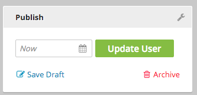

Reference Guide
---------------

All available annotations for Brightspot are listed below, including implementation instructions and usage tips.

A
~
@Abstract

Specifies whether the target can be used to create a concrete instance. In the example below, the `@Abstract` annotation is used on the AbstractArticle class: 

.. code-block:: java

	@Abstract
	public class AbstractArticle extends Content{
	
	}


B
~

@BeanProperty
Specifies the JavaBeans property name that can be used to access an instance of the target type as a modification.
For example, when a class has been modified and a field needs to be accessed to render: 

The Modification class:

.. code-block:: java

    import com.psddev.dari.db.Modification;

    public class DefaultPromotable extends Modification<Promotable> {

        @Indexed
        private String title;
        private Image image;

        // Getters Setters

    }

The class implementing the modification:

.. code-block:: java

    public class Blog extends Content implements Promotable {

        private String title;
    
        // Getters Setters
    
    }

In the example above, a new `title` and `image` can be added to the objects implementing the interface. To access those fields when rendering the content, the modification class must be annotated with `@BeanProperty`. 

.. code-block:: java

    @BeanProperty("promotable")
    public class DefaultPromotable extends Modification<Promotable> {

        @Indexed
        private String title;
        private Image image;

        // Getters Setters

    }

The annotation allows direct access when rendering content:

.. code-block:: jsp

    <cms:render value="${content.promotable.promoTitle}" />
    <cms:img src="${content.promotable.promoImage}" />   

C
~

@CollectionMaximum

Specifies the maximum amount of objects allowed in a list:

.. code-block:: java

	public class Feed extends Content {
	
		@CollectionMaximum(4)
		private List<Article> articles;
		
	}	

@CollectionMinimum 

Specifies the minimum amount of objects allowed in a list:

.. code-block:: java

	public class Feed extends Content {
	
		@CollectionMinimum(4)
		private List<Article> articles;
		
	}

@Content.Searchable

Specifies whether the instances of the target type should be searchable.

D
~

@Denormalized

Specifies whether the target field is always denormalized in another instance.
`@Denormalized` may be used on a class that is referenced by another class, it 'de-normalizes,' or copies the data to the referring class. It may be used in site searches. The denormalized data is not visible on the object, it is saved in the solr Index. For example, there are two classes, `Person` and `State`, where `Person` has a reference field `State` on it. Perform a people search to include the `State` name: 

.. code-block:: java

    public class State extends Content {

		@Indexed (unique = true)
		private String name;

		@Indexed (unique = true)
		@Denormalized
		private String abbreviation;
    }
    
    public class Person extends Content {

    	@Indexed
    	private String firstName;

    	@Indexed
		private String lastName;

		@Indexed
		private State state;
    }

To perform a people search to include the `State` name:     

.. code-block:: java

    Search search = new Search();
    search.addTypes(Person.class);
    search.toQuery("va").select(0, 5);

Boost the search by the denormalized abbreviation value:

.. code-block:: java

    search.boostFields(5.0, Person.class, "state/abbreviation");

This annotation should be reserved for advanced cases where it is absolutely necessary.

@DisplayName(String)

Specifies the target type's display name on the front end. For example:

.. code-block:: java

	public class Article extends Content {
	
		@Recordable.DisplayName("Short Headline")
		private String summary;
		
	}

E
~

@Embedded
Specifies whether the target type data is always embedded in another type data. While typically used on a class, the `@Embedded` annotation can also be used on fields. To embed an object in an object the annotation `@Embedded` is used with a static class. An example, as applied to a class: 

.. code-block:: java

	public class Company extends Content {

      private String name;
      private Contact contact;

        @Embedded
        public static class Contact extends Content {

            private String address;

        }

    }

An example, as applied to a field:

.. code-block:: java

	public class Company extends Content {
	
		@Embedded
		private Contact contact;
		
		
		public static class Contact extends Content {
		
		}
		
	}

F
~

@FieldInternalNamePrefix(String)

Specifies the prefix for the internal names of all fields in the target type. The `@FieldInternalNamePrefix` is used on a class, and a String is specified for the prefix for internal names of fields. An example of it applied to a class:

.. code-block:: java

	@Recordable.FieldInternalNamePrefix("SimpleBlog")
	public class BlogPost extends Content {
	
	}

I
~

@Ignored

Specifies whether the target field is ignored. The **@Ignored** annotation is used on fields. An example applied to a field:

.. code-block:: java

	public class Article extends Content {
	
		@Ignored
		protected boolean published = false;
		
	}

@Indexed

Specifies whether the target field value is indexed. The `@Indexed` annotation defines data against which queries may be run. To prevent performance problems, the annotation should not be applied to all fields in an object. An example of an indexed headline field:

.. code-block:: java

	public class Article extends Content {

    	@Indexed
    	private String headline;
    	private ReferentialText body;
    	private List<tag> tags;
    	private Set<string> keywords;

    	// Getters and Setters

	}

@InternalName(String)

Specifies the target type's internal name. The `@InternalName` annotation is used both for classes and fields. An example applied to a class:

.. code-block:: java

	@InternalName("Old")
	public class MigratedBlogPost extends Content {
	
	}
	
An example applied to a field:

.. code-block:: java

	public class BlogPost extends Content {
	
		@InternalName("oldBlogTitle")
		private Title oldTitle;
		
	}

L
~

@LazyLoad

Internal annotation to designate that the fields in the target type are lazily loaded. The `@LazyLoad` annotation is applied to a class. For example, if there are several images in a photo gallery, to facilitate easy browsing through the images for the user, the photo gallery class may be annotated with `@LazyLoad`:

.. code-block:: java

	@LazyLoad
	public class PhotoGallery extends Content {
	
		private String title;
		private ReferentialText description;
		private List<Image> items;
		
	}

M
~

@Maximum(double)

Specifies the maximum numeric value or string length of the target field.

.. code-block:: java

	public class Movie extends Content {
	
		@ToolUi.Note("On a scale of 1 to 10")
		@Minimum(1)
		@Maximum(2)
		private int rating;
		
	}

@Minimum(double)

Specifies the minimum numeric value or string length of the target field.
	

.. code-block:: java

	public class Movie extends Content {
	
		@ToolUi.Note("On a scale of 1 to 10")
		@Minimum(1)
		@Maximum(2)
		private int rating;
		
	}

P
~

@PageStage.UpdateClass
Specifies the `PageStage.Updatable` class that will update the PageStage for all instances of the target type. If the class directly implements `PageStage.Updatable`, this will run after.

R
~

@Recordable.Abstract
Specifies whether the target type is abstract and can't be used to create a concrete instance.

@Recordable.BeanProperty
Specifies the JavaBeans property name that can be used to access an instance of the target type as a modification.
For example, given the following modification:

.. code-block:: java

	@Modification.BeanProperty("css")
	class CustomCss extends Modification<Object> {
		public String getBodyClass() {
			return getOriginalObject().getClass().getName().replace('.', '_');
		}
	} 

The following becomes valid and will invoke the getBodyClass above, even if the content object doesn't define a getCss method.

.. code-block:: jsp

	${content.css.bodyClass}

@Recordable.BootstrapPackages

@Recordable.BootstrapTypeMappable

@Recordable.DisplayName

Specifies the target's display name.

@Recordable.Embedded

Specifies whether the target data is always embedded within another instance.

@Recordable.Groups

@Recordable.InternalName

Specifies the target's internal name.

@Recordable.JunctionField

Specifies the name of the field in the junction query that should be used to populate the target field. Given two objects, Video and Playlist, JunctionField would allow the population of a list of videos for a playlist, on the Playlist object, by having each Video object contain a reference to the Playlist it is in.

Video object:

.. code-block:: java

	public class Video extends Content { 

		private String name;
		private StorageItem videoFile;

		@Indexed 
		private Playlist playlist; 
	} 

The Playlist object:

.. code-block:: java

	public class Playlist extends Content { 

		private String name; 

		@Indexed 
		@Recordable.JunctionField("playlist") 
		private List<video> videos; 
	} 

@Recordable.JunctionPositionField

Specifies the name of the position field in the junction query that should be used to order the collection in the target field.
	
@Recordable.LabelFields(String[])

Specifies the field names that are used to retrieve the labels of the objects represented by the target type. The `@LabelFields` annotation is used on a class. In the example below, the `name` field is used to retrieve the object labels:

.. code-block:: java

	@Recordable.LabelFields("name")
	public class Author extends Content {
	
		@Required
    	private String name;
    	
    }

@Recordable.MetricValue

Specifies the field in which the metric is recorded. This annotation is only applicable to Metric fields. It allows you to specify which MetricInterval to use when storing Metric values. The default is MetricInterval.Hourly.class, so this annotation is optional.

For example, using an interval of None eliminates the time series component of the Metric value.

.. code-block:: java

    @MetricValue(interval = com.psddev.dari.db.MetricInterval.None.class)
    Metric myMetric;

It is also possible to reference a setting key that holds the name of the class to use:

.. code-block:: java

    @MetricValue(intervalSetting = "analytics/metricIntervalClass")
    Metric myMetric;

Update `context.xml` as follows:

.. code-block:: xml

    <Environment name="analytics/metricIntervalClass" type="java.lang.String" value="com.psddev.dari.db.MetricInterval$Minutely" override="false" />    

@Recordable.PreviewField

Specifies the field name used to retrieve the previews of the objects represented by the target type. This annotation is typically used on image and video classes. For example, when `@PreviewField` is used on an image object, the `file` field name is used to retrieve the preview:

.. code-block:: java

	@Recordable.PreviewField("file")
	public class Image extends Content {
		private String name;
		private StorageItem file;
		private String altText;
		
	}

@Recordable.SourceDatabaseClass

Specifies the source database class for the target type.

@Recordable.SourceDatabaseName

Specifies the source database name for the target type. The annotation is applied to a class.

@Regex(String)

Specifies the regular expression pattern that the target field value must match. This annotation is typically used on fields. For example:

.. code-block:: java

	public class Author extends Content {
	
		private String name;
		
		@Recordable.Regex("(^.*)([a-f||\\d]{8}-[a-f||\\d]{4}-[a-f||\\d]{4}-[a-f||\\d]{4}-[a-f||\\d]{12})$")
		private String email;
		
	}

@Renderer.EmbedPath

Specifies the servlet path used to render instances of the target type when embedded in another page.

@Renderer.EmbedPreviewWidth

Specifies the width (in pixels) of the preview for the instances of the target type.

@Renderer.LayoutPath("/render/common/page-container.jsp")

The LayoutPath annotation provides a path to a file that renders the layout of the page. This is often a common page container, providing the ```<head>``` section of pages (with stylesheets), as well as a common header and footer for all pages.

If a content type is used to power an entire page (Article / Homepage / Contact Us Page), it must have a `@Renderer.LayoutPath` annotation to define the page layout.

Example Layout Path File:

.. code-block:: jsp

	<!DOCTYPE html>

	<%@ taglib prefix="c" uri="http://java.sun.com/jsp/jstl/core" %>
	<%@ taglib prefix="fn" uri="http://java.sun.com/jsp/jstl/functions" %>
	<%@ taglib prefix="fmt" uri="http://java.sun.com/jsp/jstl/fmt" %>
	<%@ taglib prefix="cms" uri="http://psddev.com/cms" %>


	<html>
	<head>
		<title>${seo.title}</title>
	</head>
	<body>
		<div class="container">
			<cms:render value="${mainContent}"/>
		</div>
	</body>
	</html>


@Renderer.Path("/render/model/article-object.jsp")

The Path annotation renders the properties within the content type it is attached to. It is called when the content is accessed, allowing it to render itself. 

If a content type is used to power an entire page (Article / Homepage / Contact Us Page), it must have a `@Renderer.Path` annotation which is used to render the content data (Article headline / Body Text).

Rendering Annotations - Template/Page

.. code-block:: java

	@Renderer.LayoutPath("/render/common/page-container.jsp")
	@Renderer.Path("/render/model/article-object.jsp")
	public class Article extends Content {
		
		@Indexed
		private String headline;
		private Author author;
		private ReferentialText bodyText;
		
		// Getters and Setters
		
			
	}

@Required 
Specifies whether the target field value is required. This is a field annotation that ensures that the field it is applied to is mandatory for the user. For example, the `headline` field is required for an Article:

.. code-block:: java

	public class Article extends Content {

    	@Required
    	private String headline;

    	// Getters and Setters

	}

@RichTextElement.Tag

.. code-block:: java

	@Documented
    @ObjectType.AnnotationProcessorClass(TagProcessor.class)
    @Retention(RetentionPolicy.RUNTIME)
    @Target(ElementType.TYPE)
    public @interface Tag {

        String value();
        String initialBody() default "";
        boolean block() default false;
        boolean readOnly() default false;
        boolean root() default false;
        Class<?>[] children() default { };
        String menu() default "";
        String tooltip() default "";
        String[] keymaps() default { };
        double position() default 0d;
    }

`value`: Set the tag name, for example, `foo` in `<foo>bar</foo>`.

`initial body`: When you click the button to insert the element, it will be initialized with this value, for example, `@Tag(value = "foo", initialBody = "bar")` will have the initial value `<foo>bar</foo>`.

`block`: When set to true, 'block' makes it a block level element. A block level element takes up the whole line. Block level elements are useful for things like block quotes: normally, when user presses the button, it only toggles the style on or changes the style of the selection. If `block` is true, even without text selected, it will convert the entire line to bold and wrap it in the tag: `@Tag(value = "blockquote", block = true)`. For example, if the cursor is `|` in `this is a great | quote` - and you press the block quote button, it styles that entire line and wraps it in block quote: `<blockquote>this is a great quote</blockquote>`.

`readOnly`: Makes the tag read only. You can use it in conjuction with an initial body, some precanned text that you want to add that should be treated as a single character but may span multiple characters, or the `RichTextElement#toBody` method that allows you to dynamically change the Rich Text Editor body text that gets displayed, but cannot be edited by the user.

`root` and `children`: Control where the tags can go: with `@Tag(children = { BarRichTextElement.class } FooRichTextElement`, bar can only be placed within foo.

`menu`: Like `@ToolUi.Tab`, common text you can use to group several Rich Text elements together.

`tooltip`: Popup help text.

`keymaps`: Allows keyboard shortcut to be bound to the tag. It looks like `@Tag(keymaps = { "Cmd-B", "Ctrl-B" }`. See the modifier list at https://codemirror.net/doc/manual.html#keymaps.

`position`: Allows precise control over tag display order in the toolbar.

S
~

@SearchResultSelectionGeneratable.ItemTypes

@Seo.DescriptionFields

Specifies an array of field paths that are checked to find the page description from an instance of the target type.

@Seo.KeywordsFields

Specifies an array of field paths that are checked to find the page keywords from an instance of the target type.

@Seo.OpenGraphType

Specifies the Open Graph type of the target type.

@Seo.TitleFields("field")

Specifies an array of field paths that are checked to find the page title from an instance of the target type.

@SolrDatabase.TypeAheadFields

Specifies all fields that are stored for type-ahead from an instance of the target type.

@SourceDatabaseClass

Specifies the source database class for the target type. The annotation is applied to a class. 

@Step(double)

Specifies the step between the minimum and the maximum that the target field must match. This annotation is typically applied to fields. Using the example of the list of Articles, the step between the minimum and maximum number of Articles is 1. 

.. code-block:: java

	public class RSSFeed extends Content {
	
		@Minimum(1) 
		@Step(1)
		@Maximum(4)
		private List<article> articles;
		
	}

T
~

@ToolUi.BulkUpload

Specifies whether the target field should enable and accept files using the Bulk Upload feature. In the example below, the "Images" field in the Image Gallery class will accept files using Bulk Upload:

.. code-block:: java

	public class Gallery extends Content  {

		@Indexed
		private String name;
		private List<Slide> slides;

		@Embedded
		@PreviewField("image/file")
		@Recordable.LabelFields("image/name")
		public static class Slide extends Record implements UbikContent {

			@ToolUi.BulkUpload
			private Image image;
			private String caption;

		}
	}

@ToolUi.CodeType

Specifies the type of input text. Example String fields can be defined as `@ToolUi.CodeType("text/css")` to present inline numbers and CSS code styles. For a full list of valid values, see the [CodeMirror Documentation](http://codemirror.net/mode/). Use the MIME type.

@ToolUi.ColorPicker

Specifies whether the target field should display the color picker. This annotation is typically used for CSS overrides fields. For example:

.. code-block:: java

	public class Module extends Content {
	
		private String name;
		@ToolUi.ColorPicker
        @ToolUi.Note("Title color")
		private String color;
		private String altText;
		
	}

@ToolUi.CompatibleTypes

Specifies an array of compatible types to which the target type may switch. This annotation is applied to a class. For example, a photo gallery object may be able to switch to an Image object:

.. code-block:: java

	@ToolUi.CompatibleTypes(Image.class)
	public class PhotoGallery extends Content {
	
	}

@ToolUi.CssClass

Add a custom CSS class that can style the `.inputContainer`. This annotation is used for a field. In the example below, the `imagePreview` CSS class is provided to allow the editor to preview the image file with the CSS.

.. code-block:: java

	public class Image extends Content {
		
		@ToolUi.CssClass("imagePreview")
		private StorageItem file;
	}
	
@ToolUi.DefaultSortField

Specifies the field to be used as the default sorter. In the example below, the headline is the default sorter for Articles:

.. code-block:: java

	@ToolUi.DefaultSortField("headline")
    public class Article extends Content {
	
		private String headline;
		
	}

@ToolUi.DisplayFirst

Annotate fields added through a class modification to change the default behavior, "appearing first", and order them accordingly. For example, a modification class and the class implementing it:

.. code-block:: java

	import com.psddev.dari.db.Modification;

	public class DefaultPromotable extends Modification<promotable> {

    	@Indexed
    	@DisplayFirst
    	private String promoTitle;
    	@DisplayFirst
    	private Image promoImage;

    	// Getters Setters

	}
	
The Blog class implementing the Promotable modification:

.. code-block:: java

	public class Blog extends Content implements Promotable {

    	private String title;

    	// Getters Setters

	}

When you edit a blog, the `promoTitle` and `promoImage` fields will display before the blog title and other blog fields. 

@ToolUi.DisplayGlobalFilters

@ToolUi.DisplayLast
Annotate fields added through a class modification to change the default behavior, "appearing last," and order them accordingly. For example, a modification class and the class implementing it:

.. code-block:: java

	import com.psddev.dari.db.Modification;

	public class DefaultPromotable extends Modification<promotable> {

    	@Indexed
    	@DisplayLast
    	private String promoTitle;
    	@DisplayLast
    	private Image promoImage;

    	// Getters Setters

	}
	
The Blog class implementing the Promotable modification:

.. code-block:: java

	public class Blog extends Content implements Promotable {

    	private String title;

    	// Getters Setters

	}

When you edit a blog, the `promoTitle` and `promoImage` fields will display after the blog title and other blog fields. 

@ToolUi.DropDown
Specifies whether the target field should be displayed as a drop-down menu. For example, the Author field on an Article object is annotated to allow the user to select the author in a drop down:

.. code-block:: java

	public class Article extends Content {
	
		private String articleName;
		
		@ToolUi.DropDown
		private Author author;
		
	}

@ToolUi.Expanded
Specifies whether the target field should always be expanded in an embedded display. This annotation is applied to fields. For example, applying the annotation to the embedded Contact field will ensure that the properties of the the Contact object will be expanded in the user interface:

.. code-block:: java

	public class Company extends Content {
	
		@Embedded
		@ToolUi.Expanded
		private Contact contact;
		
		
		public static class Contact extends Content {
		
		}
		
	}

@ToolUi.FieldDisplayOrder

@ToolUi.FieldDisplayType
Specifies the internal type used to render the target field. This annotation is applied to fields. For example:

.. code-block:: java

	public class Article extends Content {
	
		@ToolUi.FieldDisplayType("body")
		private ReferentialText body;
		
	}

@ToolUi.FieldSorted
Specifies whether the values in the target field should be sorted before being saved. This annotation is applied to fields. In the example below, the author values in the author field will be sorted before being saved in the article. 

.. code-block:: java

	public class Article extends Content {
	
		@ToolUi.FieldSorted
		private Author author;
		
	}

@ToolUi.Filterable
Specifies whether the target field should be offered as a filterable field in the search interface. A field can be selected as a default filter for a particular object type by adding @Indexed and also by adding the annotation `@ToolUi.Filterable`. This will show up on the global search widget, but not on the sitemap. In the example below, the `active` field will be a default filter for Videos in the search widget:

.. code-block:: java

	public class Video extends Content {
	
		@ToolUi.Filterable
        @Indexed
		private boolean active;
		
	}
	
@ToolUi.GlobalFilter
Specifies whether the target type shows up as a filter that can be applied to any object type in search. This annotation is applied to classes to make them a custom global filter. In the example below, the Client content type is annotated with the `@ToolUi.GlobalFilter` annotation to filter projects by Client:

.. code-block:: java

	@ToolUi.GlobalFilter
	public class Client extends Content {
	
	}

@ToolUi.Heading(String)
Provides a horizontal rule in the content object, allowing new sections to be created with headings. This annotation is applied to fields. All fields following the annotation will be in the new section. For example, all the social handles will be in the Social Info section of the blog post object:

.. code-block:: java

	public class BlogPost extends Content {
	
		@ToolUi.Heading("Social Info")
		private String twitterHandle;
		private String twitterURL;
		
	}

@ToolUi.Hidden
Hide a target field from the UI. This annotation is applied to fields that should no longer be displayed. For example, hiding the author field in the Article object:

.. code-block:: java

	public class Article extends Content {
	
		@ToolUi.Hidden
		private Author author;
		
	}

@ToolUi.IconName
Specifies the name of the icon that represents the target type. For example, an icon named "logo" is created to represent image objects. To associate the icon with the image objects:

.. code-block:: java

	@ToolUi.IconName("logo")
	public class Image extends Content {
	
		private String name;
		private StorageItem file;
		private String altText;
		
	}

@ToolUi.InputProcessorPath()
Specifies the path to the processor used to render and update the target field. This annotation is typically used for fields that have complex value formats. In the example below, the duration of the video is annotated with the `@ToolUi.InputProcessorPath()` annotation:

.. code-block:: java

	public class Video extends Content {
	
		@ToolUi.InputProcessorPath("/path/duration.jsp")
		private Long duration;
		
	}

@ToolUi.InputSearcherPath()

Specifies the path to the searcher used to find a value for the target field. For example, if there is an Author field on an Article object, in order to enter a value for the Author field, Brightspot offers a default search tool to select available Author objects. Annotating the Author field with `@ToolUi.InputSearcherPath()` allows a custom search widget to be used instead of the default Brightspot search tool:

.. code-block:: java

	public class Article extends Content {
	
		@ToolUi.InputSearcherPath("/path/searchWidget.jsp")
		private Author author;
		
	}

@ToolUi.LanguageTag

Specifies the language of the text in the target type or field.

@ToolUi.LayoutPlaceholder

@ToolUi.LayoutPlaceholders

@ToolUi.Main

@ToolUi.Note("String")

To provide the user with an instruction or note for a field in the CMS, use `@ToolUi.Note`. In the UI, the note will appear above the specified field. It can also be added to a class to provide a Note for that object type in the CMS. For example:

.. code-block:: java

	public class Article extends Content {
	
		private String articleName;
		
		@ToolUi.DropDown
		@ToolUi.Note("Select an author name:")
		private Author author;
		
	}

@ToolUi.NoteHtml

Specifies the note, in raw HTML, displayed along with the target in the UI.

The note can also display dynamic content. In the example below, the editor can be alerted to the content that will be used if the field is left blank:

.. code-block:: java

	public class Image extends Content {

		private String name;
		private StorageItem file;
		@ToolUi.NoteHtml("<span data-dynamic-html='${content.name}' will be used as altText if this is left blank"></span>")
		private String altText;
	}

See the `@ToolUi.Placeholder` annotation for more options
 
@ToolUi.NoteRenderer
Renders the note displayed along with a type or a field. 

@ToolUi.NoteRendererClass

Specifies the class that can render the note displayed along with the target in the UI. 

@ToolUi.OnlyPathed
Specifies that the target field may only contain objects with a URL path.

.. code-block:: java

     @ToolUi.OnlyPathed
     private List<Content> linkableContent;

In the example above, the `linkableContent` list field will only collect and display content that have a URL Path.  

@ToolUi.Placeholder("String")

Specifies the target field's placeholder text.

Dynamic content can also be added as placeholder text, using any existing attribute on the content or a dynamic note. This allows the editorial interface to accurately represent any overrides of content that happen on the front end.

In the example below, the name field appears as a placeholder in the altText field of the image object. If you click into the altText field, you can add to or modify the text because of the `editable=true` option, increasing editor efficiency.

.. code-block:: java

	public class Image extends Content {

    	private String name;
    	private StorageItem file;
    	@ToolUi.Placeholder(dynamicText = "${content.name}", editable=true)
    	private String altText;

	}

In the CMS user interface, the placeholder text is shown in grey, which darkens on hover.

.. image:: images/placeholder-text.png

The placeholder text does not provide a value for the field. You can write code to get a default value and use it as placeholder text that serves as a default value, as shown in the example below.

.. code-block:: java

	@Required
	private String title;

	@ToolUi.Placeholder(dynamicText = "${content.shortTitleFallback}", editable = true)
	private String shortTitle;

	// @return the title.
	public String getTitle() {
		return title;
	}

	// @return the shortTitle, falling back to the title if it's missing.
	public String getShortTitle() {
		if (shortTitle != null) {
			return shortTitle;
		} else {
			return getShortTitleFallback();
		}
	}

	// @return the fallback value for the shortTitle.
	public String getShortTitleFallback() {
		return getTitle();
	}    

@ToolUi.PublishButtonText

Changes the text that appears on the Publish button.

For example, to change the text from "Publish" to "Update User:

.. code-block:: java

	@ToolUi.PublishButtonText("Update User")
	public class User extends Content

	}




@ToolUi.ReadOnly

Specifies that the target field is read-only. For example, an object has an ID field that the editor should not be able to edit: 

.. code-block:: java

    public class Article extends Content {
        
        private String title;
        @ToolUi.ReadOnly
        private String articleID;
        
        //Getters and Setters
        
    }

@ToolUi.Referenceable

Specifies whether the instance of the target type can be referenced (added) by a referential text object (rich text editor). For example, an Image object that needs to be available as an Enhancement must have this annotation:

.. code-block:: java

    @ToolUi.Referenceable
    @Recordable.PreviewField("file")
    @Renderer.Path("/WEB-INF/common/image.jsp")
    public class Image extends Content{
    
        private String name;
	    private StorageItem file;
	    
	    //Getters and Setters
	    
	}

@ToolUi.RichText

Specifies whether the target field should offer rich text editing options. This allows String fields to contain rich text controls. For example, the description field of an Article object is annotated to provide rich text features:

.. code-block:: java

	public class Article extends Content {
	
		private String headline;
		
		@ToolUi.RichText
		private String description;
		
	}

@ToolUi.Secret

Specifies whether the target field display should be scrambled. This is best used for a password field or a field where the data being entered is sensitive. An example applied to a password field:

.. code-block:: java

	public class User extends Content {
	
		private String username;
		
		@ToolUi.Secret
		private String password;
		
	}

@ToolUi.Sortable

Specifies whether the target field should be offered as a sortable field in search. The annotation is applied to a field to allow the search results to be sorted by that field. For example:

.. code-block:: java

	public class Article extends Content {
	
		private String headline;
		
		@ToolUi.Sortable
		private String publishDate;
		
	}

@ToolUi.StandardImageSizes

Specifies the standard image sizes that would be applied to the target field. For example, an image object that needs to have a specified standard size:

.. code-block:: java

    public static class Profile extends Record {

        @Required
        private String name;
        @ToolUi.StandardImageSizes("myProfile")
        private Image image;
    }
    
The Profile class has been defined with the Image object annotated with `@ToolUi.StandardImageSizes("myProfile"). When the image is to be rendered, the size specified for it in the JSP will be referenced. So, for example, the render file for the Profile class is profile.jsp: 

.. code-block:: jsp

    <cms:img src="${content.image}" size="myProfile" />    

@ToolUi.StoragePreviewProcessorPath

Specifies the path to the processor used to render previews of StorageItems fields. It is very similar to @ToolUi.InputProcessorPath, and its usage is identical. It is only applicable to StorageItem fields, and the specified JSP is only responsible for rendering the preview of the uploaded file, not the file upload control. For example:

.. code-block:: java

    @ToolUi.StoragePreviewProcessorPath("/WEB-INF/_plugins/myCustomFilePreview.jsp")
    StorageItem myFile;

Then in myCustomFilePreview.jsp:

.. code-block:: jsp

    <%
        State state = State.getInstance(request.getAttribute("object"));
        ObjectField field = (ObjectField) request.getAttribute("field");
        String fieldName = field.getInternalName();
        StorageItem fieldValue = (StorageItem) state.getValue(fieldName);
        if (fieldValue == null) return; 
    %>

The uploaded file is at `<%=fieldValue.getPath()%>`.

@ToolUi.StorageSetting

This annotation references a settings key that indicates which storage will be used when files are uploaded in the CMS. For example:

.. code-block:: java

    @ToolUi.StorageSetting("local")
    StorageItem myLocalFile;

Then, in context.xml update the following: 

.. code-block:: xml

    <environment name="dari/storage/local/class" override="false" type="java.lang.String" value="com.psddev.dari.util.LocalStorageItem" />
    <!-- etc. -->
    
This overrides the normal behavior of checking `dari/defaultStorage` to determine which storage to use for this field only.

@ToolUi.SuggestedMaximum(int)

This annotation is used to indicate a suggested upper limit on the length of the field.
The value passed to the annotation is the limiting value.  When a user is modifying the annotated field, an indicator will appear when the input size has exceeded the specified limit. For Example:

.. code-block:: java

	public class Article extends Content {
	
		@ToolUi.SuggestedMaximum(150)
		//The suggested length of the description field is 150
		private String description;
		
	}

@ToolUi.SuggestedMinimum(int)
This annotation is used to indicate a suggested lower limit on the length of the field.
The value passed to the annotation is the limiting value.  When a user is modifying the annotated field, an indicator will appear when the input size falls below the specified limit. For Example:

.. code-block:: java

	public class Article extends Content {
	
		@ToolUi.SuggestedMaximum(10)
		//The description field should be at least 10 characters long
		private String description;
		
	}

@ToolUi.Suggestions

Specifies whether the target field should offer suggestions. This is a field annotation. In the example below, the annotation is applied to the keywords field to enable suggested keywords:

.. code-block:: java

	public class Article extends Content {
	
		 private String headline;
		private ReferentialText body;
		@ToolUi.Suggestions
    	private Set<string> keywords;
    	private Date publishedDate;
    	private Author author;
    	
    }

@ToolUi.Tab("tabName")

Creates a new Tab interface in the content edit view, with the annotated fields appearing in it. All fields following this annotation will be placed in the newly created tab. For example:

.. code-block:: java

	public class BlogPost extends Content {
	
		@ToolUi.RichText
    	private String title;
    	@ToolUi.Note("Small blurb that appears under the title")
    	private String subTitle;
    	private ReferentialText body;
    	
    	@ToolUi.Tab("Social")
    	private String twitterHandle;
    	
    }

@ToolUi.Where

Limits results on the returned objects. For example, `@ToolUi.Where("title ^= a" )` would limit the returned objects to ones whose title starts with the letter "a." You can also use a field in an object. For example, when returning a list of Articles, each with an Author: `@ToolUi.Where("author/name ^= a" )` 

The `@ToolUi.Where` annotation can also be used to limit object types based on a common interface. In the example below, only objects that are taggable can be chosen.

.. code-block:: java

	@ToolUi.Where("groups = com.psddev.brightspot.Taggable") 
	List <objecttype> types; 

@Types(Class<recordable>[])

Specifies the valid types for the target field value. `@Types({Image.class, Video.class, Widget.class})`. The annotation is applied to fields. In the example below, the valid content type to be added to the list of items are the Image and Video types:

.. code-block:: java

	public class Gallery extends Content {
	
		@Types(Image.class, Video.class)
		private List<media> items;
		
	}

U
~

@UpdateTrackable.Names

Specifies the tracker names for target type.

V
~

@Values(String[])

Specifies the valid values for the target field value. The annotation is applied to fields. In the example below, the valid values to select in the team color field are: red, blue, yellow, and green:

.. code-block:: java

	public class Team extends Content {
	
		private String teamName; 
		
		@Values("Red", "Blue", "Yellow", "Green")
		private String teamColor;
		
	}
