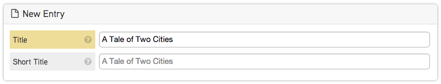

UI Control
----------

Though properties within the Java class automatically create the Brightspot user interface, you can customize your interface with the following annotations.

**@ToolUi.RichText:** Add Rich Text capabilities to a string field. The field will allow you to format your text, but not add enhancements.

**@ToolUi.Note("Note text here"):** Create instructional notes for editors.

**@ToolUi.Heading("Heading Name"):** Create a horizontal line to break up the interface. You can also move fields to a new tab.

**@ToolUi.Tab("New Tab"):** Combine each field with the annotation on a new tab. The annotation will need to be added to each individual field in order for it to be placed into the same tab as the other fields.

.. code-block:: java

    public class BlogPost extends Content {

        @ToolUi.RichText
        private String title;
        @ToolUi.Note("Small blurb that appears under the title")
        private String subTitle;
        private ReferentialText body;

        @ToolUi.Heading("Social Info")
        private String twitterHandle;

        @ToolUi.Tab("Advanced")
        private AdvertPackage adPackage;

        // Getters and Setters

    }

**@ToolUi.BulkUpload:** Specifies whether the target field should accept files using the bulk upload feature. This annotation is applied to fields. In the example below, the images field in the Image Gallery class will accept files using bulk upload:

.. code-block:: java

    public class ImageGallery extends Content {

        @ToolUi.BulkUpload
        private List<Slide> slides;

        public static class Slide extends Record {

            private Image image;
            private String caption;

        }

    }
   
**@ToolUi.CodeType:** Specifies the type of input text. Example String fields can be defined as @ToolUi.CodeType("text/css") to present inline numbers and CSS code styles. For a full list of valid values, see CodeMirror Documentation. Use the MIME type.

**@ToolUi.ColorPicker:** Specifies whether the target field should display the color picker. This annotation is typically used for CSS overrides fields. For example:

.. code-block:: java

    public class Module extends Content {

        private String name;
        @ToolUi.ColorPicker
        @ToolUi.Note("Title color")
        private String color;
        private String altText;

    }

**@ToolUi.CompatibleTypes:** Specifies an array of compatible types to which the target type can switch. This annotation is applied to a class. For example, a photo gallery object may be able to switch to an Image object:

.. code-block:: java

    @ToolUi.CompatibleTypes(Image.class)
    public class PhotoGallery extends Content {

    }

**@ToolUi.CssClass:** Add a custom CSS class that can style the .inputContainer. This annotation is used for a field. In the example below, the imagePreview CSS class is provided to allow you to preview the image file with the CSS.

.. code-block:: java

    public class Image extends Content {

        @ToolUi.CssClass("imagePreview")
        private StorageItem file;
    }

**@ToolUi.DefaultSortField:** Specifies which field should be used as the default sorter. In the example below, the headline is the default sorter for Articles:

.. code-block:: java

    @ToolUi.DefaultSortField("headline")
    public class Article extends Content {

        private String headline;

    }

**@ToolUi.DisplayFirst:** Annotate fields added through a class modification to change the default behavior (appearing first) and order them accordingly. The example below is a modification class and the class implementing it:

.. code-block:: java

    import com.psddev.dari.db.Modification;

    public class DefaultPromotable extends Modification<Promotable> {

        @Indexed
        @DisplayFirst
        private String promoTitle;
        @DisplayFirst
        private Image promoImage;

        // Getters Setters

    }

The Blog class implementing the Promotable modification:

.. code-block:: java

    public class Blog extends Content implements Promotable {

        private String title;

        // Getters Setters

    }

When you edit a blog in the user interface, the promoTitle and promoImage fields will display before the blog title and other blog fields.

**@ToolUi.DisplayLast:** Annotate fields added through a class modification to change the default behavior (appearing last) and order them accordingly. The example below is a modification class and the class implementing it:

.. code-block:: java

    import com.psddev.dari.db.Modification;

    public class DefaultPromotable extends Modification<Promotable> {

        @Indexed
        @DisplayLast
        private String promoTitle;
        @DisplayLast
        private Image promoImage;

        // Getters Setters

    }

The Blog class implementing the Promotable modification:

.. code-block:: java

    public class Blog extends Content implements Promotable {

        private String title;

        // Getters Setters

    }

When you edit a blog in the user interface, the promoTitle and promoImage fields will display after the blog title and other blog fields.

**@ToolUi.DropDown:** Specifies whether the target field should be displayed as a drop-down menu. For example, the annotation is added to the Author field on an Article object to allow you to select the author from a drop-down menu:

.. code-block:: java

    public class Article extends Content {

        private String articleName;

        @ToolUi.DropDown
        private Author author;

    }

**@ToolUi.Expanded:** Specifies whether the target field should always be expanded in an embedded display. This annotation is applied to fields. For example, applying the annotation to the embedded Contact field will expand the properties of the Contact object in the user interface:

.. code-block:: java

    public class Company extends Content {

        @Embedded
        @ToolUi.Expanded
        private Contact contact;

        public static class Contact extends Content {

        }

    }

**@ToolUi.FieldDisplayType:** Specifies the internal type used to render the target field. This annotation is applied to fields. For example:

.. code-block:: java

    public class Article extends Content {

        @ToolUi.FieldDisplayType("body")
        private ReferentialText body;

    }

**@ToolUi.FieldSorted:** Specifies whether the values in the target field should be sorted before being saved. This annotation is applied to fields. In the example below, the Author values in the Author field will be sorted before being saved in the article.

.. code-block:: java

    public class Article extends Content {

        @ToolUi.FieldSorted
        private Author author;

    }

**@ToolUi.Filterable:** Specifies whether the target field should be offered as a filterable field in search. A field can be called out as a default filter for a particular object type not only by adding @Indexed, but also by adding the annotation @ToolUi.Filterable. This will show up on the global search widget, but not on the sitemap. In the example below, the active field will be a default filter for Videos in the search widget:

.. code-block:: java

    public class Video extends Content {

        @ToolUi.Filterable
        @Indexed
        private boolean active;

    }

**@ToolUi.GlobalFilter:** Specifies whether the target type shows up as a filter that can be applied to any types in search. This annotation is applied to classes to make them a custom global filter. In the example below, the @ToolUi.GlobalFilter annotation is added to the Client content type to allow users filter projects by clients:

.. code-block:: java

    @ToolUi.GlobalFilter
    public class Client extends Content {

    }

**@ToolUi.Heading(String):** Provides a horizontal rule within the Content Object, allowing you to create new sections with headings. This annotation is applied to fields, and all fields following the annotation will be in the new section. For example, all the social handles will be in the Social Info section of the blog post object:

.. code-block:: java

    public class BlogPost extends Content {

        @ToolUi.Heading("Social Info")
        private String twitterHandle;
        private String twitterURL;

    }

**@ToolUi.Hidden:** A target field can be hidden from the UI. This annotation is applied to fields that should no longer be displayed. For example, hiding the author field in the Article object:

.. code-block:: java

    public class Article extends Content {

        @ToolUi.Hidden
        private Author author;

    }

**@ToolUi.IconName:** Specifies the name of the icon that represents the target type. For example, an icon named "logo" is created to represent image objects. For example, associating the icon with the image objects:

.. code-block:: java

    @ToolUi.IconName("logo")
    public class Image extends Content {

        private String name;
        private StorageItem file;
        private String altText;

    }

**@ToolUi.InputProcessorPath():** Specifies the path to the processor used to render and update the target field. This annotation is typically used for fields that have complex value formats. In the example below, the duration of the video is annotated with the @ToolUi.InputProcessorPath() annotation:

.. code-block:: java

    public class Video extends Content {

        @ToolUi.InputProcessorPath("/path/duration.jsp")
        private Long duration;

    }

**@ToolUi.InputSearcherPath():** Specifies the path to the searcher used to find a value for the target field. For example, if there is an Author field on an Article object, in order to enter a value for the Author field, Brightspot offers a default search tool to select available Author objects. Annotating the Author field with @ToolUi.InputSearcherPath() allows a custom search widget to be used instead of the default Brightspot search tool. For example:

.. code-block:: java

    public class Article extends Content {

        @ToolUi.InputSearcherPath("/path/searchWidget.jsp")
        private Author author;

    }

**@ToolUi.Note("String"):** Creates an instruction or note for a field in the CMS. Your note will appear above the specified field in the UI. It can also be added to a class to provide a note for that object type within the CMS. For example:

.. code-block:: java

    public class Article extends Content {

        private String articleName;

        @ToolUi.DropDown
        @ToolUi.Note("Select an author name:")
        private Author author;

    }

**@ToolUi.NoteRenderer:** Renders the note displayed along with a type or a field.

**@ToolUi.NoteRendererClass**: Specifies the class that can render the note displayed along with the target in the UI.

**@ToolUi.NoteHtml:** Specifies the note, in raw HTML, displayed along with the target in the UI. The note can also display dynamic content. In the example below, you can add an alert to the content that will be used if the field is left blank. See the @ToolUi.Placeholder annotation for more options.

.. code-block:: java

    public class Image extends Content {

        private String name;
        private StorageItem file;
        @ToolUi.NoteHtml("${content.name}</strong> will be used as altText if this is left blank">")
        private String altText;
    }

**@ToolUi.OnlyPathed**: Specifies whether the target field may only contain objects with a URL path. In the example, the linkableContent list field will only collect and display content that has a URL Path.

.. code-block:: java

     @ToolUi.OnlyPathed
     private List<Content> linkableContent;

Dynamic content can also be added as placeholder text using any existing attribute of the content or a dynamic note. This allows the editorial interface to accurately represent any overrides of content that happen on the front-end.

In the example below, the name field appears as a placeholder in the altText field of the image object. Add the editable=true option, and click into the altText field to add or modify the text.

.. code-block:: java

    public class Image extends Content {

        private String name;
        private StorageItem file;
        @ToolUi.Placeholder(dynamicText = "${content.name}", editable=true)
        private String altText;

    }

In the CMS user interface, the placeholder text is shown in grey and darkens on hover.

The placeholder text does not provide a value for the field. You can write code to get a default value and use it as placeholder text that serves as a default value, as shown in the example below.

.. code-block:: java

    @Required
    private String title;

    @ToolUi.Placeholder(dynamicText = "${content.shortTitleFallback}", editable = true)
    private String shortTitle;

    // @return the title.
    public String getTitle() {
        return title;
    }

    // @return the shortTitle, falling back to the title if it's missing.
    public String getShortTitle() {
        if (shortTitle != null) {
            return shortTitle;
        } else {
            return getShortTitleFallback();
        }
    }

    // @return the fallback value for the shortTitle.
    public String getShortTitleFallback() {
        return getTitle();
    }

**@ToolUi.ReadOnly:** Specifies that the target field is read-only.

.. code-block:: java

    public class Article extends Content {

        private String title;
        @ToolUi.ReadOnly
        private String articleID;

        //Getters and Setters

    }

**@ToolUi.Referenceable:** Specifies whether the instance of the target type can be referenced (added) by a referential text object (Rich Text Editor). For example, an Image object that needs to be available as an Enhancement must have this annotation:

.. code-block:: java

    @ToolUi.Referenceable
    @Recordable.PreviewField("file")
    @Renderer.Path("/WEB-INF/common/image.jsp")
    public class Image extends Content{

        private String name;
        private StorageItem file;

        //Getters and Setters

    }

**@ToolUi.RichText:** Specifies whether the target field should offer Rich Text editing options, which allows String fields to contain Rich Text controls. For example, you can the annotation to the description field of an Article object to provide Rich Text features:

.. code-block:: java

    public class Article extends Content {

        private String headline;

        @ToolUi.RichText
        private String description;

    }

**@ToolUi.Secret:** Specifies whether the target field display should be scrambled. This is often used for a password field or a field where the data being entered is sensitive. An example of it applied to a password field:

.. code-block:: java

    public class User extends Content {

        private String username;

        @ToolUi.Secret
        private String password;

    }

**@ToolUi.Sortable:** Specifies whether the target field should be offered as a sortable field in search. The annotation is applied to a field to allow the search results to be sorted by that field. For example:

.. code-block:: java

    public class Article extends Content {

        private String headline;

        @ToolUi.Sortable
        private String publishDate;

    }

**@ToolUi.StandardImageSizes:** Specifies the standard image sizes applied to the target field.

.. code-block:: java

    public static class Profile extends Record {

        @Required
        private String name;
        @ToolUi.StandardImageSizes("myProfile")
        private Image image;
    }

The Profile class has been defined, and the Image object has been annotated with @ToolUi.StandardImageSizes("myProfile"). When the image is rendered, the size specified for it in the JSP will be referenced. So, for example, the render file for the Profile class is profile.jsp:

.. code-block:: jsp

    <cms:img src="${content.image}" size="myProfile" />

**@ToolUi.StoragePreviewProcessorPath:** Specifies the path to the processor used to render previews of StorageItems fields. It is very similar to @ToolUi.InputProcessorPath, and follows the same implementation guidelines, but it is only applicable to StorageItem fields, and the specified JSP is only responsible for rendering the preview of the uploaded file, not the file upload control. For example:

.. code-block:: java

    @ToolUi.StoragePreviewProcessorPath("/WEB-INF/_plugins/myCustomFilePreview.jsp")
    StorageItem myFile;

Then in myCustomFilePreview.jsp:

.. code-block:: jsp

    <%
        State state = State.getInstance(request.getAttribute("object"));
        ObjectField field = (ObjectField) request.getAttribute("field");
        String fieldName = field.getInternalName();
        StorageItem fieldValue = (StorageItem) state.getValue(fieldName);
        if (fieldValue == null) return; 
    %>

The uploaded file is at <%=fieldValue.getPath()%>.

**@ToolUi.StorageSetting:** This annotation references a settings key that indicates which storage will be used when files are uploaded in the CMS. For example:

.. code-block:: java

    @ToolUi.StorageSetting("local")
    StorageItem myLocalFile;

Then, in context.xml, update the following:

.. code-block:: xml

    <environment name="dari/storage/local/class" override="false" type="java.lang.String" value="com.psddev.dari.util.LocalStorageItem" />
    <!-- etc. -->

This overrides the normal behavior of checking dari/defaultStorage to determine which storage to use for this field only.

**@ToolUi.Suggestions:** Specifies whether the target field should offer suggestions. This is a field annotation. In the example below, the annotation is applied to the keywords field to enable suggested keywords:

.. code-block:: java

    public class Article extends Content {

        private String headline;
        private ReferentialText body;
        @ToolUi.Suggestions
        private Set<String> keywords;
        private Date publishedDate;
        private Author author;

    }
    
**@ToolUi.SuggestedMaximum(int):** This annotation is used to suggest an upper limit on the length of the field. The value passed to the annotation is the limiting value. When you modify the annotated field, an indicator will appear when the input size has exceeded the specified limit. For example:

.. code-block:: java

    public class Article extends Content {

        @ToolUi.SuggestedMaximum(150)
        //The suggested length of the description field is 150
        private String description;

    }

**@ToolUi.SuggestedMinimum(int):** This annotation is used to suggest a lower limit on the length of the field. The value passed to the annotation is the limiting value. When you modify the annotated field, an indicator will appear when the input size falls below the specified limit. For Example:

.. code-block:: java

    public class Article extends Content {

        @ToolUi.SuggestedMaximum(10)
        //The description field should be at least 10 characters long
        private String description;

    }

**@ToolUi.Tab("tabName"):** Creates a new Tab interface containing the annotated fields in the Content Edit view. All fields following this annotation will be placed in the newly created tab. For example:

.. code-block:: java

    public class BlogPost extends Content {

        @ToolUi.RichText
        private String title;
        @ToolUi.Note("Small blurb that appears under the title")
        private String subTitle;
        private ReferentialText body;

        @ToolUi.Tab("Social")
        private String twitterHandle;

    }

**@ToolUi.Where:** Limits results on the returned objects. For example, @ToolUi.Where("title ^= " ) would limit the returned objects to ones whose title starts with the letter "a." You can also use a field within an object. For example, when returning a list of Articles, each with an Author: ``@ToolUi.Where("author/name ^= a" )``.

You can also use the @ToolUi.Where annotation to limit object types based on a common interface. In the example below, only objects that are taggable can be chosen.

.. code-block:: java

    @ToolUi.Where("groups = com.psddev.brightspot.Taggable") 
    List <ObjectType> types;
