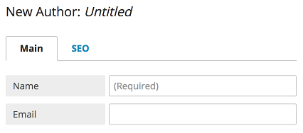
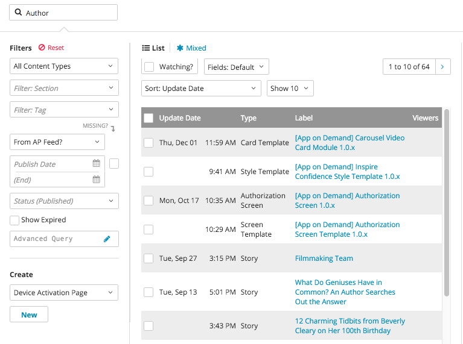

Adding Field Types
------------------

Once Brightspot has been installed and your objects have been created, you can customize those objects by adding fields. Depending on the nature of your content, Brightspot allows you to implement a variety of fields.

Text Field
~~~~~~~~~~

Text Fields are the simplest field type. These fields provide a text input for users like a title, basic input, or a small body of text without Rich Text formatting.

To add a Text field, add a String to the object within which the text field will exist.

For example, to add a title text field to an Article class:

.. code-block:: java

    public class Article extends Content {

        private String title;

        public String getTitle(){
            return title;
        }

        public void setTitle(String title){
            this.title = title;
        }

    }

You can place annotations on Text Fields. For example:

.. code-block:: java

    public class Article extends Content {

        private String plainText;
        @ToolUi.RichText
        private String richTextAnnotation;
        @ToolUi.Note("Editorial Note")
        private String withEditorialNote;
        @Required
        private String requiredExample;
    }
    
.. image:: http://cdn.brightspotcms.psdops.com/dims4/default/898c21e/2147483647/resize/700x/quality/90/?url=http%3A%2F%2Fd3qqon7jsl4v2v.cloudfront.net%2F02%2Fd7%2F9387e77f4869a9b8922cb59c7605%2Fscreen-shot-2014-11-11-at-20612-pmpng.28.28%20PM.png

Rich Text Editor
~~~~~~~~~~~~~~~~

ReferentialText can be added as a field type to any object. It will appear as a text field with the Rich Text Editor interface, and is typically implemented for the main formatted text in a piece of content. With the Rich Text Editor, you can add formatting and enhancements (other content types, such as images or modules) to your text.

To implement a Rich Text field, add private ReferentialText to an Object:

.. code-block:: java

    public class Article extends Content {

        private String title;
        private ReferentialText body;
    }

.. image:: http://cdn.brightspotcms.psdops.com/dims4/default/a6ec7f3/2147483647/resize/700x/quality/90/?url=http%3A%2F%2Fd3qqon7jsl4v2v.cloudfront.net%2Ff5%2Fb9%2Ff0f2947847ec8faf382342666117%2Fscreen-shot-2014-11-11-at-20942-pmpng.4%20-%20RichText%20Field.png

Object Field
~~~~~~~~~~~~

Object fields allow you to choose another object from within Brightspot. For example, if you wish to have an object field for an author rather than manually typing the author's name into a text field, you can create an Author object to reference.

To do this, create the object to be referenced:

.. code-block:: java

    public class Author extends Content {

        private String name;
    }

Next, add the newly created Author object to the Article:

.. code-block:: java

    public class Article extends Content {

        private String title;
        private Author author;
    }

Date Widget
~~~~~~~~~~~

The Date widget allows you to choose a specific date from a calendar drop-down menu, which can be added to any Object as a field. With the Date widget, you can specify a publish date for a piece of content, a blog post, or news article, for example.

To implement the Date widget as a field, add private Date to the Object.

.. code-block:: java

    public class Article extends Content { 

        private String title;
        private Author author;
        private Date dateWidget;
    }

.. image:: http://cdn.brightspotcms.psdops.com/dims4/default/e138686/2147483647/resize/380x/quality/90/?url=http%3A%2F%2Fd3qqon7jsl4v2v.cloudfront.net%2Fe2%2F53%2F0a60b75d465dbc91c08e6dad825b%2Fscreen-shot-2014-11-11-at-44122-pmpng.4%20-%20Date%20Widget.png

Boolean Field
~~~~~~~~~~~~~

Add a Boolean field to an Object to create a checkbox that will enable a feature specific to the edited content type. For example, if you want the option of enabling auto-play for some videos but not others, you can add a Boolean checkbox to determine whether a video should auto-play.

.. code-block:: java

    public class Video extends Content {

        private String title;
        private String caption;
        private boolean autoplay;
    }

Enum Field
~~~~~~~~~~

Enum field types are drop-down menus with a predetermined list of options. For exmaple, if the Object is a show page for a network site and needs to specify the day of the week on which it airs, add an enum field with days as the choices within it, then you could choose the day associated with the show page from the enum drop-down.

To add an enum, add public enum to the Object and specify the choices that should be included in the enum.

.. code-block:: java

    public class Show extends Content {

        private String title;
        private Day airtime;

        public enum Day {
            SUNDAY, MONDAY, TUESDAY, WEDNESDAY, THURSDAY, FRIDAY, SATURDAY
        } 
    }

.. image:: http://cdn.brightspotcms.psdops.com/dims4/default/5529102/2147483647/resize/380x/quality/90/?url=http%3A%2F%2Fd3qqon7jsl4v2v.cloudfront.net%2F34%2F51%2F3f53fa0547f39b0718a952826366%2Fenum-field.4%20-%20Enum.png

List Fields
~~~~~~~~~~~

List fields allow you to create a list that pulls from existing content within Brightspot. For example, if your content needs a list of contributing authors, you can add a List field referencing only Author objects. If a desired author name doesn't exist, you can create a new author in the field search widget.

Once you've created a list of items, you can drag the items on the list to re-order them.

This field can be implemented into an Object by adding private List<Author> authors

.. code-block:: java

    public class Article extends Content {

        private String title;
        private List<Author> authors; 
    }

.. image:: http://cdn.brightspotcms.psdops.com/dims4/default/4ca2a6e/2147483647/resize/700x/quality/90/?url=http%3A%2F%2Fd3qqon7jsl4v2v.cloudfront.net%2F08%2F06%2F9feb1745466081025b0fa8922dfb%2Fscreen-shot-2014-11-12-at-121942-pmpng.4%20-%20List%20Field.png

Set Fields
~~~~~~~~~~

Set Fields are similar to List Fields, but items in a Set cannot be reordered. You can implement Set Fields like List Fields.

.. code-block:: java

    public class Article extends Content {

        private String title;
        private Set<Author> authors;
    }

Storage Item
~~~~~~~~~~~~

Storage Items allow files to be uploaded and stored in the default storage mechanism defined in the context.xml.

.. code-block:: java

    public class Article extends Content {

        private String title;
        private Author author; 
        private ReferentialText body; 
        private StorageItem image;
    }

Locations/Regions
~~~~~~~~~~~~~~~~~

You can add a location or region to your content by adding a Location field to your Object. When added to an Object, the Location field appears on the Content Edit screen as a map, linked to MapQuest, that allows you to define a geographical area by identifying a specific address, selecting a free-form region, or selecting a radius region.

.. code-block:: java

    public class StorePromotion extends Content {

        private String title;
        private ReferentialText description;
        private Location locationMap;
        private Region regionMap;

    }

.. image:: http://cdn.brightspotcms.psdops.com/dims4/default/4c103f7/2147483647/resize/700x/quality/90/?url=http%3A%2F%2Fd3qqon7jsl4v2v.cloudfront.net%2Ff0%2Fa8%2F60b49aac4acfb4b3f26de68e2549%2Fbrightspot-24-map-fieldpng.4%20-%20Map%20Field.png

In the example provided above, a Location Field is added to a Store Promotion page and you can identify a specific region for your promotion.

.. image:: http://cdn.brightspotcms.psdops.com/dims4/default/e364b9d/2147483647/resize/700x/quality/90/?url=http%3A%2F%2Fd3qqon7jsl4v2v.cloudfront.net%2F55%2F42%2F9e33a4c344df98fa538a090e6ae1%2Fscreen-shot-2014-12-03-at-35431-pmpng.54.31%20PM.png

Markdown Editor
~~~~~~~~~~~~~~~

You can use a Markdown editor instead of Rich Text, if needed.

.. code-block:: java

    public class Documentation extends Content {

        private String name;
        private Markdown markdownText;

        // Getters and Setters
    }

Media List
~~~~~~~~~~

When a list of a content type that has a StorageItem as a preview field is added, it appears in a grid list user interface:

.. code-block:: java

    public class Gallery extends Content {

        private String name;
        private List<Image> images;

        // Getters and Setters
    }

.. image:: http://cdn.brightspotcms.psdops.com/dims4/default/88db933/2147483647/resize/700x/quality/90/?url=http%3A%2F%2Fd3qqon7jsl4v2v.cloudfront.net%2F53%2Fbe%2Fc28122824e27b6846d3f12b78677%2Fmedia-grid-dropdown.46.34%20PM.png

Embedded Types
~~~~~~~~~~~~~~

You can embed a content type referenced within another to prevent it from being used elsewhere. You can embed it at a class or field level. Apply the embedded annotation and the fields within the referenced content type are expanded inline:

**Field Level Embed**

Author is embedded inside of the Article content type, but can be used elsewhere as a normal reference, not embedded.

.. code-block:: java

    public class Article extends Content {

        private String headline;
        private ReferentialText bodyText;
        @Embedded
        private Author author;

        // Getters and Setters
    }

.. image:: http://cdn.brightspotcms.psdops.com/dims4/default/3fc5a7f/2147483647/resize/700x/quality/90/?url=http%3A%2F%2Fd3qqon7jsl4v2v.cloudfront.net%2F8b%2F37%2F56d1ac714a1cb2dc00e8b5158234%2Fscreen-shot-2014-12-04-at-11656-pmpng.16.56%20PM.png

Class Level Embed

Any reference of Author will be embedded:

.. code-block:: java

    @Embedded
    public class Author extends Content {

        private String name;

        // Getters and Setters
    }
