Adding Field Types
------------------

Once Brightspot has been installed and your objects have been created, you can customize those objects by adding fields. Depending on the nature of your content, Brightspot allows you to implement a variety of fields.

Text Field
~~~~~~~~~~

Text Fields are the simplest field type. These fields provide a text input for users like a title, basic input, or a small body of text without Rich Text formatting.

To add a Text field, add a String to the object within which the text field will exist.

For example, to add a title text field to an Article class:

.. code-block:: java

    public class Article extends Content {

        private String title;

        public String getTitle(){
            return title;
        }

        public void setTitle(String title){
            this.title = title;
        }

    }

You can place annotations on Text Fields. For example:

.. code-block:: java

    public class Article extends Content {

        @ToolUi.Note("Editorial Note")
        private String withEditorialNote;
        @Required
        private String requiredExample;
    }

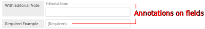

Rich Text Editor
~~~~~~~~~~~~~~~~

A rich-text editor includes controls for enhanced formatting. Authors often use rich-text editors for the main formatted text in a content type.

To implement a Rich Text field, add a ``@ToolUi.RichText`` annotation to a String property.

.. code-block:: java

    public class Article extends Content {

        @ToolUi.RichText
        private String richTextAnnotation;
    }

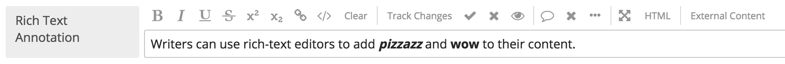

Object Field
~~~~~~~~~~~~

Object fields are controls for displaying a list of existing objects or for creating a new object of a specified class. For example, to implement a list of existing authors in each article object, first create a class for authors.

.. code-block:: java

   public class Author extends Content {
      @Recordable.Required
      private String name;
      
      private String email;
}

.. image:: ./images/new-author.png

Next, include the author class inside the article class.

.. code-block:: java

    public class Article extends Content {

        private String title;
        private Author author;
    }

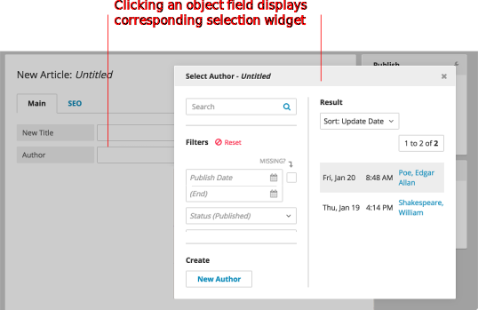

Users can click on the author field to select from a list of existing authors or to create a new author.

Date Widget
~~~~~~~~~~~

The Date widget allows you to choose a specific date from a calendar drop-down menu. With the Date widget, you can specify a publish date for a piece of content, a blog post, or news article, for example.

To implement the Date widget as a field, add private Date to the object.

.. code-block:: java

    public class Article extends Content { 

        private String title;
        private Author author;
        private Date dateWidget;
    }

Boolean Field
~~~~~~~~~~~~~

Add a Boolean field to an object to create a checkbox that will enable a feature specific to the edited content type. For example, you can add a checkbox to auto-play a video.

.. code-block:: java

    public class Video extends Content {

        private String title;
        private String caption;
        private boolean autoplay;
    }

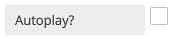

Enum Field
~~~~~~~~~~

Enum field types are drop-down menus with a predetermined list of options. For example, an enum field can list the possible days on which a program airs.

To add an enum field, add a ``public enum`` property to the class and specify the options.

.. code-block:: java

    public class Show extends Content {

        private String title;
        private Day airtime;

        public enum Day {
            SUNDAY, MONDAY, TUESDAY, WEDNESDAY, THURSDAY, FRIDAY, SATURDAY
        } 
    }

List Fields
~~~~~~~~~~~

List fields allow you to create a list that pulls from existing content within Brightspot. For example, if your content needs a list of contributing authors, you can add a List field referencing only Author objects. If a desired author name doesn't exist, you can create a new author in the field search widget.

Once you've created a list of items, you can drag the items on the list to re-order them.

This field can be implemented into an object by adding ``private List<Author> authors``.

.. code-block:: java

    public class Article extends Content {

        private String title;
        private List<Author> authors; 
    }

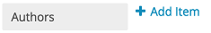

Set Fields
~~~~~~~~~~

Set Fields are similar to List Fields, but items in a Set cannot be reordered. You can implement Set Fields like List Fields.

.. code-block:: java

    public class Article extends Content {

        private String title;
        private Set<Author> authors;
    }

Storage Item
~~~~~~~~~~~~

Storage Items allow files to be uploaded and stored in the default storage mechanism defined in the context.xml.

.. code-block:: java

    public class Article extends Content {

        private String title;
        private Author author; 
        private ReferentialText body; 
        private StorageItem image;
    }

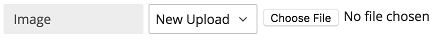

Locations/Regions
~~~~~~~~~~~~~~~~~

You can add a location or region to your content by adding a Location field to your object. When added to an object, the Location field appears on the Content Edit screen as a map, linked to MapQuest, that allows you to define a geographical area by identifying a specific address, selecting a free-form region, or selecting a radius region.

.. code-block:: java

    public class StorePromotion extends Content {

        private String title;
        private ReferentialText description;
        private Location locationMap;
        private Region regionMap;

    }

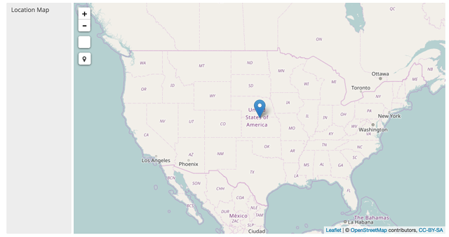

In the example provided above, a Location Field is added to a Store Promotion page and you can identify a specific region for your promotion.

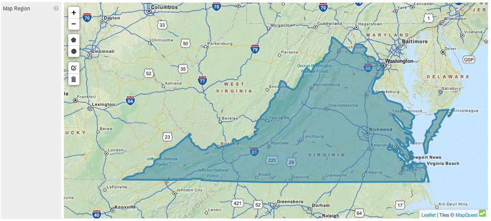

Markdown Editor
~~~~~~~~~~~~~~~

You can use a Markdown editor instead of Rich Text, if needed.

.. code-block:: java

    public class Documentation extends Content {

        private String name;
        private Markdown markdownText;

        // Getters and Setters
    }

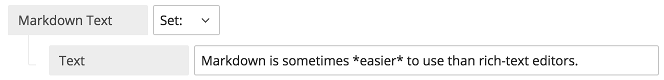

Media List
~~~~~~~~~~

When a list of a content type that has a StorageItem as a preview field is added, it appears in a grid list user interface:

.. code-block:: java

    public class Gallery extends Content {

        private String name;
        private List<Image> images;

        // Getters and Setters
    }

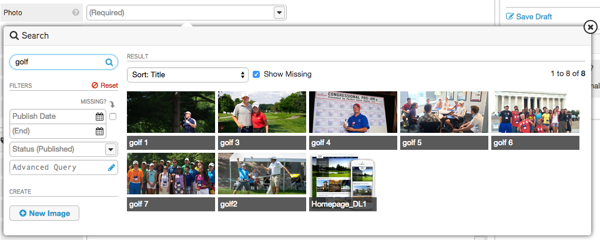

Embedded Types
~~~~~~~~~~~~~~

Embedding exposes a content type's fields within another content type. There are two levels of embedding\ |emdash|\ at the field level and at the class level.

**Embedding at the Field Level**

At the field level, embedding exposes a class's fields within the enclosing content type. In the following example, the Author class is embedded at the field level within the Article class; whenever a user creates or modifies an article, the author's fields are exposed.

.. code-block:: java

    public class Article extends Content {

        private String title;
        @Embedded
        private Author author;

        // Getters and Setters
    }

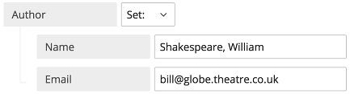

**Embedding at the Class Level**

At the class level, embedding exposes the fields within any enclosing content type. In the following example, the Author class is embedded at the class level. Whenever you create a class that includes Author, the author's fields are always exposed. 

.. code-block:: java

    @Embedded
    public class Author extends Content {

        private String name;

        // Getters and Setters
    }
