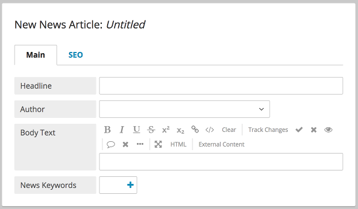
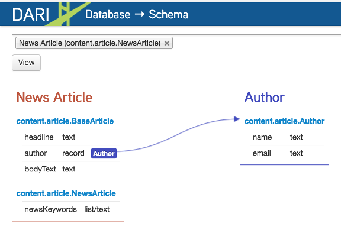

Inheritance
-----------

Parent Child
~~~~~~~~~~~~

Inheritance of classes works in Brightspot as expected in Java. The user interface updates to show inherited fields, and the query API supports the querying of the parent to return children.

Abstract parent classes they are not made available in Brightspot for editorial control. For example, users cannot create new instances of the following BaseArticle abstract class.

.. code-block:: java

    public abstract class BaseArticle extends Content {

        private String headline;
        private Author author;
        @ToolUi.RichText
        private bodyText;

        // Getters and Setters
    }

In contrast, concrete classes extending an abstract class are available in Brightspot. For example, users can create new instances of the following NewsArticle concrete class.

.. code-block:: java

    public class NewsArticle extends BaseArticle {

        private List<String> newsKeywords;

        // Getters and Setters
    }

The Dari db-schema tool shows the inheritance of each type:

Junction Field
~~~~~~~~~~~~~~

The @JunctionField annotation can help with many to many relationships in Brightspot.

This annotation specifies the name of the field in the junction query that should be used to populate the target field. Given two objects, Video and Playlist, JunctionField would allow the population of a list of videos for a playlist on the Playlist object by having each Video object contain a reference to the Playlist it is in.

Video object:

.. code-block:: java

    public class Video extends Content { 

        private String name;
        private StorageItem videoFile;

        @Indexed 
        private Playlist playlist; 
    }
    
The Playlist object:

.. code-block:: java

    public class Playlist extends Content { 

        private String name; 

        @Indexed 
        @Recordable.JunctionField("playlist") 
        private List<Video> videos; 
    }

The @JunctionPositionField annotation specifies the name of the position field in the junction query that should be used to order the collection in the target field.
