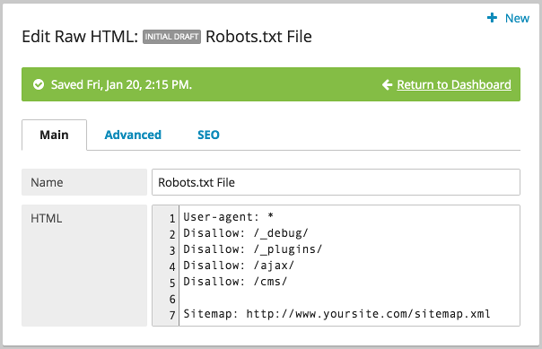
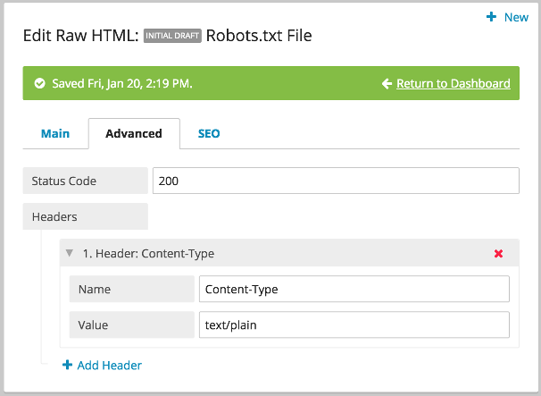

Robots.txt
----------

You can create and manage a robots.txt file with Brightspot. There are two approaches: Raw HTML and Pagefilter.

RAW HTML
~~~~~~~~

In Brightspot, you can use a Raw HTML to create a robots.txt file in the CMS. Create a new RawHTML object, and add disallows:

In the advanced tab, create a new header called Content-Type with the value text/plain.

In the URL widget on the right, add robots.txt as the URL for the object and it will be accessed and rendered when robots.txt is accessed.

PageFilter
----------

For earlier versions of Brightspot, you can use a PageFilter to handle the request through an associated class if you wish to have multiple robots.txt files, for example, on a MultiSite implementation.

The logic processed for the filter is handled in a dedicated filter class, extending AbstractFilter. You can either code the content for the robots.txt into this file or enter it in the CMS, with the RobotsTxtFilter class returning that object. For example, a SiteSettings object, extending Tool, could have a robots.txt string field that is accessed here:

.. code-block:: java

    public class RobotsTxtFilter extends AbstractFilter {

        private static final Logger LOGGER = LoggerFactory.getLogger(RobotsTxtFilter.class);
        private static final String ROBOTS_TXT = "robots.txt";

        @Override
        protected void doRequest(HttpServletRequest request, HttpServletResponse response, FilterChain chain)
        throws IOException, ServletException {
            String servletPath = request.getServletPath();
            if (servletPath.endsWith(ROBOTS_TXT)) { 

                // LOGIC HERE FOR YOUR ROBOTS.TXT

            }
            chain.doFilter(request, response);
        }
    }
