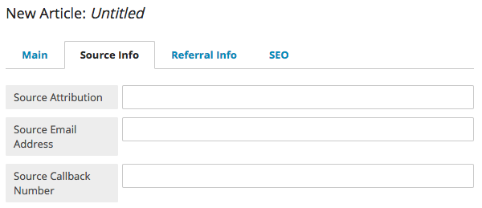

Tools
-----

Built-In Tools
~~~~~~~~~~~~~~

Brightspot provides a comprehensive set of built-in tools for customizing a site to best meet your needs. These tools include Editorial Workflows, MultiSite functionality, User Profiles, Custom Widgets, and Custom Brightspot Navigation.

Profile Defaults
~~~~~~~~~~~~~~~~

Brightspot allows each user to have defaults set in their ToolUser profile. Those defaults drive default field population as they create new content.

**Create the Modification**

Start by modifying the ToolUser class in **Admin > Users & Roles** for the User account, or in the **Profile** drop-down in the top right of Brightspot.

In this example, a default category will be provided for each user. When they create new content that has a Category object in it, it will be automatically populated with their chosen default category. The category can later be changed to any other category from the Content Edit view.

.. code-block:: java

    public class ToolUserDefaults extends Modification<ToolUser> {

        @ToolUi.Note("Choose your default Category")
        private Category category;

        public Category getCategory(){
            return category;
        }

        public void setCategory(Category category){
            this.category = category;
        }

    }

**Update the Content Class**

When you create a new Blog Post, the category field will be pulled from your default settings. To do this, the following piece of code is added to the BlogPost class. Now, when a new blog is created, the logged-in user's default category appears automatically.

.. code-block:: java

    public BlogPost() {

        ToolUser user = getCurrentToolUser();

        if (user != null) {
            ToolUserDefaults category = user.as(ToolUserDefaults.class);

            setCategory(category.getCategory());
        }
    }

Adding Widgets
~~~~~~~~~~~~~~

You can add Widgets as Dashboard widgets or Content widgets. A Dashboard widget appears for all users, so you can provide a custom tool that is available immediately upon login. The Content widget appears on the Content Edit screen in either the right rail or underneath the other widgets.

**Creating the Class**

Create a new class and extend Tool. Add all custom widgets in this class. Introduce the plugin and define the path to the JSP that will render it, if required.

Access custom tools via **Admin > Settings**.

You can add two types of widget: a Page Widget, added via AJAX, and a JSP Widget.

.. code-block:: java

    public class DashboardWidget extends Tool {

        private static Logger LOGGER = LoggerFactory.getLogger(DashboardWidget.class);

        @Override
        public List<Plugin> getPlugins() {
            List<Plugin> plugins = new ArrayList<plugin>();

            plugins.add(createPageWidget(
                    "Dashboard Widget",
                    "dashboardWidget",
                    "/_widgets/dashboardWidget.jsp",
                    DASHBOARD_WIDGET_POSITION, 1, 1));

            plugins.add(createJspWidget(
                    "Content Widget",
                    "contentWidget",
                    "/_widgets/contentWidget.jsp",
                    CONTENT_RIGHT_WIDGET_POSITION, 0.0, 100.0));

            plugins.add(createPageWidget(
                    "Content Widget",
                    "contentWidget",
                    "/_widgets/contentWidget.jsp",
                    CONTENT_BOTTOM_WIDGET_POSITION, 0.0, 100.0));

            return plugins;
        }

    }

**Creating the JSP**

The JSP used to render the content of a widget uses any present h1 tag to create the widget label. It must also include ``<%@ page session="false" %>``.

.. code-block:: jsp

    <%@ page session="false" %>

    

    <h1>New Dashboard Widget</h1>
    Render your widget content here.
    

You can use wp.writeHeader and wp.writeFooter to include the Brihgtspot header and footer if you're creating a new page with a custom tool. For example:

.. code-block:: jsp

    <%@ page import="com.psddev.cms.tool.ToolPageContext"%>

    <%
        ToolPageContext wp = new ToolPageContext(pageContext);

        wp.writeHeader();
    %>

    

    

        

            <h1>Custom Tool</h1>

        

    

    

        

            <h1 class="icon icon-object">New Custom Tool</h1>
        

    

    <%
        wp.writeFooter();
    %>

Adding Tabs
~~~~~~~~~~~

You can customize the tabs and fields available for each content type. The annotation :code:`@ToolUi.Tab` inside a content's class indicates that the subsequent field appears in the specified tab. For example, referring to the following snippet, :code:`@ToolUi.Tab("Source Info")` appearing in :code:`Article.java` indicates that when editing articles the fields :code:`attribution`, :code:`secondaryEmailAddress`, and :code:`callbackNumber` appear in the :code:`Source Info` tab.

.. code-block:: java

   public class Article extends Content {

      @ToolUi.Tab("Source Info")
      private String sourceAttribution;
      @ToolUi.Tab("Source Info")
      private String sourceEmailAddress;
      @ToolUi.Tab("Source Info")
      private String sourceCallbackNumber;

      @ToolUi.Tab("Referral Info")
      private String referralName;
      @ToolUi.Tab("Referral Info")
      private String referralEmailAddress;
      @ToolUi.Tab("Referral Info")
      private String referralCallbackNumber;

   }

Brightspot displays the tabs and fields in the order in which they appear in your source code; see the following illustration.

Workflow Actions
~~~~~~~~~~~~~~~~

With Brightspot's workflow tool, you can create and update content types through a managed workflow with custom transitions and permissions.

If your process require more actions than the default Approval and Publication, you can create a custom workflow modification.

Status In a Workflow
^^^^^^^^^^^^^^^^^^^^

Content in a workflow has the current workflow state saved as a property of the content, "cms.workflow.currentState" : "StatusHere" and the rules around whether it should be made visible in queries "dari.visibilities" : [ "cms.workflow.currentState" ].

Previously published content can re-enter a workflow when you save a draft. Click Save a Draft on published content to get the workflow options for live content. The new draft is referenced and accessible from the live content and replaces the live version if published.

Toggle visibility features on or off for all or some of the states created in workflows using the Query tool: _debug/query.

Modifying a Workflow
^^^^^^^^^^^^^^^^^^^^

Modify the WorkflowLog object to create new actions when specific transitions are made:

`Workflow Log JavaDoc <http://public.psddev.com/javadoc/brightspot-cms/com/psddev/cms/db/WorkflowLog.html>`_

Example - Notify on Transition
^^^^^^^^^^^^^^^^^^^^^^^^^^^^^^

In this example, the user's chosen notification method is used to send a notification that content has been received for review:

Create a user group so multiple editors can be notified at once:

.. code-block:: java

    public class EditorialGroup extends Content implements ToolEntity {

        @Indexed(unique = true)
        @Required
        private String name;

        @Indexed
        private Set<ToolUser> users;

        // Getters and Setters

        @Override
        public Set<ToolUser> getUsers() {
            if (users == null) {
                users = new LinkedHashSet<ToolUser>();
            }
            return users;
        }

        public void setUsers(Set<ToolUser> users) {
            this.users = users;
        }
    }

Create a modification on the WorkflowLog that allows users to select who to notify:

.. code-block:: java

    public class WorkflowLogExtras extends Modification<WorkflowLog> {

        @Indexed
        @ToolUi.DropDown
        @ToolUi.Placeholder("Editors")
        @WorkflowLog.Persistent
        private Set<ToolEntity> editors;

        public Set<ToolEntity> getEditors() {
            if (editors == null) {
                editors = new LinkedHashSet<ToolEntity>();
            }
            return editors;
        }

        public void setEditors(Set<ToolEntity> editors) {
            this.editors = editors;
        }

        @Override
        protected void afterSave() {
            WorkflowLog log = getOriginalObject();
            String userName = log.getUserName();
            String transition = log.getTransition();
            State state = State.getInstance(log.getObject());
            String label = state.getLabel();
            String comment = log.getComment();
            String cmsUrl = Application.Static.getInstance(CmsTool.class).fullUrl("/content/edit.jsp", "id", state.getId());

            for (ToolEntity entity : getEditors()) {
                for (ToolUser receiver : entity.getUsers()) {
                    for (NotificationMethod method : receiver.getNotifyVia()) {
                        switch (method) {
                            case EMAIL :
                                ObjectType type = state.getType();
                                MailMessage mail = new MailMessage();
                                StringBuilder subject = new StringBuilder();
                                StringBuilder body = new StringBuilder();

                                subject.append("[Workflow Notification] ");
                                subject.append(transition);
                                subject.append(" - ");
                                subject.append(label);

                                body.append("User: ").append(userName).append("\n");
                                body.append("Workflow: ").append(transition).append("\n");
                                body.append("Type: ").append(type.getLabel()).append("\n");
                                body.append("Content: ").append(label).append("\n");

                                if (!ObjectUtils.isBlank(comment)) {
                                    body.append("Comment: ").append(comment).append("\n");
                                }

                                body.append("CMS URL: ").append(cmsUrl).append("\n");

                                mail.from("info@yoursite.com");
                                mail.to(receiver.getEmail());
                                mail.subject(subject.toString());
                                mail.bodyPlain(body.toString());
                                mail.send();
                                break;

                            case SMS :
                                StringBuilder message = new StringBuilder();

                                message.append("User: ").append(userName).append(", ");
                                message.append("Workflow: ").append(transition).append(", ");
                                message.append("Content: ").append(label).append(" - ");
                                message.append(comment).append(" - ");
                                message.append(cmsUrl);

                                SmsProvider.Static.getDefault().send(
                                        null,
                                        receiver.getPhoneNumber(),
                                        message.toString());
                                break;

                            default :
                                throw new UnsupportedOperationException(String.format(
                                        "Can't send notification via [%s]", method));
                        }
                    }
                }
            }
        }
    }

Search Tools
~~~~~~~~~~~~

Generate Content from Selection
^^^^^^^^^^^^^^^^^^^^^^^^^^^^^^^

With Brightspot, you can select content in Search and then use your selection to create new content. For example, you can select several videos in Search and turn them into a Video Playlist, or select several images and turn them into a Gallery.

**Implementation**

The SearchResultSelectionGeneratable interface allows you to provide a SearchResultAction so you can quickly produce complex Content instances by injecting selected pieces of Content.

The SearchResultSelectionGeneratable interface provides a code hook, fromSelection(SearchResultSelection). The hook is executed upon creation of a new Draft of the implementing type to populate its state using the current SearchResultSelection. After using the SearchResultSelection to create a new Content instance, the SearchResultSelection is destroyed.

The annotation @SearchResultSelectionGeneratable.ItemTypes is required to designate which types of selected Content can be used to produce a SearchResultSelectionGeneratable type.

**Example A: Content Package Using Interface**

.. code-block:: java

    @SearchResultSelectionGeneratable.ItemTypes({Story.class, PressRelease.class, CaseStudy.class})
    public class ContentPackage extends Content implements SearchResultSelectionGeneratable {

        @Indexed
        private String name;
        private ReferentialText description;

        @Indexed
        private List<PackageContent> packageContent;

        @Override
        public void fromSelection(SearchResultSelection searchResultSelection) {

            List<PackageContent> packageContent = new ArrayList<PackageContent>();

            for (Object object: searchResultSelection.createItemsQuery().selectAll()) {

                if (object instanceof PackageContent) {
                    packageContent.add((PackageContent) object);
                }
            }

            setPackageContent(packageContent);
        }
    }

**Example B: MultiMedia Gallery With Static Abstract Classes.**

.. code-block:: java

    @SearchResultSelectionGeneratable.ItemTypes({Image.class, Video.class})
    public class MultiMediaGallery extends Content {

        private String title;
        private List<Slide> slides;

        // other internal fields

        @Embedded
        private static abstract class Slide extends Record { }

        private static class ImageSlide extends Slide {

            private Image image;

            // other internal fields
        }

        private static class VideoSlide extends Slide {

            private Video video;

            // other internal fields
        }

        public void fromSelection(SearchResultSelection selection) {

            for (Object object : selection.createItemsQuery().selectAll()) {

                if (object instanceof Image) {

                    // If the selected object is an Image, create a new ImageSlide to wrap it.
                    ImageSlide imageSlide = new ImageSlide();
                    imageSlide.setImage((Image) object);
                    getSlides().add(imageSlide);

                } else if (object instanceof Video) {

                    // If the selected object is a Video, create a new VideoSlide to wrap it.
                    VideoSlide videoSlide = new VideoSlide();
                    videoSlide.setVideo((Video) object);
                    getSlides().add(videoSlide);

                }

                // Ignore any other objects that aren't Images or Videos
            }
        }
    }

