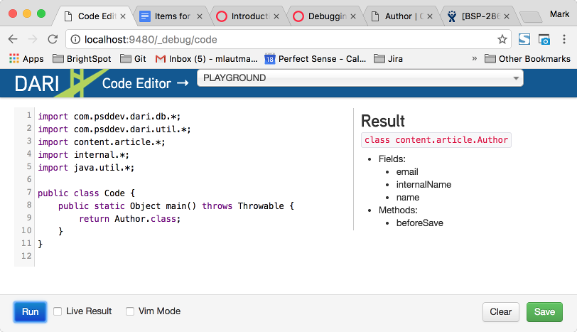
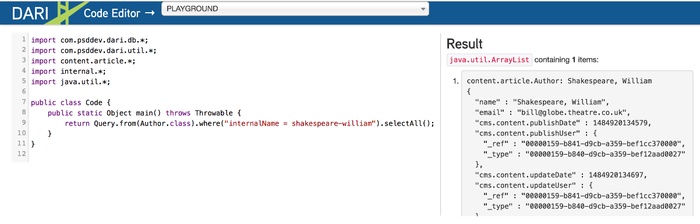
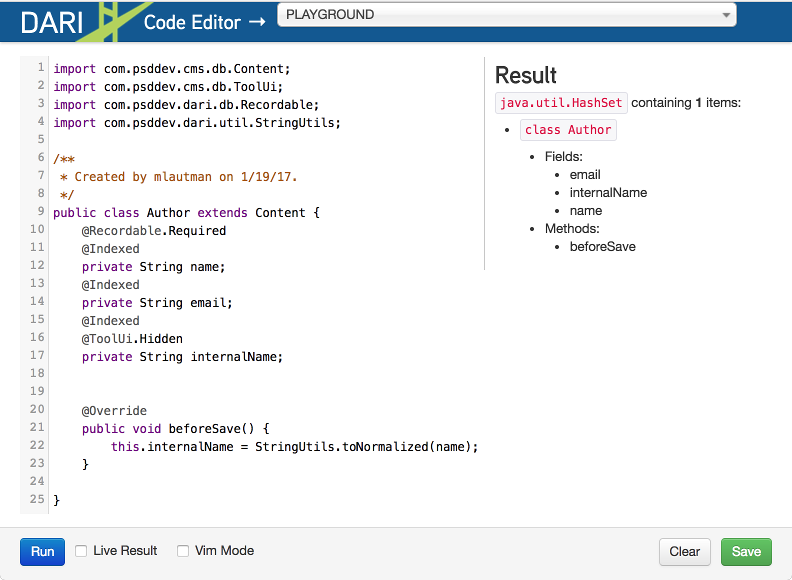
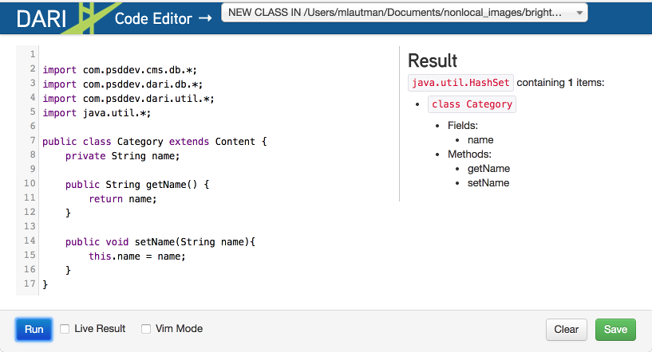

Code Editor
-----------

The Code Editor, available at http://localhost:9480/_debug/code, provides a playground for on-the-fly code compiling from Dari. Here, you can see instant results for the Java code in your browser. 

You can run queries against your project data. For example, returning an Author object where all fields, `getters`, and `setters` are outlined.

Below is an example of a query of authors with internal name = shakespeare-william.

You can also access and edit existing objects from a project. When running locally, any changes saved will be made to the source.

Select the New Class option in the drop-down to create an entirely new object. The example below shows the creation of a new Category object.

