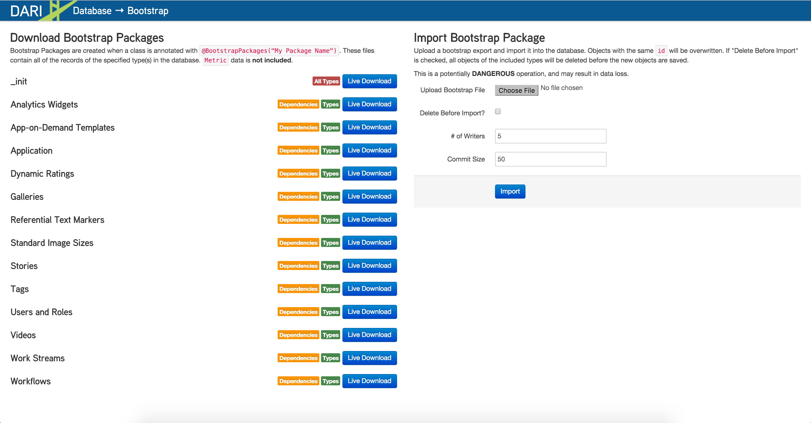

Data Exports/Imports
--------------------

The `db-bootstrap` tool provides a quick Beta way to grab data from Brightspot projects. The best practice for moving data from one instance of Brightspot to another is through MySQL database files. The `db-bootstrap` method is suitable for quick testing.

By default, Brightspot allows certain content packages to be downloaded as a `txt` JSON file.

**_init**: The full database. It is downloaded as a `.txt` file which can be uploaded using the import tool on the right side of the `db-bootstrap` tool.

**Application**: Downloads the application specific settings only. These are programmed in the **Admin > Settings** section.

**Production Guides**: Downloads all created production guides.

**Referential Text Markers**: Downloads any Text Markers created in an instance.

**Sites**: Downloads any MultiSite settings.

**Standard Image Sizes**: Downloads all Crop Image sizes and internal names.

**Users and Roles**: Downloads all Users and Roles from a Database.

**Workflows**: Downloads all created workflows, transitions, and statues.

Custom Packages
~~~~~~~~~~~~~~~~~~

You can create additional applications or objects as packages. Create Bootstrap packages by annotating an application or object class with `@Record.BootstrapPackages("My Package Name")`. For example, to make the Article class a package:

.. code-block:: java

	@Record.BootstrapPackages("Articles")
	public class Article extends Content {
	
	    private String headine;
	    private Author author;
	    private Image image;
	    
	    // Getters and Setters
	}
	
After saving the class, reload DB Bootstrap to find the new package listed. 

Dependencies
~~~~~~~~~~~~~~~~~~

Dependencies are other objects that are referenced by the Package in DB Bootstrap. For example, the Articles package created above has the following dependencies: Author, Image. If a package is downloaded and imported without selecting a dependency, the relationship will be lost if the destination database does not have the dependency types. So, if Articles were downloaded without also downloading Author, when imported into an empty database, the Author values associated with each Article will be null. 

Import Data
~~~~~~~~~~~~~~~~~~

DB Bootstrap also offers a tool to import content into a Brightspot instance. Upload data using the import tool by clicking the ***Choose File*** button. 

.. note::

    Objects with the same ID will be overwritten. If the database importing data to is not empty, check the ***Delete Before Import*** checkbox. If "Delete Before Import" is checked, all objects of the included types will be deleted before the new objects are saved.
