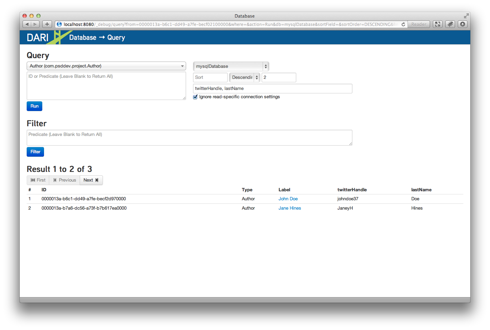
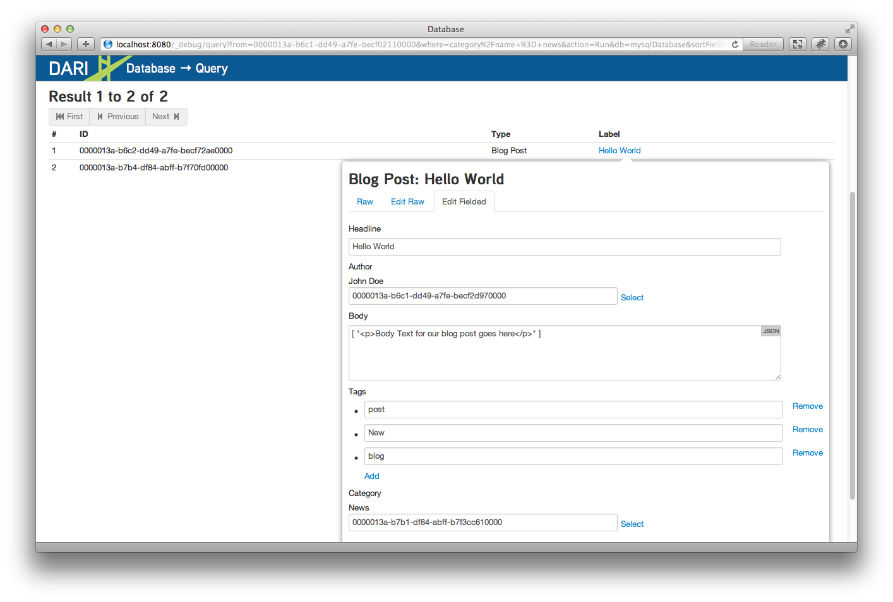

Executing Queries
-----------------

In the Query section, you can query single, aggregated, or multiple SQL and Solr databases.

The `All Types` drop-down allows you to specify the content in which you would like to query. In the example below, running the query against the `Author` content type shows the stored records.

You can provide a specific ID for querying directly. You can choose a single database in the drop-down on the right, and you can specify a sort order and from which field to sort. Use standard operators.

Example Syntax:

::

    title matches "This is the"
    title ^= "This"
    title = "This is the Title"
 
Also, you can search in an object. For example, an Article with an image:

::

	image/caption matches "This is the caption"

Click into each result to get a detailed look at each object in the JSON format.

You can return results for a specific field in an object. The example above specifies the `twitterHandle` and the `lastName`.

Click on a result to show the `JSON`, `Raw JSON` and `Fielded` view that allows control of the object content.

