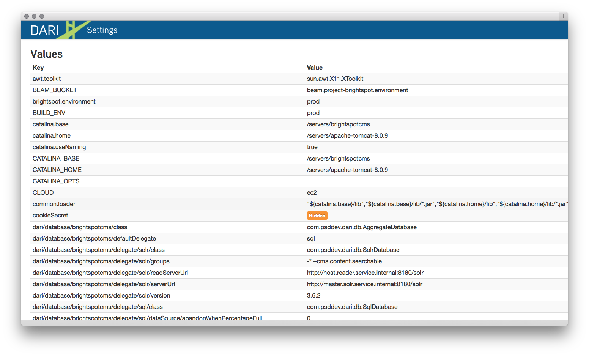

Application Settings
--------------------

The Settings section of the _debug tool gives you an overall view of your application, with information taken from the JVM, server, Tomcat, `context.xml`, and the application, `web.xml` and `pom.xml`. You cannot edit from this view, but it provides direct context for the settings of the running application.

