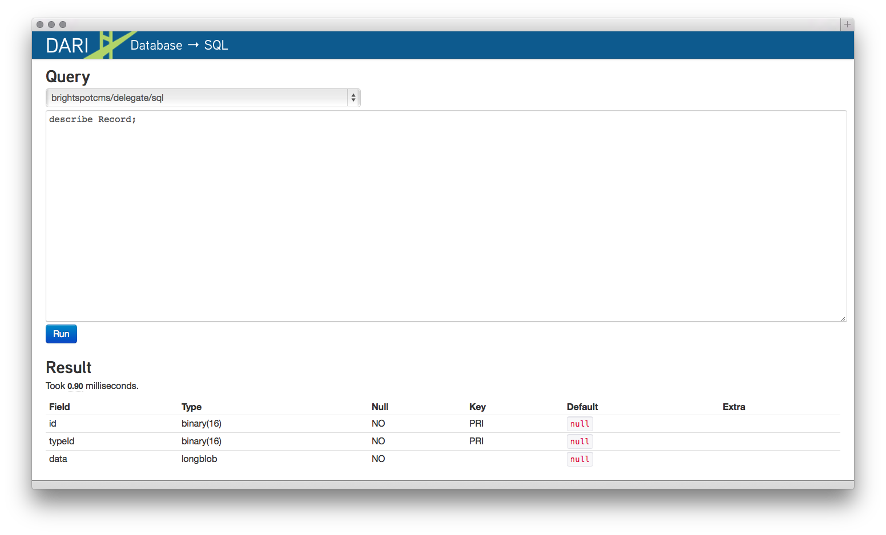

Sql Database
------------

Access to the SQL tables is provided for the `db-sql` tool. Use normal SQL syntax.




Access a database record with the following SQL query:

::

    select hex(id), hex(typeId), data from Record where id = 0xUUID_HERE;

Remove the dashes from the record ID and add ```0x``` in front of it.

View specific columns by selecting the values from a record.

::

    select hex(id), hex(typeId), symbolId, value from RecordString4 where id = 0x00000152cb06daacaf5eeb8e4ce30000;
