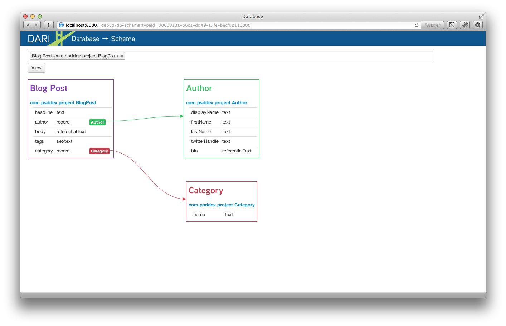

Visual Schema
-------------

A unique view of the data model is available through the Dari Schema tool. All content types in a project are listed. Select the type they want to view, or type to find it in the list.

The schema outlines the model, showing all fields and associated content types. The example shows a Blog object with associated Author and Category objects.

When working on a local machine, the objects listed are clickable, opening the Code Tool directly so changes can be made. 
