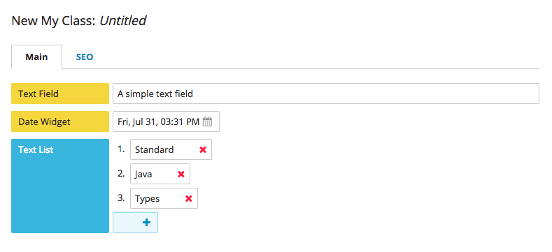

############
Introduction
############

******************
What is Brightspot
******************

Brightspot is a digital experience platform for building scaleable content management and asset management applications, as well as a platform for integrating other publishing systems, such as video, social media, and CRM. Brightspot can be used as a publishing platform for websites and native mobile applications, or as an application backend.

Brightspot can be tailored to the specific business requirements of an organization or industry. It enables the creation, editing, storage, retrieval and delivery of content items at a fine granular level, down to individual attributes of content objects. Web pages, page components and content modules are content objects themselves, making all editorial and management capabilities applicable to them as well.

Brightspot streamlines design, development, and editorial processes:

- Brightspot enables developers to model content types with Java classes. A data model can be altered by modifying the Java classes that define it, without regard to database schema or other configurations.

- Editors are an integral part of the modeling process, directing developers in the "editorial language" that defines content models. The editorial user interface is automatically derived from the underlying Java classes that describe the content objects. 
     
- Brightspot ensures a complete separation of content and display.  Designers and frontend developers can focus on user interfaces (UIs), without prerequiste knowledge of the backend content model implementation.

Brightspot supports any operating system that runs Java, all recent versions of Chrome, Firefox, and Safari, and Internet Explorer 11 or better.

********************
How Brightspot Works
********************

Brightspot is built using the `Dari Framework <http://www.dariframework.org>`_, an object persistence library for building complex content types and persisting them to one or more database backends. Using simple annotations and standard Java types, anything can be modeled and accessed with a web view or through an API.

A simple Brightspot content model might look like this:

.. code-block:: java

    public class MyClass extends Content {

        private String textField;
        private Date dateWidget;
        private List<String> textList;

        // Getters and Setters...

    }

To model content, a Java class must extend the Brightspot class ``com.psddev.cms.db.Content``, which extends the Dari base class of ``com.psddev.dari.db.Record``. To facilitate development, Brightspot includes libraries of content types and annotations.

Brightspot automatically builds a UI from a Java class that models content. An instance of the class is created when the fields are set in the UI and saved. All fields in a class that extends `Content` are persisted to the database when the object is saved.
Brightspot uses Dari to save objects to an SQL database and index them for full-text search.

You have complete control over how your data is stored. Objects are not mapped to database tables, but instead are serialized into JSON and stored in the database as JSON, eliminating the need to alter database tables and allowing you to quickly evolve data models.

::

    {
        "textField" : "Create a user interface automatically",
        "dateWidget" : 1393688100000,
        "textList"; : [ "Standard Java" ],
    }        

In Brightspot, an instance of a content type can be drafted, versioned, searched, and scheduled for publication. Changes between versions can be tracked, and roles and permissions for creating and accessing content instances can be applied.

***********
Get Started
***********

To explore the editorial interface of the Content Management System, install the :doc:`Brightspot Demo application <../demo-install/all>`. Seeded with sample content from Inspire Confidence, the Demo introduces the CMS tools for creating, managing, and publishing content.

To get started with Brightspot development, :doc:`install the platform </cms/developers-guide/installation/index>`. Brightspot applications are built with standard Java development techniques, and the Brightspot stack consists of proven open-source software: Java, MySQL, Solr and Apache httpd. No proprietary technology is used. Brightspot is open-source and freely available for use under the GNU GENERAL PUBLIC LICENSE V2. Brightspot supports any SQL server via JDBC, including MySQL, Postgres, and Oracle.
