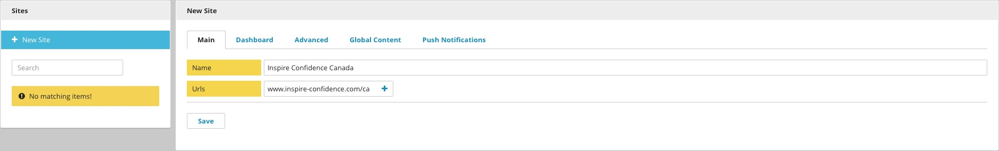

Setup
-----

Brightspot MultiSite allows multiple site applications to be powered by the same codebase and the same instance of Brightspot.

Setup
~~~~~

Go to Admin & Sites and provide one or more URLs for the new sites.

Once a site has been created, you can switch from site to site with the MultiSite menu.

.. image:: images/switch-site.jpg

Once you've selected a site, all content types are available. Content creation is limited by default to the current site. When you've selected Global, any content created is available to all sites. To control access, all content will have a Sites widget on the right side. Ownership can be transferred or left as None, which sets it to Global. Set access to allow some, all, or no sites to access the created content.

.. image:: images/site-permission.gif

