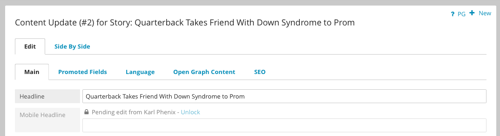
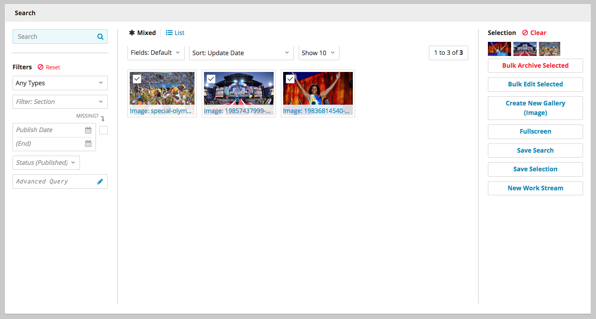
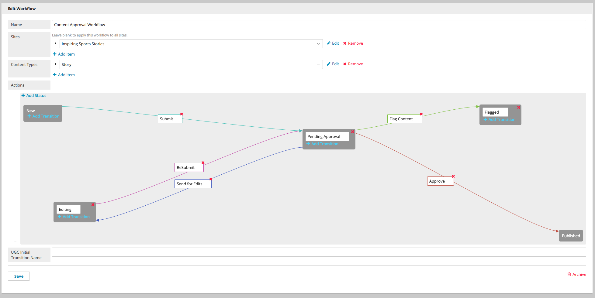

*****************
Release Notes 3.1
*****************

Brightspot 3.1 was released September 22, 2015 as the latest stable release of the platform. The 3.1 update streamlines collaboration and makes content more flexible and responsive.

Real Time Updates
=================

Brightspot 3.1 introduces real time updates to make working as a team easier than ever. As you edit fields, save drafts, and publish or schedule content, your changes are immediately visible to other users with no page refresh required.

Content Locking
===============

With Content Locking at the field level, you can now work collaboratively without worrying about conflicting edits. Brightspot will intelligently lock other users out of individual fields as you work. When your work is complete, it will store different versions of the content automatically and, where applicable, allow it to be merged into the final version of the content, unlocking the field.

New Rich Text Editor
====================

Brightspot 3.1 includes a rebuilt Rich Text Editor using Code Mirror. It provides new tools and capabilities without increasing complexity.

By default, the Rich Text Editor ignores HTML tags and renders them as text. To render HTML, highlight the code and click the Raw HTML  button. You can also toggle the new Rich Text editor into HTML mode. In HTML mode, your content displays with visible HTML code to help you track down an error or add some custom formatting. Click Toggle HTML Mode again to return to the Rich Text Editor with all changes intact.

The new editor also supports greater toolbar customization.

Your implementation can now include clean-up rules for copying and pasting so you can adjust what is stripped out and what remains. The default cleaner supports Word and Google Doc pasting, and you can add custom cleaners to meet your individual needs.

.. image:: images/new-rte.png

Drag and Drop Content
=====================

Content that is embedded and compatible with multiple fields on an object can now be dragged and dropped between the fields, simplifying the process of arranging your content.

Modules can also be dragged and dropped between containers and layouts. Brightspot knows where modules can be placed, and will only permit compatible results.

Content Updates
===============

Brightspot 3.1 improves the way you work with published content. "Draft" now refers exclusively to unpublished content, and the new Content Update function creates a new version of published content that can be used as a base for new content, or edited and saved as a replacement to the original. Multiple Content Updates can be created from a single original, and each Content Update can have its own Workflow for approval. If desired, Content Updates that have moved through a workflow can even be merged into a single final version that incorporates all changes.

Content Updates can be scheduled to publish at specified date and time, and deleting a Content Update will not affect the original content.

Field Scheduling
================

To add more flexibility to the way you edit content, Brightspot 3.1 allows content changes to be scheduled for individual fields as well as entire posts. Changes will proceed as scheduled irrespective of changes to other fields, and will overwrite intervening edits to the scheduled field as well.

Bulk Uploads
============

For your convenience, uploading multiple files will now take you directly to the Fullscreen Search Experience, where Bulk Tools are immediately available.

Optional progress indicators are now available for the Bulk Upload feature. Enable the progress indicators by selecting Admin > Settings > CMS > Debug > Enable Front End Upload.

Improved MultiSite Workflows
============================

Workflows can now be assigned to a specific site in a MultiSite implementation of Brightspot, permitting greater editorial independence for all of your sites.

Multi-Language UI Support
=========================

Modify Brightspot's editorial interface to display any language by creating and adding resource language bundles.

Granular Permissions
====================

New permissions in the Users & Roles section allow administrators to permit or deny actions like Delete, Archive, and Bulk actions.

.. image:: images/permissions.png

Upgrading To Brightspot 3.1
===========================

The 3.1 release of Brightspot includes great new features like a rebuilt Rich Text Editor, a refined user interface, and powerful new methods and annotations.

Requirements
------------

To upgrade Brightspot to the latest version, 3.1, you must have the following software installed:

* Java 1.8
* Maven 3.*
* MySQL 5.6.*
* Tomcat 8

Optional Requirements
---------------------

* Brightspot supports Solr 4.8.1

Update Version
--------------

Update the Dari and Brightspot versions to the latest stable build of Brightspot 3.1

`Releases <https://github.com/perfectsense/brightspot-cms/releases>`_

All Dari and CMS dependencies need to be updated to the 3.1 version you choose:

.. code-block:: xml

    <parent>
        <groupId>com.psddev</groupId>
        <artifactId>dari-parent</artifactId>
        <version>3.1.4561-4d7380</version>
    </parent>

       <properties>
        <dari.version>3.1.4561-4d7380</dari.version>
        <cms.version>3.1.4561-4d7380</cms.version>
         </properties>

        <!-- Dari Util Example-->
        <dependency>
            <groupId>com.psddev</groupId>
            <artifactId>dari-util</artifactId>
            <version>${dari.version}</version>
        </dependency>

        <!-- CMS DB Example-->
        <dependency>
            <groupId>com.psddev</groupId>
            <artifactId>cms-db</artifactId>
            <version>${cms.version}</version>
        </dependency>

Update web.xml
--------------

To support the new field-level locking and real time Dashboard widget updates, Brightspot 3.1 requires the addition of the following to the default web.xml:

.. code-block:: xml

    <async-supported>true</async-supported>.

An example 3.1 web.xml file:

.. code-block:: xml

    <?xml version="1.0" encoding="UTF-8"?>
    <web-app version="3.0" xmlns="http://java.sun.com/xml/ns/javaee"
            xmlns:j2ee="http://java.sun.com/xml/ns/javaee"
            xmlns:xsi="http://www.w3.org/2001/XMLSchema-instance"
            xsi:schemaLocation="http://java.sun.com/xml/ns/javaee
            http://java.sun.com/xml/ns/javaee/web-app_3_0.xsd">

        <display-name>com.packageName: projectName</display-name>

        <!-- Filters -->
        <filter>
            <filter-name>ApplicationFilter</filter-name>
            <filter-class>com.psddev.dari.db.ApplicationFilter</filter-class>
            <async-supported>true</async-supported>
        </filter>
        <filter-mapping>
            <filter-name>ApplicationFilter</filter-name>
            <url-pattern>/*</url-pattern>
            <dispatcher>ERROR</dispatcher>
            <dispatcher>FORWARD</dispatcher>
            <dispatcher>INCLUDE</dispatcher>
            <dispatcher>REQUEST</dispatcher>
        </filter-mapping>

        <!-- BEGIN CUSTOM FILTERS -->

        <!-- END CUSTOM FILTERS -->

        <filter>
            <filter-name>PageFilter</filter-name>
            <filter-class>com.psddev.cms.db.PageFilter</filter-class>
            <async-supported>true</async-supported>
        </filter>
        <filter-mapping>
            <filter-name>PageFilter</filter-name>
            <url-pattern>/*</url-pattern>
            <dispatcher>ERROR</dispatcher>
            <dispatcher>FORWARD</dispatcher>
            <dispatcher>INCLUDE</dispatcher>
            <dispatcher>REQUEST</dispatcher>
        </filter-mapping>
    </web-app>
    <servlet>
            <servlet-name>jsp</servlet-name>
            <servlet-class>org.apache.jasper.servlet.JspServlet</servlet-class>
            <init-param>
                <param-name>fork</param-name>
                <param-value>false</param-value>
            </init-param>
            <init-param>
                <param-name>development</param-name>
                <param-value>${developmentMode}</param-value>
            </init-param>
            <init-param>
                <param-name>compilerSourceVM</param-name>
                <param-value>1.8</param-value>
            </init-param>
            <init-param>
                <param-name>compilerTargetVM</param-name>
                <param-value>1.8</param-value>
            </init-param>
            <load-on-startup>3</load-on-startup>
        </servlet>
        <servlet-mapping>
            <servlet-name>jsp</servlet-name>
            <url-pattern>*.jsp</url-pattern>
            <url-pattern>*.jspx</url-pattern>
        </servlet-mapping>

Upgrading to Solr 4.8.1
-----------------------

Brightspot 3.1 requires that you upgrade your Solr installation to 4.8.1.

**1. Download Solr 4.8.1**

First, download Solr 4.8.1 from the `archive <http://archive.apache.org/dist/lucene/solr/>`_. Copy the solr.war file, found in solr-4.8.1/example, to the Tomcat webapps directory, tomcat/webapps: 

::

    cp solr-4.8.1/example/webapps/solr.war tomcat/webapps

Next, copy the Solr database directory, solr-4.8.1/example/solr, into the Tomcat root directory:

::

    cp -r solr-4.8.1/example/solr tomcat

You must also update two configuration files from Solr with Brightspot specific configurations:

* `Download <https://github.com/perfectsense/dari/tree/master/etc/solr>`_ the Brightspot Solr Config file and replace ``tomcat/solr/collection1/conf/solrconfig.xml``.
* `Download <https://github.com/perfectsense/dari/tree/master/etc/solr>`_ the Brightspot Solr Schema file and replace ``tomcat/solr/collection1/conf/schema.xml``.

The files must be named solrconfig.xml and schema.xml.

Edit the solr.xml file, found in solr/solr.xml, to replace the default host port, <int name="hostPort">${jetty.port:8983}</int>, with the Tomcat port <int name="hostPort">9480</int>

Finally, copy the logging .jar files from /solr-4.8.1/example/lib/ext into tomcat/lib.

**2. Update pom.xml**

Update your pom.xml with the following dependencies:

.. code-block:: xml

    <dependency>
        <groupId>org.apache.solr</groupId>
        <artifactId>solr-solrj</artifactId>
        <version>4.8.1</version>
    </dependency>

    <!-- Optional for Unit Testing -->
    <dependency>
        <groupId>org.apache.solr</groupId>
        <artifactId>solr-core</artifactId>
        <version>4.8.1</version>
        <scope>test</scope>
    </dependency>

Editorial Options in Brightspot 3.1
===================================

Upgrading to Brightspot 3.1 offers powerful new editorial features. Many features are installed and activated by default, but some require configuration before use.

Permissions
-----------

**All Tabs**

In Brightspot 3.1, you can control user access to tabs on specified content types and admin tools. By default, any user with an assigned role will not inherit access to tabs. When the upgrade is complete, each user role must have a tab access level specified. Access levels are only required for users with assigned roles. Users without roles will have access to all tabs by default.

**Permission Control Options**

Brightspot 3.1 adds new options for limiting user access to delete, archive and bulk edit content. All permissions are denied by default for users assigned to a role. To enable these features, update the user role to reflect the desired level of access.

Options
-------

**New RTE**

Brightspot 3.1 includes a rebuilt Rich Text Editor using Code Mirror. You can disable the new CodeMirror-based Rich Text Editor in Admin > Settings > CMS > Debug > Disable Code Mirror Rich Text Editor?.

**Field Level Locking**

With Content Locking at the field level, you can now work collaboratively without worrying about conflicting edits. Brightspot will intelligently lock other users out of individual fields as you work. Enabling Field Level Locking disables opt-in and automatic complete content locking. To turn on field level locking, select Admin > Settings > CMS > Debug > Disable Content Locking?.

**RTC Live Update**

The Real-Time Updating feature in Brightspot can be disabled in the Admin Settings menu by selecting Admin > Settings > CMS > Debug > Disable Rtc?.

**Front End Uploader**

Brightspot 3.1 now includes optional progress indicators for the Bulk Upload feature. Enable the progress indicators by selecting Admin > Settings > CMS > Debug > Enable Front End Upload.

**Extra CSS**

The updated User Interface incorporates new CSS classes that you can style. Add custom CSS in **Admin > Settings > CMS > Debug > Extra CSS**.

::

    .toolNav-toggle {background-color:#000;}
    .toolHeader {background-color:#000;}
    .toolUserDisplay a {color:#000;}

