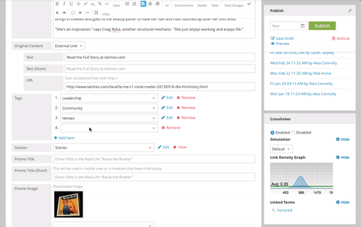

#################
Release Notes 3.2
#################

Brightspot 3.2 was released on January 21, 2016 as the latest stable release of the platform. The 3.2 update includes a new Tables tool for the Rich Text Editor, and numerous smaller improvements and bug fixes.

********
Features
********

This release contains the following features and improvements:

Tables
======

Brightspot 3.2 adds a new Tables feature to the Rich Text Editor, allowing you to easily enrich your content with tables. Add tables to your content in three general ways:

* Create a table directly in the Rich Text Editor: Click the "Table" button in the Rich Text Editor toolbar. The default table is one row high and two columns wide.
* Copy and paste a table: The Rich Text Editor will accept tables copied from most sources, including Microsoft Excel, Google Sheets, Apple Numbers, and rendered HTML tables.
* Create an HTML table: Write your table in raw HTML in the Rich Text Editor, select your code, and click the "Raw HTML" button, or write it in HTML mode.

All features of the Brightspot Rich Text Editor are available in tables, including links, enhancements, text formatting, and change tracking. For more information, please see the Tables chapter.

Rich Text Editor Improvements
=============================

Brightspot's Rich Text Editor is even better in 3.2. Anchor links are now supported in your text, and links you paste from other sources can now be edited to add click tracking or other parameters.

Search Improvements
===================

You can now multi-select images in grid view by clicking anywhere on the image. Search will now offer you options to create new content based on the content you've chosen. For example, if you've chosen multiple images, Brightspot will offer a "Create New Gallery" button. You can also save your multi-selected content as a Selection, which you can return to later, use for bulk actions, or convert into a Workstream.

Dashboard Improvements
======================

The Dashboard is your homepage for working in Brightspot, and 3.2 makes it more flexible than ever. You can now choose specific content to keep in your Common Content widget's Edit Existing section for easy access to the content you edit the most or need to edit again in the future. You can also control which widgets are associated with your content types. The new Selections widget allows you to view or share others' Selections. The Workstreams widget can now be filtered, and will only display 10 Workstreams per page. For more infomration, see the Dashboard chapter.

Interface Improvements
======================

Text fields now support Find and Replace. See the Publishing Tools chapter for more information.

.. image:: images/find-replace.gif

Modal windows now use the name of the field and the parent as a title, and will now appear to the right of the selected field, allowing you to see what you're adding to the field as you add it. (3.2.2)

.. image:: images/modal.gif

Multiple modal windows will stack to the right to make sure the field remains visible. Close the current active modal by clicking the X in the upper right corner, or press Escape to close all modals at once. (3.2.2)

The algorithm for finding users in the Users & Roles section has been improved.

The improved Hotspot interface replaces the right "Edit Hotspot" menu with a less intrusive pop-up menu.

Embedded objects can now be multi-selected.

Publishing Improvements
=======================

The process of creating, saving, and publishing your content has been streamlined and simplified. Please see the updated :doc:`../../../editorial-guide/publishing-process/all` chapter for more detail. (3.2.2)

Architecture and Development Changes
====================================

* The Twilio API has been upgraded to the latest version.
* You can now conditionally validate a field
* Builtwith integration added
* @ToolUi.ReadOnly annotation now allowed at the type level
* A stand-alone Rich Text Editor is available for front end use

*****
Fixes
*****

* RTE Table: Clicking "Link" while editing a table cell no longer causes the link option to load behind the edit field
* RTE Table: Improved handling of comments inside table cells
* RTE Table: Hyperlinks can now be added in table cells
* RTE Table: Changes can now be tracked in tables
* RTE Table: Selecting and moving the cursor beyond the edit cell window no longer closes the window
* RTE Table: Certain scrolling situations in the CMS no longer cause the RTE to disappear when there is a table
* RTE Table: A column can now be removed from a 2-column table
* RTE Table: Moving an enhancement up or down when editing a table cell no longer moves main page
* RTE Inline Enhancement: Raw HTML inside tags no longer breaks the tags
* RTE Inline Enhancement: Removing an inline enhancement after creation is now easier
* RTE Inline Enhancement: Newlines no longer break up tags
* RTE Inline Enhancement: Annotations, validation and state triggers are now applied in the edit pop-up
* RTE: Links can no longer be clicked and edited when object/field does not have write permission
* RTE: Image editor text annotations no longer use the old RTE
* RTE: Commenting text with a spellcheck-flagged word no longer causes the word to appear in a separate box
* Preview: Laptop view is no longer cut off on right side
* Newly saved searches no longer require a page reload to show up
* Saving a search with a multi-valued filter field no longer truncates to single value
* @Filterable fields on a Record no longer cause an error when "matchesany" gets sent to MySQL
* Selecting a search result no longer causes results display to scroll back to the top
* Global search dropdowns are no longer truncated by page height
* Cropping is now pixel accurate
* Empty main tab is visible on Singletons
* @ToolUi.Expanded now takes effect on a list of records

************
3.2.1 Update
************

Brightspot 3.2.1 was released on February 19, 2016 as the latest stable release of the platform.

Features
========

* Uploader: Video can now be synced with MPX via S3 bucket (MPX plugin specific)
* Add UI support for audio files
* RTE Inline Enhancements: Now can specify a RichTextElement is self-closing
* RTE Inline Enhancements: Can now designate that some RichTextElements shouldn't pop up
* RTE Inline Enhancements: Can now designate which tag can be used based on cursor position in DOM
* RTE Inline Enhancements: Can now style inline enhancement toolbar buttons
* Block-styled inline enhancements are now supported
* Side-by-side editing: differences now show up visually
* Side-by-side editing: Tabs for unchanged sections will not be displayed
* The Common Content Dashboard widget can now be customized per user
* For a copied object, only set the owner to current site under specific circumstances
* List entries can now display more information
* Search field selection is now easier in certain circumstances
* Main Content and Miscellaneous Content definitions are now more flexible
* Unpublished gallery and grid items can now be identified by their workflow state
* When creating a new object, the content title now updates dynamically
* Positioning has been added to search result actions
* ToolUsers can now be archived
* Saved Searches UI now handles users with many saved searches more gracefully
* Return to dashboard is now possible in a workflow
* Local changes to Handlebars templates now get picked up by SourceFilter
* Content Update items have been relocated to the Revisions widget
* Admin/Content Locking option has been tidied up
* Visibility labels are improved

Fixes
=====

* RTE Inline Enhancements: Context restriction of RichTextElements no longer allows restricted elements in a nested hierarchy
* RTE Inline Enhancements: Tag dropdown menu no longer exponentially doubles as tags are added
* RTE Inline Enhancements: Popup now positioned at the location of the enhancement, not the button
* RTE Inline Enhancements: Toolbar icon in submenu now gets icon class
* RTE Table: Cell dropdown now appears in the correct position
* RTE: Previewing enhancements no longer requires updating text as well
* RTE: Change case no longer duplicates enhancements
* RTE: Performance no longer as slow for raw html
* RTE: Clicking clear when cursor position is inside a word with inline enhancement no longer causes duplication of the tag
* RTE: Can now be customized in Firefox
* RTE Table: Inserting row before final row no longer causes new cells to show as null
* NullPointerException when using on a null object has been fixed
* Save action during Workstream no longer fails with an error and does not advance the workstream
* Now have a state flag to designate bulk upload import to prevent validation and set draft status
* LIVE is no longer showing pieces of content that aren't LIVE yet
* Scheduled content is no longer showing as live when logged into the CMS
* Subsequent publishes of Content with a StorageItem no longer removes some metadata
* Auto-adding embedded objects through search pop-up no longer adds empty objects that persist after saving
* Dynamic placeholder is now working in widgets
* Focus no longer interferes with image display in some circumstances
* User & Roles: Edit Tool Role no longer hangs
* Manual content locking options renamed for clarity
* Recent Activity "Any Types" no longer shows up with no options
* Projects still using @Renderer.Path will no longer see excessive log message output
* Tab order now maintained from Record field to RTE2
* RTE no longer empty when it's initially hidden and then displayed on user action
* StorageItem copy debug servlet now works on multiple levels
* Set/Add header to ViewResponses now works
* @ReadOnly List no longer shows call-to-action to add another
* Link editor in WYSIWIG now retains link URL
* Select All display no longer has inconsistent count of selected items
* Content revisions widget should no longer time out -- After upgrading, History objects should be re-indexed via /_debug/db-bulk
* Side-by-side changes no longer should become the same when viewing
* Styleguide iframe no longer grows continually when inner content has height set to 100%
* ViewModel#createView(Class, Object) no longer returns null when 2 different ViewBindings present
* Adding public setter methods to ViewModels no longer causes NullPointerException in ViewMap#toString
* Preview link now displays when using ViewBinding annotation
* Adding an internal link no longer generates an extra object
* Visibility label on notification no longer has odd positioning
* Task host setting is now available for metrics re-calculation task
* Scrolling on a short Edit page no longer causes page frame to move when a search carousel is present
* Object search popups no longer fly off the screen
* Search result carousel: Long label no longer overflows container
* Track changes - accepting a change no longer reverts styling
* Advanced Search - .csv exports no longer show errant  s
* Clicking "gallery" view link when initially viewing a gallery-view field does not show the gallery
* Redirect URLs on content with double-asterisked permalinks no longer results in single-asterisked URLs
* "Back To" link on edit page popup no longer shows concatenation of all @ValidTypes

************
3.2.2 Update
************

Brightspot 3.2.2 was released on March 18, 2016 as the latest stable release of the platform.

Features
========

* Views can now be rendered outside the Servlet/PageFilter context
* Sort Relevant now works with Publish Date
* RTE - Inline Enhancements - RichTextElements can now be declared read-only
* RTE - Inline Enhancements - Usage of RichTextElement can now be restricted by field
* RTE - Inline Enhancements - Some no-field, no-popup enhancements now behave like regular markup buttons
* RTE - Inline Enhancements - RichTextElement groups can now be designated as exclusive, which prevents nesting
* RTE - Inline Enhancements - A tooltip can now be specified for the enhancement button on the toolbar
* RTE - Inline Enhancements - Workflow can now be "Apply" and update form without closing
* RTE - Inline Enhancements - Key mappings can now be bound to inline enhancements
* RTE - Tables - Can now designate where tables can be used, like RichTextElement
* RTE - User and timestamp now appears on comments
* @ToolUI.Expanded now works on the outer field declaration
* "Profile" on the header navigation is now independently localizable from the User panel "Profile"
* Saved Searches are now deletable from the Search interface
* Different render results can be displayed based on the same handlebar template
* SourceFilter/Reloader now work with the Brightspot MVVM paradigm
* Object Picker view no longer falls out of browser
* Workstreams - when exhausted, user is now notified the workstream is empty
* Search for Record now matches text query against all labelfields, not just the first one
* Label for list/record field now displays "Untitled" if label is object UUID
* Embedded object label now displays "Untitled" instead of UUID
* Multi-Site implementations now support Site Categorization. See Multi-Site for more information.

Fixes
=====

* Tab is now activated even if tab name has a space
* RTE - typing is very slow
* RTE - Full screen editing toolbar no longer cuts off the top when you start typing
* RTE - switching to HTML mode when using track changes no longer changes all text to green
* RTE - when cutting and pasting a table, the enhancement no longer appears at the top of the body field
* RTE - cutting and pasting a list from Google Doc no longer creates 2 extra lines between each item
* RTE - toggle style across multiple lines now works more reliably
* RTE - can now toggle a single styled character
* RTE - clearing part of a style no longer leaves style to which no text can be added
* RTE - placing cursor on paragraph below an image enhancement and hitting enter no longer generates a new line above the enhancement
* RTE - when using track changes, highlighting text, deleting and then typing will now add text
* RTE - when scrolling up and down the first line of the sticky toolbar is now visibile
* RTE - spellcheck performance is improved
* RTE - ReferentialText fields now always show yellow highlight when field has been changed
* RTE - no longer shows field as modified when in readonly mode
* RTE - Inline Enhancements - enhancement with popup now works inside the popup form of another inline enhancement
* RTE - Inline Enhancements - RTE no longer shows visible dropdown by default when a field ends with an inline enhancement
* RTE - Inline Enhancements - Read and write access now available to ReferentialText element children content within the ReferentialTextElement class
* RTE - Inline Enhancements - Button and menu items no longer move randomly after every server restart
* RTE - Inline Enhancements - "Clear" dropdown no longer shows up for RichTextElements inside ReadOnly field
* RTE - Inline Enhancements - Concrete classes are no longer ignored in "children" attribute of RichTextElement.Tag
* RTE - Inline Enhancements - Toolbar menus no longer cut off when menu appears near edge of RTE
* RTE - Tables - Toggling upper/lowercase selected text under a table or enhancement no longer duplicates the table or enhancement
* Preview - Safari - preview now has vertical scrollbars
* Preview - no longer experiences issue where preview doesn't show when inline style set to "height: 0px;"
* Workstreams - now function if item is added to second workstream
* User & Roles: Edit Tool Role no longer hangs in some circumstances
* Can now search ToolUser on last name
* Nested @ReadOnly fields and @ReadOnly fields on @ReadOnly types no longer decrease legibility with increasing transparency
* Object ID Select now showing selecting object in field
* Dropdown js requirejs loading/timing is now fixed
* Gallery - horizontal toolbar no longer shows vertically
* Can now reorder List
* Collapsing one note no longer collapses all notes
* Resource Widget link with "Same Window" true no longer triggers a frame ajax request
* Profile - "search" is now suppressed in the User Profile tabs
* Tab button now works to move between fields
* Debug HTML no longer embedded into rendered Handlebars view when it's not an HTML response
* UrlViewTemplateLoader no longer throws NullPointerException when a view template cannot be loaded
* CSRF race condition no longer causes 500 error to display on preview pane when preview is already open
* Multi-valued search filter no longer shows duplicate value rather than input placeholder for second value
* SQL query using /! IGNORE INDEX (PRIMARY) / no longer causes query timeout
* Visibility label in list of objects is no longer doubled
* Search columns with wrapped links no longer have unclickable links
* HTML label on repeatable object no longer breaks display
* Edit popup "Back" text ("Back To __") is no longer missing type on ToolUser page
* Recent Activity widget no longer shows "Please select a {0}" when refining

************
3.2.3 Update
************

Brightspot 3.2.3 was release on April 20, 2016 as the latest stable release of the platform.

Features
========

* ImageEditor now has new setting, privateBaseUrl, which will be used (if provided) by proxy.jsp to fetch the resized image
* RTE Tables: Cell context menu now has "Delete"
* StorageItems can now be created from http parameter using HttpFileParameter annotation
* HeadView$Builder#addItems now handles Collection argument
* Bulk Edit: Success / Failure Messaging is now color-coded
* View system now supports modules embeds
* Record text search on @LabelFields now matches case

Fixes
=====

* RTE: Clicking Save on a Quote Enhancement is now responsive
* RTE: Full screen view is no longer obscured by the right rail or other widgets when you activate full screen after scrolling down the page
* RTE: Track changes on multiple RTEs no longer causes javascript error on form submit
* RTE: No longer shows as modified when user has not made changes
* RTE Inline Enhancement: Cursor can now move past enhancement even if EOL contains enhancement that has been cleared
* RTE Inline Enhancement: Hotkeys no longer allow restricted elements to be used inappropriately
* RTE Inline Enhancement: Applying URL citation to italic text no longer creates incorrect XML structure and RTE display
* RTE Inline Enhancement: Large objects no longer cause GET response of 400 Bad Request from enhancement.jsp
* RTE Inline Enhancement: Restricted elements are no longer disabled inside track changes markup
* RTE Inline Enhancement: Taxon view popup no longer flies all over the screen on second use after popup save
* RTE Inline Enhancement: For read only enhancements, there is now a visual cue that once you start typing you are outside the enhancement
* RTE Tables: Can now save image in cell, Save button is no longer unreachable
* RTE Tables: Cells that have wrapped text no longer push right side of table out of body field edge
* CMS Background image uses secure URL when request is secure
* StorageDebugServlet no longer saves all items in the database when the "saveObject" checkbox is checked
* Scheduled Content: Enhancements no longer disappear and don't get published
* Field level updates now update on initial draft
* Create New popup form now scrolls so all fields are reachable
* @ToolUI.ReadOnly type can no longer be created via "Create New"
* Gallery interface no longer sends you to the first image when clicking edit on any image
* Hotkeys no longer work when associated toolbar buttons have been removed
* Read only elements now contain all of their context elements
* Pagination on lazy-loaded search results has been removed as it was not providing accurate information
* Archive button no longer appears on ReadOnly types
* "Save Draft" button no longer disappears if an Object has an error on save
* "Save" button no longer missing when you copy new from a draft
* Embedded object field containing embedded object fields with multiple type options no longer incorrectly sends all types
* Taxon list now scrolls
* Search Result images are now clickable even when Suggestions are present
* Article image enhancements: Now able to select image size for left-aligned enhancements in line with page breaks
* Incorrect stacked popup behavior is now fixed
* Article enhancement box no longer locks in place where editors can't access "Save" button
* Field-level locking now occurs when second user is in a popup or overlay
* Read only fields can no longer be edited
* Second level deep editing is now working
* "Add Item" issue where empty item gets added exorcised again
* Enhancements: Long list of image sizes is now clickable
* db-bulk copy will now copy invisible objects
* IllegalStateException no longer occurs in login.jsp
* Dynamic text no longer gets replaced if contents haven't changed
* Nested popups is now cleaned up
* "Content Update Items" banner no longer returned on ajax save
* StorageItemFilter no longer throws NullPointerException if parameter is not set
* Edit overlay popup no longer missing text at the end of "Back To" in user profile settings tab
* Edit popup scrolls down off the page in a normal manner
* Updating newly created content in a popup no longer causes an error
* Predicates' order in combined predicate containing both case-sensitive and case-insensitive "contains" operators no longer mis-uses first operator in place of all subsequent operators in SQL generation
* Publishing widget is now always sticky in the full screen UI
* Add Dari Query Comment to SolrQuery to enable better query analysis
