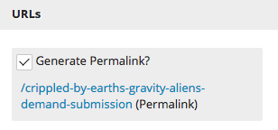

Automatically Creating Permalinks
^^^^^^^^^^^^^^^^^^^^^^^^^^^^^^^^^

Permalinks are the links external readers use to access a published web page. Brightspot includes an interface for creating permalinks automatically.

#. Returning to the IDE, update the file Article.java with the following:

.. code-block:: java

   package content.article;

   import com.psddev.cms.db.Content;
   import com.psddev.cms.db.Directory;
   import com.psddev.cms.db.PageFilter;
   import com.psddev.cms.db.Site;
   import com.psddev.cms.db.ToolUi;
   import com.psddev.cms.view.ViewBinding;
   import com.psddev.dari.db.Recordable;
   import com.psddev.dari.util.StringUtils;

   @ViewBinding(value = ArticleViewModel.class, types = PageFilter.PAGE_VIEW_TYPE)
   public class Article extends Content implements Directory.Item {

      @Recordable.Required
      private String headline;

      @ToolUi.RichText
      private String body;

      public String getHeadline() {
         return headline;
      }

      public void setHeadline(String headline) {
         this.headline = headline;
      }

      public String getBody() {
         return body;
      }

      public void setBody(String body) {
         this.body = body;
      }

      @Override
      public String createPermalink(Site site) {
         return StringUtils.toNormalized(getHeadline());
      }
   }

2. Refresh the web page running at localhost:9480. A permalink appears in the URLs widget.

3. View your article at http://localhost:9480/crippled-by-earths-gravity-aliens-demand-submission.

.. image:: images/published.png

The previous listing uses the  @ViewBinding annotation to bind the article’s model to the view model created in the previous step. This annotation is the link between the article’s model and its view.

For more information about the permalink interface, see `Interface Directory.Item <https://artifactory.psdops.com/psddev-releases/com/psddev/cms/3.2.6504-ad4fbd/cms-3.2.6504-ad4fbd-javadoc.jar!/com/psddev/cms/db/Directory.Item.html>`_. Similarly, for more information about the @ViewBinding annotation, see `Annotation Type Viewbinding <https://artifactory.psdops.com/psddev-releases/com/psddev/cms/3.2.6504-ad4fbd/cms-3.2.6504-ad4fbd-javadoc.jar!/com/psddev/cms/view/ViewBinding.html>`_. 
