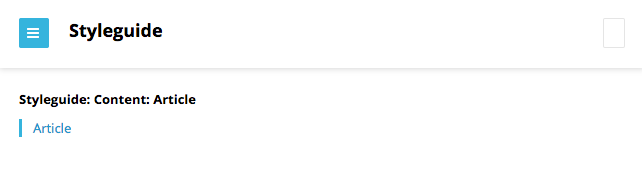

Creating an Article View
~~~~~~~~~~~~~~~~~~~~~~~~

An article's view represents how an article appears on the screen. This typically includes character- and paragraph-level formatting, headers and footers, and other standard features for web pages. 

Brightspot maintains views inside a styleguide.

Step 1: Open Blank Styleguide
^^^^^^^^^^^^^^^^^^^^^^^^^^^^^

In this step, you run and open the blank styleguide.

#. Ensure port 3000 on your local machine is open.
#. Open a new command window and change to ``brightspot-tutorial/``.
#. Run ``gulp styleguide``. A server starts.
#. In your web browser, open http://localhost:3000/_styleguide/index.html. An empty styleguide appears.

.. image:: images/styleguide_blank.png

Step 2: Add Article View to Styleguide
^^^^^^^^^^^^^^^^^^^^^^^^^^^^^^^^^^^^^^

By convention, views are in directories parallel to their models. In this step, you create a view for your article model in the appropriate directory.

#. Open a new command window and change to ``brightspot-tutorial/styleguide/``.
#. Create a directory content/ and a subdirectory article/: ``mkdir -p content/article/``.
#. Change to the new directory ``content/article/``.
#. Create the file Article.hbs and enter the following text:

.. code-block:: html

   

      <h1 class="Article-headline">
         Headline Text
      </h1>
    
      

         Body Paragraphs
      

   

5. In the same directory, create a new file Article.json and enter the following text:

.. code-block:: html

   {
      "_template": "Article.hbs"
   }

6. Refresh the web page running at localhost:3000/_styleguide/index.html. An entry for the article appears. (If you do not see an entry for the article, in the terminal press Ctrl-C to stop the server and then rerun ``gulp styleguide``.)

7. Click **Article**. The style guide displays boilerplate text for the heading and body.

.. image:: images/styleguide_default_boilerplate.png
 
Step 3: Modify a View's Boilerplate Text
^^^^^^^^^^^^^^^^^^^^^^^^^^^^^^^^^^^^^^^^

The default view you created in the previous step includes standard boilerplate text. You can use helpers to modify the boilerplate text and give authors a better idea of an article's final appearance.

#. In the text editor, return to the file Article.hbs and enter the following text:

.. code-block:: html

   

      {{#with headline}}
         <h1 class="Article-headline">
            {{this}}
         </h1>
      {{/with}}

      {{#with body}}
         

            {{this}}
         

      {{/with}}
   

2. In the text editor, return to the file Article.json and enter the following text:

.. code-block:: json

   {
      "_template": "Article.hbs",
      "headline": "Headline Text",
      "body": "lorem ipsum"
   }

3. Refresh the web page running at localhost:3000/_styleguide/index.html and click **Article**. The new boilerplate text appears.

.. image:: images/styleguide_custom_boilerplate.png

For more information about the helpers available in a view's JSON and handlebars files, see `Brightspot Base <http://docs.brightspot.com.s3-website-us-east-1.amazonaws.com/base/all.html>`_ and  `Handlebars <http://handlebarsjs.com/>`_.

Step 4: Randomize a View's Boilerplate Text
^^^^^^^^^^^^^^^^^^^^^^^^^^^^^^^^^^^^^^^^^^^

Brightspot's JSON files include a helper you can use to randomize the boilerplate text.

#. Returning to the IDE, update the file Article.json with the following:

.. code-block:: json

   {
      "_template": "Article.hbs",
      "headline": "{{words(10)}}",
      "body": "{{paragraphs([2,3])}}"
   }

2. Refresh localhost:3000/_styleguide/index.html and click **Article**. The boilerplate text is now randomized.

.. image:: images/styleguide_randomized_boilerplate.png

For more information about the helpers available in a view's JSON file, see `Brightspot Base <http://docs.brightspot.com.s3-website-us-east-1.amazonaws.com/base/all.html>`_.
