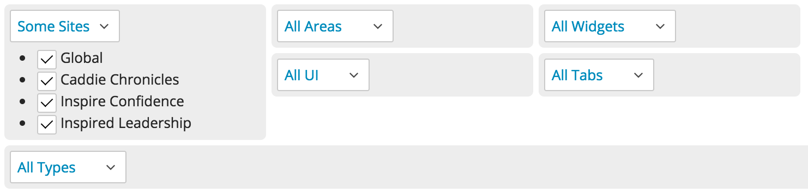

.. |emDash| raw:: html

   &#8212;

Contributor Controls
====================

A role's definition includes access to various Brightspot controls. The following sections describe those controls and how to use them.

Working with Contributor Controls
---------------------------------

The contributor controls are drop-down lists with three options: all, none, or some.

* If you select all, the role has access to all options within that feature. For example, selecting ``All Sites`` grants the role's users access to all sites.
* If you select none, the role has no access to the options within that feature. For example, selecting ``No Sites`` prevents the role's users from accessing any site.
* If you select some, the role has access to those options you select. For example, selecting ``Some Sites`` grants the role's users access to those sites you select.

Sites Control
-------------

If your Brightspot implementation has multiple sites, the sites control indicates which of the sites a role can access. For example, a Spanish-speaking role might be limited to the Spanish and English sites, not French and German sites. If access to one or more sites is prohibited for a role, users with that role cannot access the ``Global`` option because it encompasses all sites in that Brightspot implementation.

.. image:: http://cdn.brightspotcms.psdops.com/dims4/default/da33665/2147483647/resize/380x/quality/90/?url=http%3A%2F%2Fd3qqon7jsl4v2v.cloudfront.net%2Fdc%2F65%2Fa8c427954a6088e00656c8aeb8bc%2Fscreen-shot-2014-12-05-at-120127-pmpng.44.35.png

Areas Control
-------------

The areas control contains the following sub-controls:

* Content\ |emdash|\ Covers the Dashboard and User-Generated Content (UGC). Assigns access to either view or both views, including all content created internally and externally.
* Crosslinker\ |emdash|\ Limits access to different features of Crosslinker, including Dictionaries, Dictionary Import, Simulations, Term Finder, Term Mappings, and Terms. (This sub-control is available if the Crosslinker is included in your version of Brightspot.) If you select ``No Crosslinker``, the Crosslinker tab does not appear in that role's Brightspot interface.
* Admin\ |emdash|\ Controls access to features in the Admin tab. If you select ``All Admin``, role sees all admin features in the Admin tab. If you select ``No Admin``, the Admin tab is not available.

.. image:: http://d3qqon7jsl4v2v.cloudfront.net/7b/d8/36d7caf94759b4e553b1f5ac3ab9/screen-shot-2016-03-29-at-3.21.43%20PM.jpg

Widgets Control
---------------

The widgets control specifies which Dashboard and Content Edit widgets are available to a role.

.. image:: http://d3qqon7jsl4v2v.cloudfront.net/09/6b/90b4a04244fe812091e1a10965a4/screen-shot-2016-03-29-at-3.22.59%20PM.jpg

By limiting widgets, you can prevent certain roles from creating new content, scheduling content, setting URLs, and accessing other basic functions.

Types Control
-------------

The types control shows sub-controls for the content types associated with your Brightspot implementation. For each content type, you can set permissions for the role. 

.. image:: http://cdn.brightspotcms.psdops.com/dims4/default/2221de7/2147483647/resize/700x/quality/90/?url=http%3A%2F%2Fd3qqon7jsl4v2v.cloudfront.net%2F44%2Fda%2Fc5f4639649c1843ac693715e4ec5%2Fscreen-shot-2014-12-05-at-120002-pmpng.54.01.png

For example, you could create a role that can read or write screenshots. You can also exclude specific fields in a content type; typing ``Author`` in the Exclude field prevents the role from assigning authors to the screenshot.

.. image:: images/some-screenshot.png

