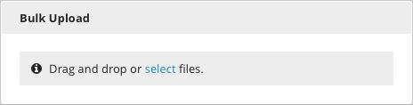
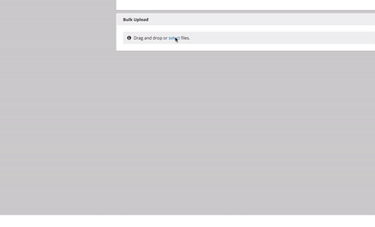

Bulk Upload
-----------

With the Bulk Upload widget, you can upload multiple files to Brightspot simultaneously by dragging and dropping or clicking the Select Files button and choosing the desired assets from your local machine. All files selected for the purposes of a Bulk Upload must be of the same content type (e.g., images, videos, etc.).

Any metadata or edits made during the bulk upload process will apply to all files. No changes may be made to unique fields like "Name." Unique fields may be edited on individual files after the upload is complete. Making an entry in a unique field during a bulk upload will cause an error.

