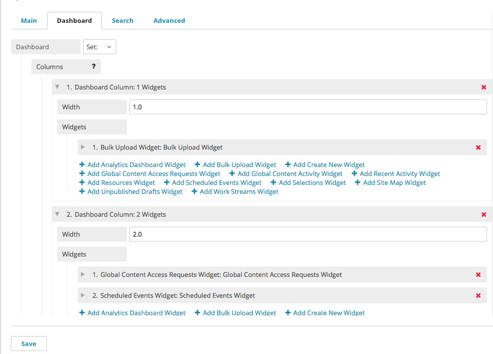

Building a Custom Dashboard
---------------------------
 
Brightspot's default Dashboard is designed to make your job easy, but you can also customize your Dashboard to make it perfect. Dashboard customization is available to you in four different ways:

* The Global Dashboard, which is the Dashboard that every user sees by default. **Admin -> Settings -> Dashboard**
* The Site Dashboard, which is the Dashboard that only users of a specific site will see by default. **Admin -> Site -> Dashboard**
* The Role Dashboard, which is the Dashboard that only users with a certain role will see by default. **Admin -> Users & Roles -> Dashboard**
* Your personal Dashboard, which is a Dashboard that only you will see. **Profile -> Dashboard**

The order of preference goes from least personal to most personal. For example, a Dashboard created for a site will be ignored in favor of a Dashboard created for a Role, and a Dashboard created for a Role will be ignored in favor of a personal Dashboard. If you wish to enforce the use of a specific Dashboard, you can change the Roles and Permissions to restrict the ability to create Dashboards to the desired level.

When you're ready to create a new Dashboard, click the drop-down menu next to "Dashboard" and select "Set:". Add as many columns as you need with the "Add Dashboard Column" button. Click the grey arrow next to a column to change the width of the column or add Widgets. To return to the default Dashboard, return "Set:" to "None".

Dashboard Column widths are entered as relative ratios or precentages. For example, in a three-column Dashboard, assigning each column a width of "1" will produce the same result as a width of "33": each column will occupy a third of the screen. Similarly, in a two column Dashboard, assigning the left column a width of "1" and the right column a width of "2" will yield the same results as "33" and "66", respectively. By default, or if the Width is left blank, columns will divide the available space equally.

Click the name of the desired widget to add it to a column. Reorder widgets in a column by dragging and dropping. You can also drag and drop widgets between different columns. You can also add the same widget to your Dashboard in multiple locations. For example, with two Recent Activity widgets on your Dashboard, you could leave one filtered to display just your activity, and the other could show all activity on the site.

When you've finished designing your Dashboard, click Save at the bottom.
