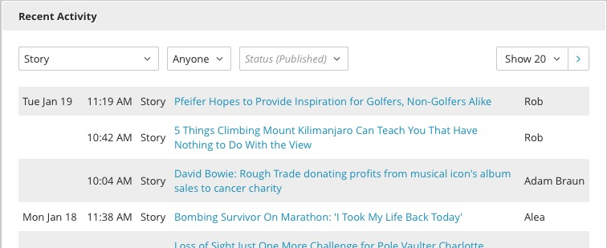

Recent Activity
---------------

The Recent Activity widget is a live window into all publishing activity across the entire site, displayed in the order of publication. You can use this widget to track the efforts of the publishing team and to locate recently published or edited content. The widget displays the name of the content, the date and time it was published, and the name of the user who published it. Editors can filter content by Type, User, and Status with the drop down menus at the top. Filters are cumulative, and will persist between sessions and page reloads.

