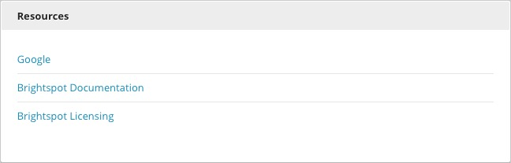

Resources
---------

The Resources widget, which is inactive by default, allows you to make useful files or links accessible from the Dashboard. You can add links or files in Admin Settings under Resources.

