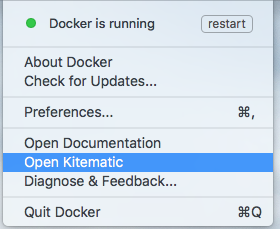
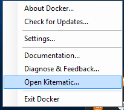
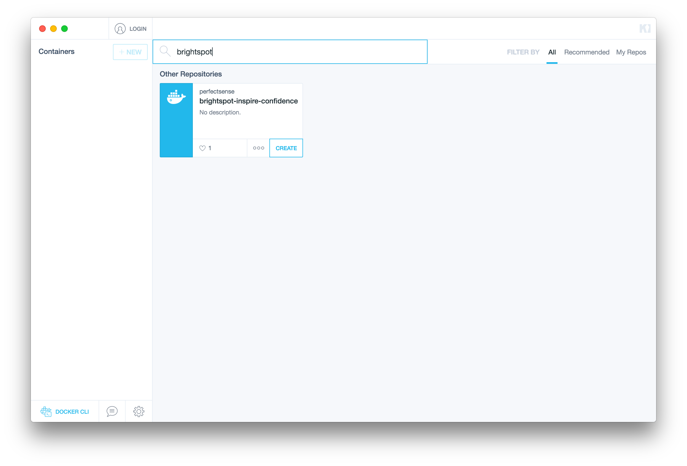
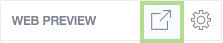
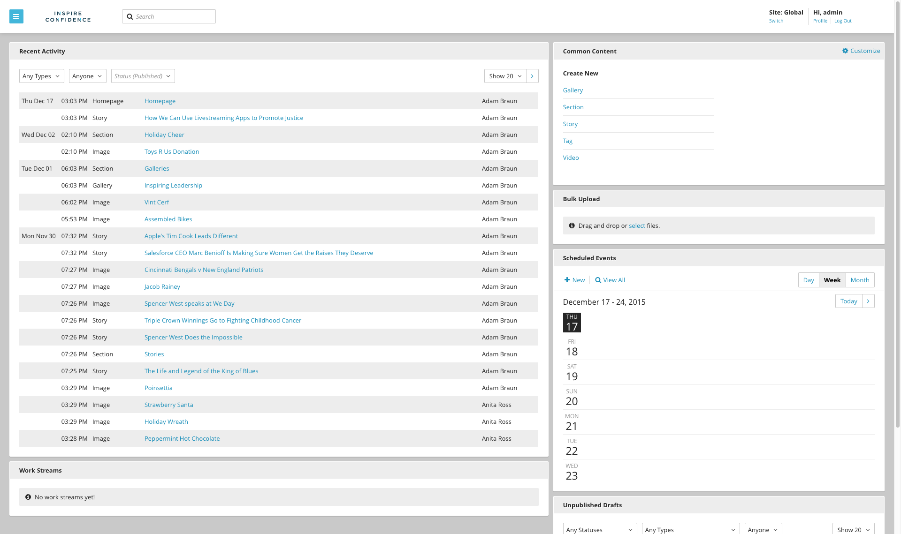

===================================================
Using Docker Platform
===================================================

The following procedure is for installing Brightspot using Docker Platform. Docker Platform is recommended for OS X, or the Windows 10 Professional or Enterprise 64-bit operating system. For earlier versions of Windows, you must install Docker Toolbox.

--------------------------------------------
1. Download and Install the Docker Platform
--------------------------------------------

Begin by downloading the |docker_platform| installer for your operating system.

.. |docker_platform| raw:: html

     <a href="http://www.docker.com/products/overview#/install_the_platform" target="_blank">Docker Platform</a>

When the download is complete, double-click the Docker Platform installer and follow the instructions for your operating system.

OS X
-----

Once installed, click the Docker icon in the menu bar and choose **Open Kitematic**. If Kitematic is not already installed, follow the instructions to download it.

Windows
-------

When the Docker Setup Wizard completes, select the Launch Docker checkbox and choose **Finish**. If Hyper-V is not already enabled on your PC, enable it. This requires a Windows restart.

After Hyper-V is enabled, open the Start menu and click **Docker for Windows**.

Once Docker is loaded, right-click the Docker icon on the taskbar and choose **Open Kitematic**. If Kitematic is not already installed, follow the instructions to download it.

-----------------------
2. Install Brightspot
-----------------------

When you open Kitematic for the first time, you'll be prompted to provide a username and password. If you already have a Docker Hub account, you may use it here, but an account is not required to continue.

Next, locate the Brightspot container by searching for ``brightspot`` in the search box at the top of the Kitematic screen. Kitematic will locate the correct container for you. Click **Create** to download the container to your computer. You'll see it appear under **Containers** in the leftmost column. The Brightspot container is over 900 MB in size, so it may take a few minutes to complete, depending on the speed of your internet connection.

--------------------------------------
3. Start an Instance of Brightspot
--------------------------------------

When the Brightspot container has finished downloading, a black **CONTAINER LOGS** box will appear in the middle of the Kitematic screen. Click the box and arrow icon to the right of the **Web Preview** button as marked below, and Kitematic will open a new browser window and start a local instance of Brightspot.

-------------------------
4. Using Brightspot
-------------------------

When Brightspot finishes loading, you'll get a "Loading Complete" page. Click ``CONTINUE`` to see the **Inspire Confidence** homepage. Explore this web site to get a feel for the content and structure of the application.

To begin working with the included content or uploading your own, add ``/cms`` to the URL in the address bar. You'll be taken to the Brightspot CMS login screen. Login with one of the following credentials:

| Role: admin
| Username: adam\@brightspot.com
| Password: demo

\

| Role: contributor
| Username: connie\@brightspot.com
| Password: demo

.. image:: images/loginscreen.png

After you log in, you'll see the Dashboard, your starting point for learning about Brightspot content types. 

