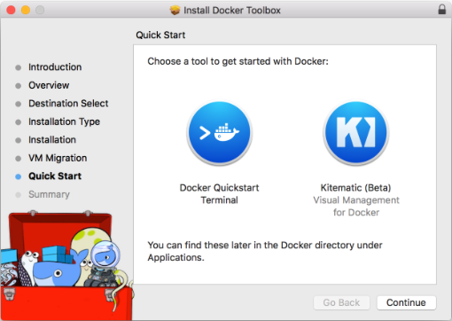

===================================================
Using Docker Toolbox
===================================================

The following procedure is for installing Brightspot using Docker Toolbox. Docker Toolbox is required for any Windows versions earler than  Windows 10 Professional or Enterprise 64-bit.

--------------------------------------------
1. Download and Install the Docker Toolbox
--------------------------------------------

Begin by downloading the |docker_toolbox| installer for Windows.

.. |docker_toolbox| raw:: html

     <a href="http://www.docker.com/products/docker-toolbox" target="_blank">Docker Toolbox</a>

When the download is complete, double-click the Docker Toolbox installer and follow the instructions. On the last screen of the installer, you'll be asked to choose between **Docker Quickstart Terminal** or **Kitematic (Beta) Visual Management for Docker**. Choose **Kitematic**.

If you accidentally choose **Docker Quickstart Terminal** or **Continue** at the bottom of the installer, you can still run Kitematic by locating it on your hard drive.

.. include:: docker-platform.rst
     :start-after: InstallBrightspot
