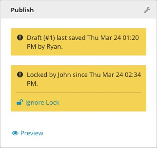
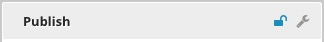
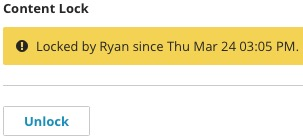
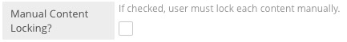
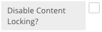

Locking
=======

To prevent conflicting edits, Brightspot can lock content in three ways: Content locking, Manual locking, and Field-Level locking. Locked content can only be edited by the user who locked it. Other users may view the content, but will not be able to save any changes.

Content Locking
---------------

By default, Brightspot has Content Locking activated. Content that you have opened in the Content Edit pane will be automatically locked for other users. The Publishing Widget will display a warning to other users that the content is locked and unavailable for editing.

While the content is locked, no changes may be saved or published except by the editor who initially locked the content. Users with sufficient permission can manually bypass the lock by clicking Ignore Lock.

.. image:: images/ignore.jpg

Any changes made to the content before it is manually unlocked will be lost.

Manual Content Locking
----------------------

Manual Content Locking replaces the default Content Locking feature. Manual content locking will not automatically lock content as you edit it. Instead, you can choose to lock content or leave it unlocked. A small lock icon will appear in the upper right corner of the Publishing widget. Click the lock to prevent other users from editing the content. When you're finished, click the lock again to unlock the content.

While the content is locked, no changes may be saved or published except by the editor who initially locked the content. To unlock content that was manually locked by another user, click the wrench icon in the upper right corner of the Publishing widget and click Unlock. Any changes made to the content before it is manually unlocked will be lost.

To replace the default Content Locking with Manual Content Locking, go to **Admin > Settings > CMS > UI** and check the **Manual Content Locking?** option.

Field-Level Locking
-------------------

With Field Level Locking, Brightspot will intelligently lock other users out of individual fields as you work. When your work is complete, your changes will be merged back into the content and the field will automatically unlock. Other users will see a warning that the field is locked.

Users with sufficient permission can manually bypass the lock by clicking **Unlock**. Any changes made to the field before it is manually unlocked will be lost.

Disabling
---------

If you would prefer to never have content locked, go to **Admin > Settings > CMS > UI** and check the **Disable Content Locking?** option.

