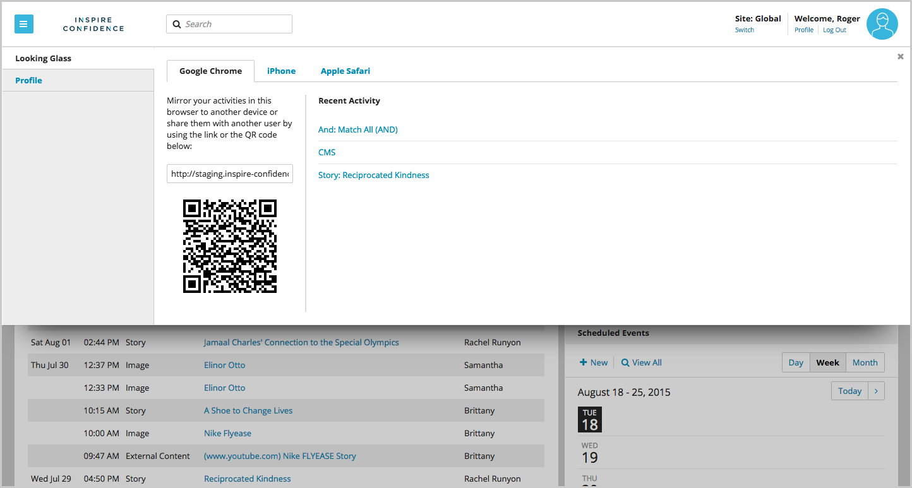
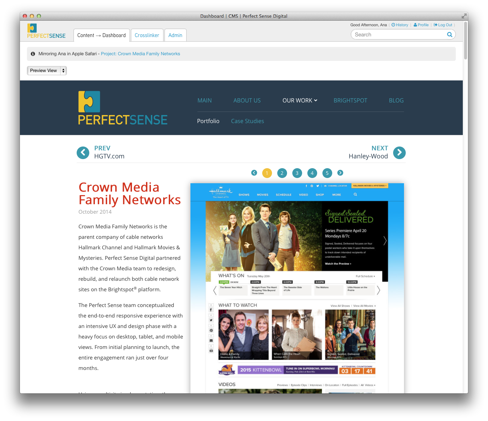

Looking Glass
=============

The Looking Glass enhances the content preview feature across multiple windows, browsers, and devices.

**Opening a New Looking Glass Window**

The **Looking Glass** link is located under the **Profile** link at the top right side of the CMS window.

The link opens a new window. Open the Looking Glass on a mobile device by scanning the QR code in the pop-up, which opens the window on any mobile phone or tablet.

The preview window shows the front end view of the content you're viewing or editing in the CMS.

As you work and edit new pages, the front end view shows a live preview of your edits. The Looking Glass window automatically updates as you add text or images and make changes. You can see your work translated to different browsers or devices while controlling the content from one desktop device.

You can also send the Looking Glass URL to anyone with CMS credentials, allowing collaboration and screensharing. There are two views available in the Looking Glass window: Edit View shows the content in the CMS, and Debug View shows the page load time in a waterfall view.

Developers can choose a Grid layout for the page and any HTML API that is constructed for the page.

