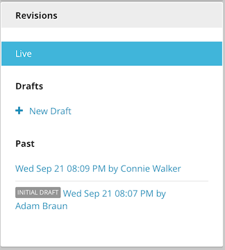

.. raw:: html

    

==========================================
Publishing Process
==========================================

Brightspot content moves through different states in the publication process. The first state is new content, followed by draft, published (live on the production web site), and, finally, archived or deleted. A content instance can only exist in one of these states at a time. In addition, content can be associated with a workflow, providing a review-and-approval process that is defined by your organization.

This chapter shows you how to use the Publish widget to manage content publishing. For reference information on content states and their impact on the Publish widget UI, see :doc:`pub-widget-ref`.

.. note:: 
    The screenshots in this chapter reflect the default Dashboard UI. However, the Brightspot platform is highly customizable. The appearance and availability of widgets can vary, depending on role permissions, workflow associations, and other customizations. Therefore, the Dashboard UI for your installation might appear differently from the UI illustrated in this chapter. 

    The default Dashboard UI can be viewed in the :doc:`Inspire Confidence demo<../../getting-started/demo-install/all>`, which you can download  and run locally. 

The following screenshot is a generic view of the Publish widget in the new content state. The Workflow tab is included in the Publish widget for content types associated with a workflow.

============= ============
Workflow Tab  Publish Tab
============= ============
|image1|      |image2|
============= ============
.. |image1| image:: ./images/state1_wftab.png 
.. |image2| image:: ./images/state1_pubtab.png

When you create a new content item and save it as a draft, that initial draft is a single revision of the content; that is, it is an independent version object that is stored in the database. If another user creates a second draft of the content item, then a second revision of the content is created, and a second version object is stored in the database. If the user publishes the second revision, the content state of that revision changes from draft to published. 

No saved content is ever lost.  All of the revisions of a content item provide an historical record of the content, and are listed in the Revisions widget, which is displayed in the Content Edit pane below the Publish widget.

| **See also:**
| :doc:`../versioning/all`

.. toctree:: 
   :includehidden:
   :hidden:

   pub-new
   pub-draft
   pub-wf
   pub-preview
   pub-live
   pub-live-group
   pub-archive
   pub-rename
   pub-widget-ref

.. Ideally, pub-live-group would appear as a subtopic of pub-live

