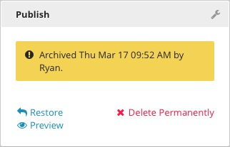

Archived
--------

You can archive published content that is no longer needed but is not ready to be permanently deleted. Archived content will not be available for use on the front end of your site, but will remain stored in Brightspot. Archived content cannot be edited.

**Restore:** To return your content to published status from the archive, click Restore. The content will again be live and available for use on the front end of your site. Any changes made to the archived version of the content will be lost.

**Delete Permanently:** If you're ready for your archived content to be removed permanently from Brightspot, click Delete Permanently. You will be asked to confirm that you wish to permanently delete the archived content. Deleted content is not recoverable. You will be returned to a blank Content Edit pane.

