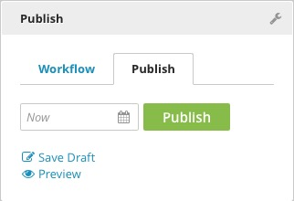

New Content
-----------

When you've opened the Content Edit pane, but you've not yet saved or published, any content you create is new content. New content is not stored anywhere in Brightspot, and it will be completely lost if you navigate away from the Content Edit pane or close the browser tab.

**Save Draft:** Click Save Draft to save a draft version of your new content without publishing it to the front end of your site. The draft version will be stored in Brightspot, and you can safely close the tab or navigate away.

**Publish:** The most common process in Brightspot is to create new content and click Publish. The content goes live immediately. Published content remains published until it is archived.

**Schedule:** Schedule new content for future publication by clicking the calendar icon next to the Publish button in the Publishing widget. Select a date and time for the content to be published to the site and click Set. The Publish button will now read Schedule. Scheduling your new content saves it as a draft. For more details, please see the Scheduling chapter.

**Workflow:** To send your new content through a Workflow, use the Workflow tab. Sending new content to a Workflow immediately saves it as a draft.

