.. raw:: html

    

.. This fixes the sizes of the two image maps. Without it, the images are resized, breaking the area coordinates.
.. raw:: html

    

==========================================
Publish Widget: Content States Reference
==========================================

This topic describes the content states in the Brightspot publications process and how these states drive the Publish widget UI. The state of a content instance determines the widget's UI functionality that is available to the user.

---------------------------
Overview of Content States
---------------------------

The following two diagrams show the states through which a content instance passes and the actions that trigger the state transitions. For example, a save action puts the content into a saved state and a publish action puts the content into a published state. Generally speaking, Brightspot content moves from new to draft to published state. More specifically, there are variations of the draft state, for example, draft-not-in-workflow, draft-in-workflow, or draft-scheduled-for-publication.

To see the Publish widget screens that correspond with their content states, click the numbered states in the diagrams.

The first diagram shows the pre-publication content states, starting with creating a new content instance and transitioning to publication of the instance (steps 1 to 5).

.. Need solution for referencing the image maps. Raw html requires that the images be referenced in the output directory, but gulp recreates the output directories when it rebuilds. Absolute paths do not work. As a workaround, I use an rst reference to the image so that the Sphinx build copies the image to the output directory.

|prePubMap|

.. |prePubMap| raw:: html

     
     <map name="prePub" id="prePub">
       <area alt="" title="state1" href="#state1" shape="rect" coords="10,100,139,155" />
       <area alt="" title="" href="#state2" shape="rect" coords="165,100,280,210" />
       <area alt="" title="" href="#state3" shape="rect" coords="310,120,425,210" />
       <area alt="" title="" href="#state4" shape="rect" coords="310,300,435,375" />
       <area alt="" title="" href="#state4a" shape="rect" coords="170,325,280,390" />
       <area alt="" title="" href="#state5" shape="rect" coords="475,100,585,165" />
       <area alt="" title="" href="#state6" shape="rect" coords="490,315,625,415 />
     </map>
.. Do rst reference so the Sphinx build copies it to output directory. Give it 0 width/height so it does not appear twice on the page.
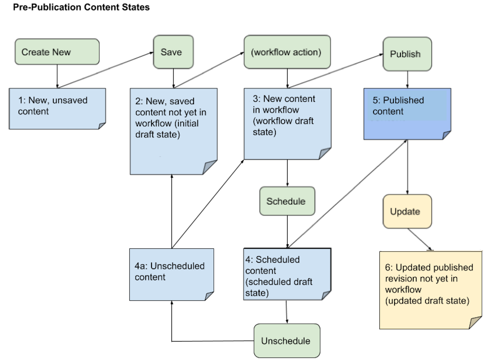

\

The second diagram shows the post-publication content states, in which published content is updated (step 6) and republished (step 5). Note that the update-republish cycle can occur indefinitely in the content live cyle. Also note that multiple update-republish cycles can occur simultaneously, and that concurrent drafts can be scheduled for separate publication dates. For example, user A can update the content headline in one draft and schedule it for next-day publication. User B can update the content body in another draft and schedule it for next-week publication.

|postPubMap|

.. |postPubMap| raw:: html

     
     <map name="postPub" id="postPub">
       <area alt="" title="" href="#state5" shape="rect" coords="45,55,165,125" />
       <area alt="" title="" href="#state6" shape="rect" coords="150,157,305,267" />
       <area alt="" title="" href="#state7" shape="rect" coords="300,125,455,260" />
       <area alt="" title="" href="#state8" shape="rect" coords="325,325,435,390" />
       <area alt="" title="" href="#state9" shape="rect" coords="30,300,165,340" />
       <area alt="" title="" href="#state5" shape="rect" coords="500,130,720,200" />
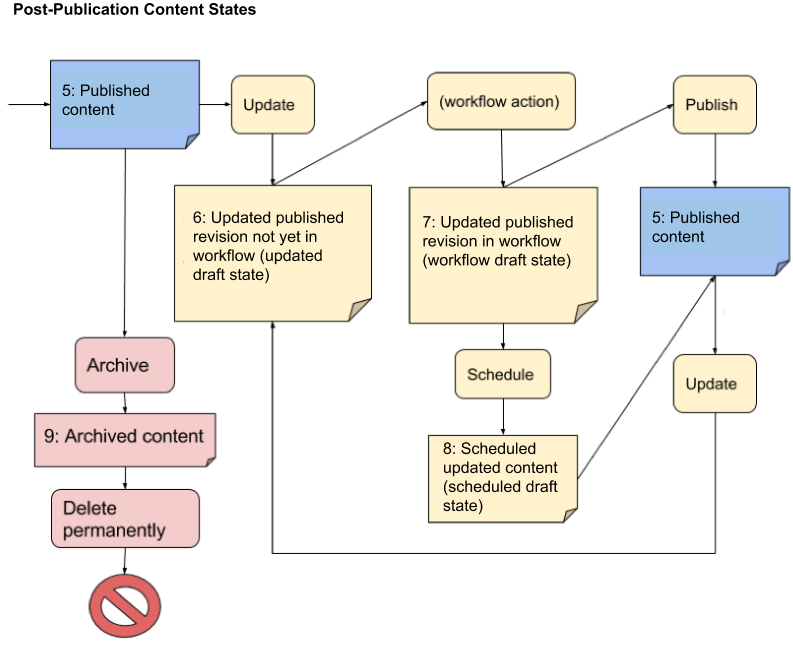

.. _tc-label: 

-------------------------
Publish Widget UI States
-------------------------

The following Brightspot content states determine the Publish Widget UI functionality states.

| :ref:`state1`
| :ref:`state2`
| :ref:`state3`
| :ref:`state4`
| :ref:`state4a`
| :ref:`state5`
| :ref:`state6`
| :ref:`state7`
| :ref:`state8`
| :ref:`state9`

.. _state1:

1: New Unsaved Content
=========================

| *Current Context*: New content, not yet saved or moved into a workflow (WF).

| *Brightspot Notes*: 

============= ============
Workflow Tab  Publish Tab
============= ============
|image1|      |image2|
============= ============
.. |image1| image:: ./images/state1_wftab.png 
.. |image2| image:: ./images/state1_pubtab.png

.. Use escape character to prevent tables from running together.

====================================     ============================   ================================
Link                                     Actions                        New State
====================================     ============================   ================================
Submit for Approval (inital WF step)     | > Saves as WF draft          :ref:`state3`
                                         | > Advances WF                
                                   

Save Draft                               > Saves as initial draft       :ref:`state2`

Preview                                  | > Shows content as it        (preview pane opened)
                                         | will appear in live page

Calendar/Schedule                        | > Saves to scheduled draft   :ref:`state4`
                                         | > Schedules publication 
                                           of draft

Publish                                  | > Saves as past version      :ref:`state5`
                                         | > Publishes now
====================================     ============================   ================================

**Revision Widget**

For new, unsaved content, the Revision widget is not rendered in the Content Edit pane.

.. _state2:

2: Initial Draft 
=================================================================

| *Current Context*: New content that is saved, but not yet in a workflow.

| *Previous Context*: :ref:`state1`

| *Brightspot Notes*: 

============= ============
Workflow Tab  Publish Tab
============= ============
|image3|      |image4|
============= ============
.. |image3| image:: ./images/state2_wftab.png 
.. |image4| image:: ./images/state2_pubtab.png

.. Use escape character to prevent tables from running together.

====================================     ============================   ================================
Link                                     Actions                        New State
====================================     ============================   ================================
Submit for Approval (inital WF step)     | > Saves as WF draft          :ref:`state3`
                                         | > Advances WF                
                                  
Save                                     | > Saves to current draft     :ref:`state2`

Preview                                   > Shows content as it         (preview pane opened)
                                          will appear in live page

Calendar/Schedule                        | > Saves to scheduled draft   :ref:`state4`
                                         | > Schedules publication

Publish                                  | > Saves as past version      :ref:`state5`
                                         | > Publishes now

Delete Permanently                       | > Prompts for confirmation   (irrecoverably deleted)
                                         | > If confirmed, deletes 
                                           draft
====================================     ============================   ================================

**Revision Widget**

For initial draft state, the Revision widget is similar to the following:

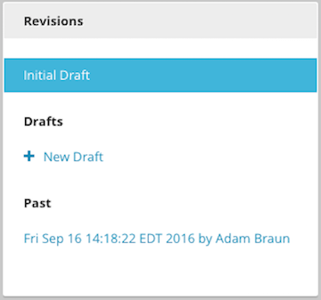

.. _state3:

3: New Workflow Draft
======================================================

| *Current Context*: Content that was moved from initial draft state into a workflow, but not yet published. Each workflow transition is saved as a new workflow draft.

| *Previous Context*: :ref:`state1` or  :ref:`state2` or  :ref:`state4a`

| *Brightspot Notes*: 

============= ============
Workflow Tab  Publish Tab
============= ============
|image5|      |image6|
============= ============
.. |image5| image:: ./images/state3_wftab.png 
.. |image6| image:: ./images/state3_pubtab.png

.. Use escape character to prevent tables from running together.

====================================     ============================   ================================
Link                                     Actions                        New State
====================================     ============================   ================================
Send back for edits                      | > Saves as WF draft          :ref:`state3`
                                         | > Advances WF                
                                  
Save                                     | > Saves to current draft     :ref:`state3`

Preview                                  | > Shows content as it        (preview pane opened)
                                           will appear in live page

Calendar/Schedule                        | > Saves to scheduled draft   :ref:`state4`
                                         | > Schedules publication
                                           of draft

Publish                                  | > Saves as past version      :ref:`state5`
                                         | > Publishes now

Delete Permanently                       | > Prompts for confirmation   (irrecoverably deleted)
                                         | > If confirmed, deletes 
                                           draft
====================================     ============================   ================================

**Revision Widget**

For new content in a workflow, the Revision widget lists all of the workflow drafts, one for each workflow transition. In this example, the workflow transitioned through three  states: Submitted, Rejected, and Submitted (submitted for review a second time).

===================== ================== ===================
Submitted             Rejected           Resubmitted               
===================== ================== ===================
|image30|             |image31|                  |image32|
===================== ================== ===================
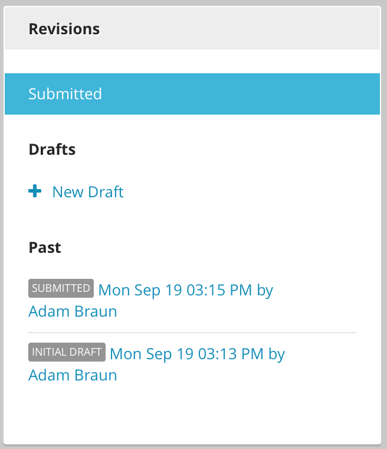
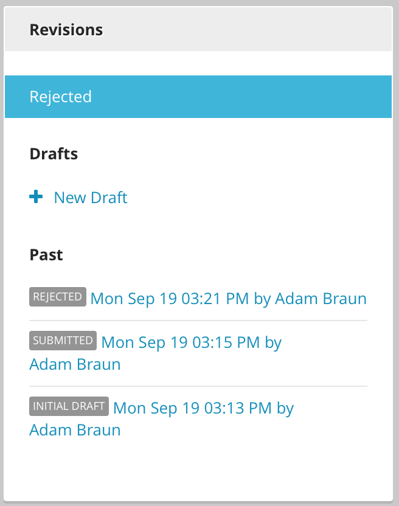
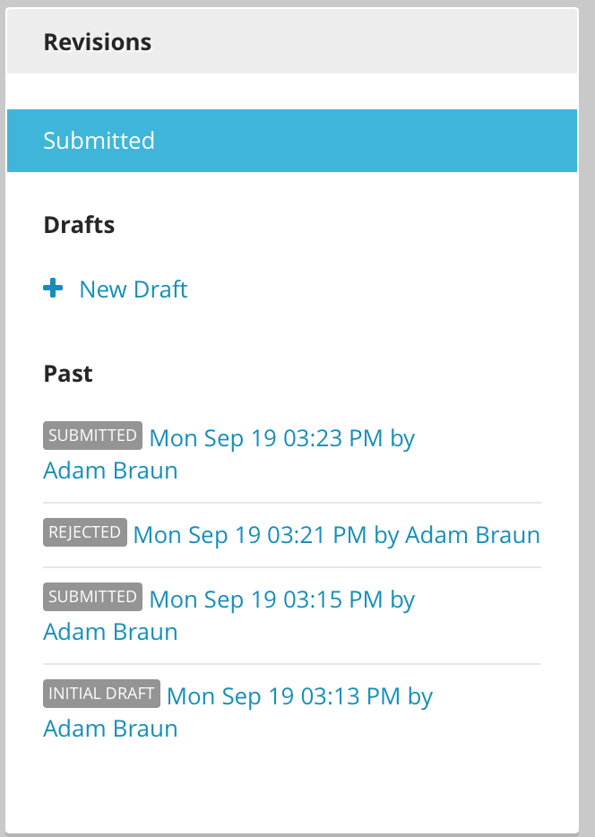

.. _state4:

4: New Scheduled Draft
=========================

| *Current Context*: Unpublished content scheduled to go live on a future date.

| *Previous Context*: :ref:`state1` or  :ref:`state2` or :ref:`state3` or :ref:`state4a`

| *Brightspot Notes*: 

============= ============
Workflow Tab  Publish Tab
============= ============
n/a           |image7|
============= ============
.. |image7| image:: ./images/state4_pubtab.png

.. Use escape character to prevent tables from running together.

====================================     ============================   ================================
Link                                     Actions                        New State
====================================     ============================   ================================
Calendar/Reschedule                      | > Reschedules publication    :ref:`state4`
                                         
                                                        
                                  
Unschedule                               | > Unschedules content from   :ref:`state4a`
                                           publication     

Preview                                  | > Shows content as it        (preview pane opened)
                                           will appear in live page

Delete Permanently                       | > Prompts for confirmation   (irrecoverably deleted)
                                         | > If confirmed, deletes 
                                           draft
====================================     ============================   ================================

**Revision Widget**

For new scheduled content, the Revision widget is similar to the following:

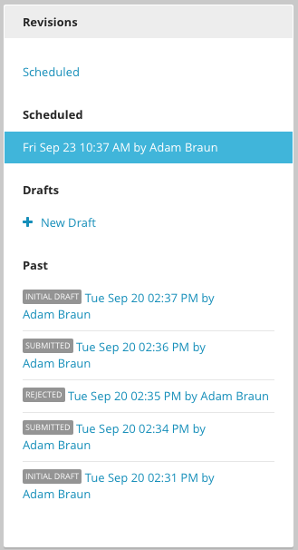

.. _state4a:

4a: New Unscheduled Content
=====================================

| *Current Context*: New content for which scheduled publication was canceled with ``Unschedule`` option.

| *Previous Context*: :ref:`state4`

| *Brightspot Notes*: 

============= ============
Workflow Tab  Publish Tab
============= ============
|image8|      |image9|
============= ============
.. |image8| image:: ./images/state4a_wftab.png
.. |image9| image:: ./images/state4a_pubtab.png

.. Use escape character to prevent tables from running together.

====================================     ============================   ================================
Link                                     Actions                        New State
====================================     ============================   ================================
Merge with initial Draft                 > Merges changes that may      :ref:`state2`
                                         have been made in workflow
                                         with the initial draft     
                                         
                                                        
                                  
Submit for Approval                      > Advances workflow from       :ref:`state3`
                                         initial step     

Save                                     > Saves to current draft       :ref:`state4a`

Publish                                  | > Saves as past version      :ref:`state5`
                                         | > Publishes now

Preview                                  | > Shows content as it        (preview pane opened)
                                           will appear in live page

Delete Permanently                       | > Prompts for confirmation   (irrecoverably deleted)
                                         | > If confirmed, deletes 
                                           draft
====================================     ============================   ================================

**Revision Widget**

For previously scheduled content that was unscheduled from publication, the Revision widget is similar to the following:

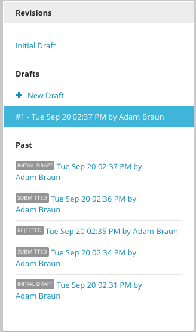

.. _state5:

5: New or Updated Published Content
===================================

| *Current Context*: New content that is published to a live site, or published content that is updated and republished.

| *Previous Context*: :ref:`state1` or :ref:`state2` or :ref:`state3` or :ref:`state4` or :ref:`state6` or :ref:`state7`    

| *Brightspot Notes*: 

============= ============
Workflow Tab  Publish Tab
============= ============
n/a           |image10|
============= ============
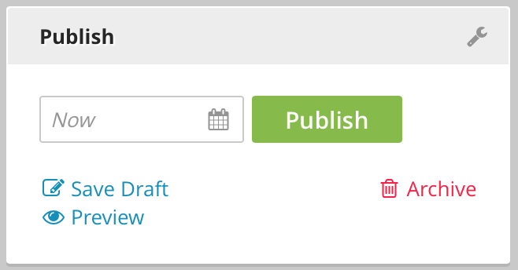

.. Use escape character to prevent tables from running together.

====================================     ============================   ================================
Link                                     Actions                        New State
====================================     ============================   ================================
Calendar/Schedule                        | > Saves scheduled draft      :ref:`state8`
                                         | > Schedules publication 
                                           of draft
                                  
Publish                                  | > Saves as past version      :ref:`state5`
                                         | > Overwrites previously
                                           published version with
                                           new version

Save Draft                               > Saves new draft              :ref:`state6`

Preview                                  > Shows content as it          (preview pane opened)
                                         appears in live page

Archive                                  > Removes live content,        :ref:`state9`
                                         but keeps it in the 
                                         database
====================================     ============================   ================================

**Revision Widget**

For published content that has transitioned through various draft states, the Revision widget is similar to the following:

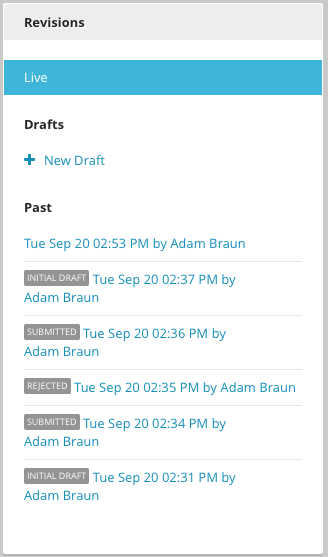

.. corresponds with state2
.. _state6:

6: Updated Draft
==========================

| *Current Context*: Live content or a previously published revision is updated and saved as a draft, but not yet moved into a workflow. 

| *Previous Context*:  :ref:`state5`

| *Brightspot Notes*: 

============= ============
Workflow Tab  Publish Tab
============= ============
|image11|      |image12|
============= ============
.. |image11| image:: ./images/state6_wftab.png 
.. |image12| image:: ./images/state6_pubtab.png

.. Use escape character to prevent tables from running together.

====================================     ============================   ================================
Link                                     Actions                        New State
====================================     ============================   ================================
Submit for Approval (inital WF step)     | > Saves as WF draft          :ref:`state7`
                                         | > Advances WF                
                                  
Save                                     | > Saves to current draft     :ref:`state6`

Back to Live                             | > Returns to live version    :ref:`state5`
                                           in Content Edit pane                        

Preview                                   > Shows content as it         (preview pane opened)
                                          will appear in live page

Calendar/Schedule                        | > Saves to scheduled draft   :ref:`state8`
                                         | > Schedules publication
                                           of draft

Publish                                  | > Saves as past version      :ref:`state5`
                                         | > Publishes now

Delete Draft                             | > Prompts for confirmation   (irrecoverably deleted)
                                         | > If confirmed, deletes 
                                           draft
====================================     ============================   ================================

**Revision Widget**

For published content that is updated, the Revision widget is similar to the following:

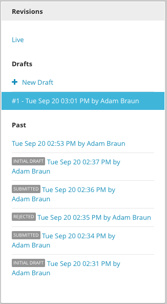

.. corresponds with state3
.. _state7:

7: Updated Workflow Draft
====================================================

| *Current Context*: Updated content that was previously saved as a draft and is not transitioned through a workflow. Each workflow transistion is saved as a new workflow draft. 

| *Previous Context*:  :ref:`state6`

| *Brightspot Notes*: 

============= ============
Workflow Tab  Publish Tab
============= ============
|image13|      |image14|
============= ============
.. |image13| image:: ./images/state7_wftab.png 
.. |image14| image:: ./images/state7_pubtab.png

.. Use escape character to prevent tables from running together.

====================================     ============================   ================================
Link                                     Actions                        New State
====================================     ============================   ================================
Send back for edits                      | > Saves to WF draft          :ref:`state7`
                                         | > Advances WF                
                                  
Save                                     | > Saves to current WF        :ref:`state7`
                                           draft     

Back to Live                             | > Returns to live version    :ref:`state5`
                                           in Content Edit pane                        
                                              

Preview                                  | > Shows content as it        (preview pane opened)
                                           will appear in live page

Calendar/Schedule                        | > Saves to scheduled draft   :ref:`state8`
                                         | > Schedules publication

Publish                                  | > Saves as past version      :ref:`state5`
                                         | > Publishes now

Delete Draft                             | > Prompts for confirmation   (irrecoverably deleted)
                                         | > If confirmed, deletes 
                                           draft
====================================     ============================   ================================

**Revision Widget**

For published content that is updated and transitioning through a workflow, the Revision widget lists all of the workflow drafts, one for each workflow transition. In this example, the workflow transitioned through three states: Submitted, Rejected, and Submitted (submitted for review a second time).

===================== ================== ===================
Submitted             Rejected           Resubmitted               
===================== ================== ===================
|image60|             |image61|          |image62|
===================== ================== ===================
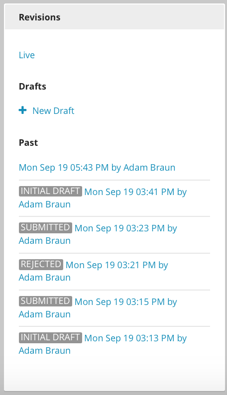
.. |image61| image:: ./images/state7_revision2.png
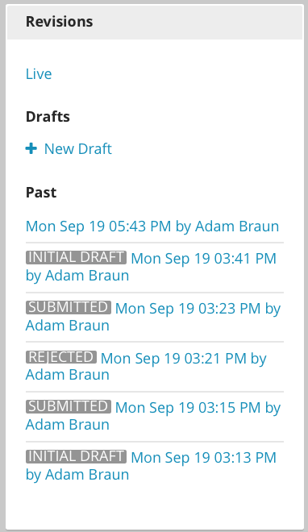

.. corresponds with state4
.. _state8:

8: Updated Scheduled Draft
==============================
| *Current Context*: Updated revision is scheduled for publication at a future date. 

| *Previous Context*:  :ref:`state5` or :ref:`state6` or :ref:`state7`    

| *Brightspot Notes*: 

============= ============
Workflow Tab  Publish Tab
============= ============
n/a           |image15|
============= ============
.. |image15| image:: ./images/state8_pubtab.png

.. Use escape character to prevent tables from running together.

====================================     ============================   ================================
Link                                     Actions                        New State
====================================     ============================   ================================
Calendar/Reschedule                      | > Reschedules publication    :ref:`state8`
                                         
                                                        
                                  
Back to Live                             | > Returns to live version    :ref:`state5`
                                           in Content Edit pane                        

Preview                                  | > Shows content as it        (preview pane opened)
                                           will appear in live page

Unschedule                               | > Unschedules content from   | Depending on prior state: 
                                           publication                  | :ref:`state6`
                                                                        | or
                                                                        | :ref:`state7`

Delete Draft                             | > Prompts for confirmation   (irrecoverably deleted)
                                         | > If confirmed, deletes 
                                           draft
====================================     ============================   ================================

**Revision Widget**

For updated content that is scheduled for republication, the Revision widget is similar to the following:

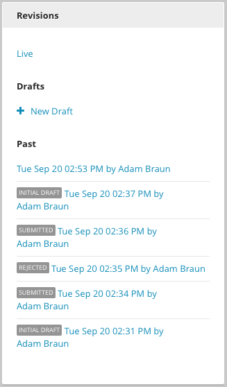

.. corresponds with 4a
.. .. _state8a:

.. 8a: Revised Unscheduled Content
.. =================================

.. | *Current Context*: Revised content for which scheduled publication has been cancelled via "Unschedule" option (see state #8). Note that workflow state, "Submitted", reflects this content's status prior to scheduling. If this content had been scheduled for publication in draft state rather than workflow state, it would return to draft state after being unscheduled.

.. | *Previous Context*:  :ref:`state8`

.. | *Brightspot Notes*: 

.. ============= ============
.. Workflow Tab  Publish Tab
.. ============= ============
.. |image16|      |image17|
.. ============= ============

.. Use escape character to prevent tables from running together.

.. Link                                     Actions                        New State
.. ====================================     ============================   ================================
.. Send back for edits                      | > Saves to WF draft          :ref:`state7`
..                                         | > Advances WF                
                                  
.. Save                                     | > Saves to current draft     :ref:`state3`

.. Back to Live                             | > Returns to live version    :ref:`state6`
..                                           in Content Edit pane                        
                                              

.. Preview                                  | > Shows content as it        (none)
..                                           will appear in live page

.. Calendar/Schedule                        | > Saves to scheduled draft   :ref:`state8`
..                                         | > Schedules publication

.. Publish                                  | > Saves as past version      :ref:`state5`
..                                         | > Publishes now

.. Delete Draft                             | > Prompts for confirmation   (irrecoverably deleted)
..                                         | > If confirmed, deletes 
..                                           draft
.. ====================================     ============================   ================================

.. **Content Header**

.. For previously scheduled content that's been unscheduled from publication, the content header in the Content Edit pane is similar to the following:

.. 

.. _state9:

9: Archived Content
=======================
| *Current Context*: Live content was removed from the web site, but all revisions remain in the database.

| *Previous Context*: :ref:`state5`

| *Brightspot Notes*: 
============= ============
Workflow Tab  Publish Tab
============= ============
n/a           |image18|
============= ============
.. |image18| image:: ./images/state9_pubtab.png

====================================     ============================   ================================
Link                                     Actions                        New State
====================================     ============================   ================================
Restore                                  | > Restores live content to   :ref:`state5`
                                           and all revisions
                                                    

Delete Permanently                       | > Prompts for confirmation   (irrecoverably deleted)
                                         | > If confirmed, deletes 
                                           all revisions from 
                                           database                   

Preview                                  | > Shows content as it        (preview pane opened)
                                           will appear in live page                         
====================================     ============================   ================================

**Revision Widget**

For live content that is archived, the Revision widget is similar to the following:

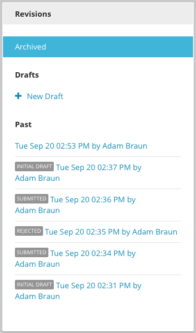