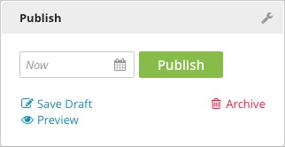

Published
---------

Published content is complete and available on the front end of your site. Published content will not be lost if you navigate away from the Content Edit pane or close the browser tab, but unsaved edits will be lost. Once published, content cannot be moved back to draft status.

**Publish:** To make an immediate edit to published content, make your changes and then click the Publish button again. The live version of the content will be updated to reflect your changes. To see previous versions of your content, go to the Revisions widget.

**Save Draft:** To save changes to your published content without immediately updating it, click Save Draft. The updated version of the content will be saved as a draft. The draft can be sent through a Workflow, scheduled, or published like any other. When you publish a draft of your previous published content, the original content will be replaced by the draft. The Revisions widget will contain a link to the previous version of the content for later use or reference.

**Archive:** Click Archive to take down published content. You will be asked to confirm that you wish to Archive the content. Archived content will not be available for use on the front end of your site, but will remain stored in Brightspot.

**Schedule:** You can schedule an update to published content. After making the necessary changes, click the calendar icon next to the Publish button. The scheduled content becomes a draft, and will replace the published content at the designated time. For more details, please see the Scheduling chapter.

