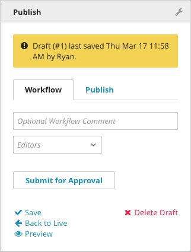

Workflow
--------

With the Workflow tool, you can attach a custom Workflow approval process to any content type in Brightspot. The Workflow can be a simple process where editors must submit content for review before it can be published, or a more complex Workflow where content can be sent in multiple directions, from department to department, and through various levels of editorial and legal approval. A draft in a workflow can still be edited, published, deleted, or scheduled. See the Workflows chapter for more information.

