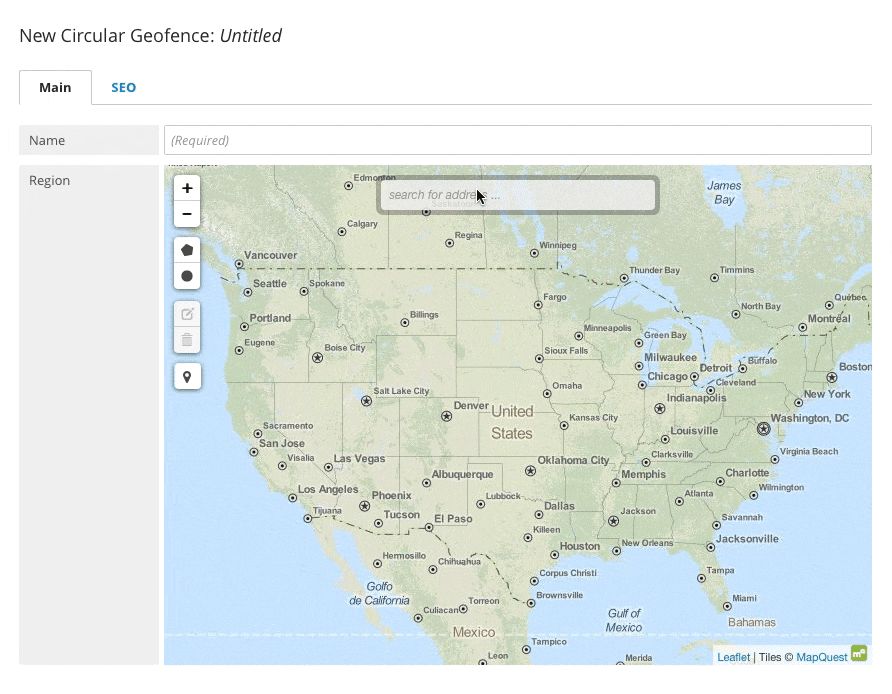

Locations and Maps
------------------

Brightspot supports the use of web maps and locations. The field contains a map, linked with MapQuest, with which you can define a location in two ways:

* Click the pentagonal icon on the left side of the map to hand-select an area by clicking on specific points on the map to create a region.
* Click the circle icon, then click on the map and drag to create a radius, in miles or kilometers, around a point.
* Click the plus and minus icons to zoom in or out as needed. Edit designated areas on the map by clicking on the edit icon to the left of the map, which highlights regions for modification. Delete an area by selecting the trash icon and clicking on the area to be deleted.

