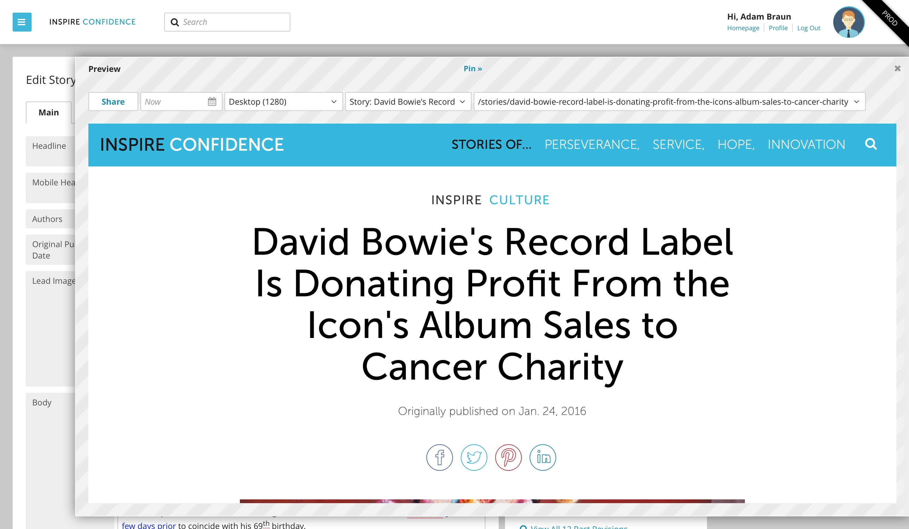
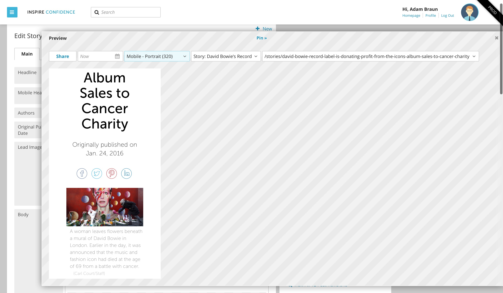

Preview
-------

Preview shows you how your content will look on the page as you work. Click the Preview link in the publishing widget at the top right hand side of the Content Edit screen. Changes you make in Content Edit will be reflected instantly in the Preview. Click Pin at the top of the Preview screen to shrink the live preview and places it to the right of the Content Edit screen. Click "Preview" at the top of the Preview window to expand the pinned Preview.

You can preview your content in a variety of resolutions to make sure your content looks its best on tablets and mobile devices.

You can also share a Preview with others. Click Share at the top left of the preview window to open a preview of the unpublished content in a new window and generate a temporary URL that directs to a snapshot of the content.

Use the Preview date picker to preview the content at any point in time. Changes associated with scheduled events will be included in the preview.
