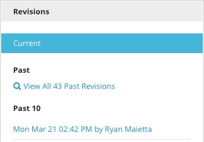

Revisions
---------

The Revisions widget at the bottom right of the Content Edit page displays a list of all previously published or saved revisions, all scheduled updates, and all saved drafts of the current content. Click on a revision from the list to retrieve that version for comparison or to revert back to the previous version. An item is added to the Revisions widget when content is published or saved as a draft.

