Rich Text Editor
----------------

The Rich Text Editor is a robust, CodeMirror-based word processing field used to format text and embed images, videos, and other supported content. Content from a Microsoft Word or Google Docs document can be pasted directly into the Rich Text Editor without losing formatting. Copy and paste handling can be customized by your administrators. Your implementation can include clean-up rules about pasting so you can adjust what is stripped out and what remains. The default cleaner supports Word and Google Doc pasting.

The toolbar at the top of the Rich Text Editor is customizable, but contains the following tools by default.

Text Formatting
~~~~~~~~~~~~~~~

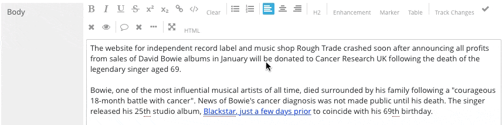

Bold
^^^^ 

Toggles text bolding on and off.

Italic
^^^^^^ 

Toggles italicised text on and off.

Underline
^^^^^^^^^ 

Toggles underlined text on and off.

Strikethrough
^^^^^^^^^^^^^

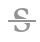

Toggle text strikethrough on and off.

Superscript 
^^^^^^^^^^^

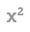

Toggles superscript on and off.

Subscript
^^^^^^^^^

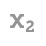

Toggles subscript on and off.

Link
^^^^

Adds a link to any line of text. Highlight the desired text and click the  icon in the Enhancement section of the toolbar. You will be prompted to specify a URL for an external link or, if linking to a piece of internal content, you can click the Search icon and choose an asset from a Contextual Search window. By default, links will open in the same browser window, but you may elect to force the link to open in a new window instead. To edit an existing link, click the link and choose an option from the small menu that appears below the link.

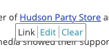

Click "Edit" to change the destination URL for the link, and click "Clear" to remove the link entirely. You can also edit the link by clicking the link and then clicking the  icon in the toolbar again.

Raw HTML
^^^^^^^^

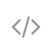

By default, the Rich Text Editor ignores HTML tags and renders them as text. To render HTML, highlight the code and click the Raw HTML  button.

Clear Formatting
^^^^^^^^^^^^^^^^ 

Removes all formatting from the selected text.

Lists
~~~~~

Bulleted List
^^^^^^^^^^^^^

Add a bulleted list to your text, or make the selected text a bulleted list.

Numbered List
^^^^^^^^^^^^^

Add a numbered list to your text, or make the selected text a numbered list.

Text Alignment
~~~~~~~~~~~~~~

Left Align Text 
^^^^^^^^^^^^^^^

Align text to the left.

Center Align Text
^^^^^^^^^^^^^^^^^

Align text to the center.

Right Align Text
^^^^^^^^^^^^^^^^

Align text to the right.

Tables
~~~~~~

Brightspot 3.2 adds tables to the Rich Text Editor, providing better control for laying out your content.

Adding Tables
^^^^^^^^^^^^^

You can add tables to your content in three general ways:

Create a table directly in the Rich Text Editor: Click the "Table" button in the Rich Text Editor toolbar. The default table is one row high and two columns wide.

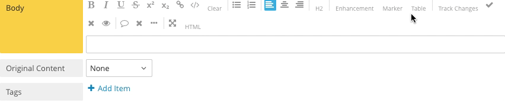

\

* Copy and paste a table: The Rich Text Editor will accept tables copied from most sources, including Microsoft Excel, Google Sheets, Apple Numbers, and rendered HTML tables.
* Create an HTML table: Write your table in raw HTML in the Rich Text Editor, select your code, and click the "Raw HTML" button, or write it in HTML mode.

Editing Tables
^^^^^^^^^^^^^^

Three buttons in the top left corner of the table allow you to change the location of the table in your content. From left to right, the buttons move the table toward the top of your content, toward the bottom of your content, and remove it from your content entirely.

To edit the contents of the table, click an empty cell and choose from the following options:

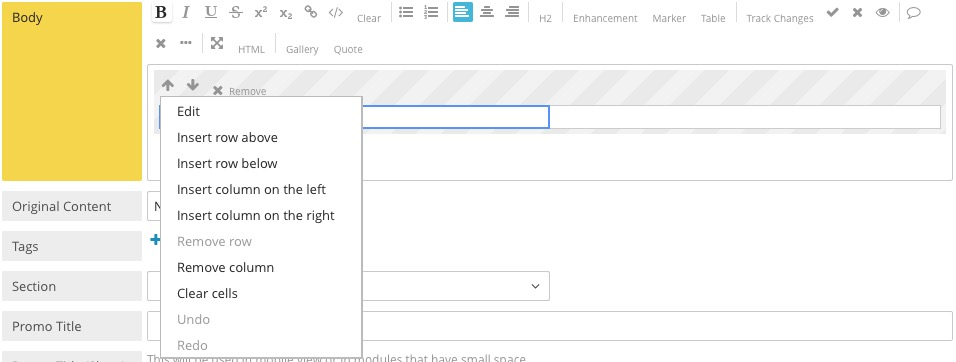

\

* Edit: Change the content of a cell.
* Insert row above: Create a new row above the currently selected cell. The new row will have the same number of columns as the current row.
* Insert row below: Create a new row below the currently selected cell. The new row will have the same number of columns as the current row.
* Insert column on the left: Create a new column to the left of the currently selected cell. The new column will have the same number of rows as the current column.
* Insert column on the right: Create a new column to the right of the currently selected cell. The new column will have the same number of rows as the current column.
* Remove row: Deletes the row containing the selected cell from the table. All content in the row will be lost.
* Remove column: Deletes the column containing the selected cell from the table. All content in the column will be lost.
* Clear Cells: Removes the contents of the current cell from the table.
* Undo: Reverts the last change made to the table.
* Redo: Recommits the last change made to the table.

All features of the Brightspot Rich Text Editor are available in tables, including links, enhancements, text formatting, and change tracking.

Additions
~~~~~~~~~

Add Block Enhancement
^^^^^^^^^^^^^^^^^^^^^

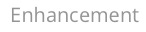

Opens a Contextual Search window from which you can embed links, images, videos, and other supported content. You can choose pre-existing content or create new content from the Contextual Search window. Move the enhancement to the left, right side of the page using the arrows in the Placement section of the enhancement toolbar. Use the up and down arrows to move the enhancement toward the top or bottom of the page. Text will automatically wrap around the enhancement, or you can click the intersecting arrows icon to expand the asset to the full width of the page. To remove an enhancement from your content, click the red "Remove" button. To delete an enhancement entirely, click "Remove Completely." Enhancements with media attached will be previewed in the Rich Text Editor. Because Brightspot is a flexible platform, administrators can also add new enhancement types.

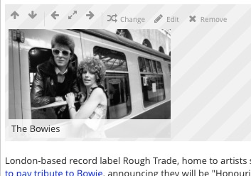

Add Marker
^^^^^^^^^^

.. image:: images/marker.jpg

Add to denote breaks in a body of text like truncation, a "Read More" link, or a page break.

Change Tracking
~~~~~~~~~~~~~~~

Change tracking allows you to review edits to your content before you commit them. Deleted content will be highlighted in red, and additional content will be highlighted in green.

Track changes
^^^^^^^^^^^^^

Toggles change tracking on and off. When you stop tracking, any previously tracked changes will remain marked until you have accepted or rejected them.

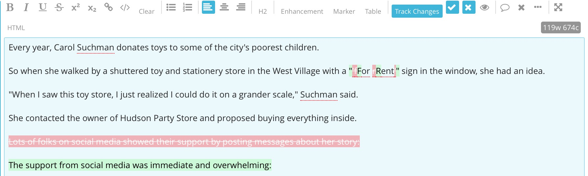

Accept Change
^^^^^^^^^^^^^

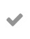

Accepts edits. To accept or reject a single change, place your cursor anywhere in the red or green highlighted area; to accept or reject multiple changes at once, select the text containing the relevant changes and click  or .

Reject Change
^^^^^^^^^^^^^ 

Rejects edits. To accept or reject a single change, place your cursor anywhere in the red or green highlighted area; to accept or reject multiple changes at once, select the text containing the relevant changes and click  or .

Toggle Preview
^^^^^^^^^^^^^^ 

Preview the content as it would appear with all changes committed; click it again to return to the content with changes tracked. Viewing your edited content in preview mode does not commit the changes.

Commenting
~~~~~~~~~~

Add Comment
^^^^^^^^^^^ 

Create a new comment at the cursor's location.

Remove Comment
^^^^^^^^^^^^^^ 

Remove a comment permanently.

Toggle Comment Collapse
^^^^^^^^^^^^^^^^^^^^^^^

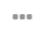

Show or hide all comments.

Views
~~~~~

Toggle Fullscreen Editing
^^^^^^^^^^^^^^^^^^^^^^^^^ 

Expands the Text Editor to fill the screen.

Toggle HTML Mode 
^^^^^^^^^^^^^^^^

.. image:: images/html.jpg

Changes the Rich Text Editor into HTML mode. In HTML mode, your content displays with visible HTML code to help you track down an error or add some custom formatting. Click Toggle HTML Mode again to return to the Rich Text Editor with all changes intact.

Find & Replace
~~~~~~~~~~~~~~

Text fields support the following Find and Replace commands:

Find: Cmd-F (OS X), Ctrl-F (Windows)

Find Next: Cmd-G (OS X), Ctrl-G (Windows)

Find Previous: Shift-Cmd-G (OS X), Shift-Ctrl-G (Windows)

Replace: Cmd-Option-F (OS X), Shift-Ctrl-F (Windows)

Replace All: Shift-Cmd-Option-F (OS X), Shift-Ctrl-R (Windows)

Persistent Search: Alt-F, Enter to find next, Shift-Enter to find previous

Jump to Line: Alt-G
