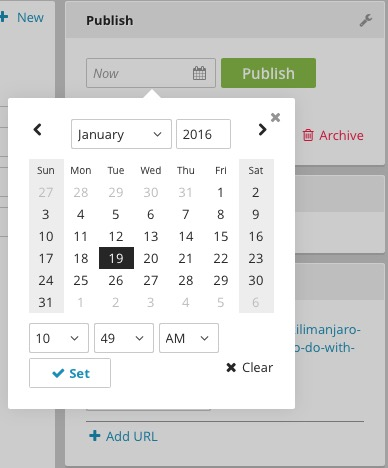
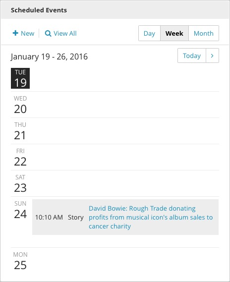

Scheduling
----------

You can schedule content for future publication by clicking the calendar icon() next to the Publish button in the Publishing widget. Select a date and time for the content to be published to the site and click Set. The Publish button will now read Schedule.

Brightspot also allows you to schedule content changes for individual fields as well as entire posts. Changes will proceed as scheduled irrespective of changes to other fields, and will overwrite intervening edits to the scheduled field as well.

You can also schedule multiple simultaneous changes across all of your content by grouping the edits together into a single Scheduled Event. You can use this feature to implement broad changes to the content of your site for a specific event, like a holiday, major news story, or product launch. Click New in the Scheduled Events widget to begin creating a Scheduled Event.

Scheduled content is displayed in the Scheduled Events widget on the Dashboard.

