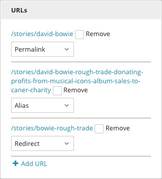

URLs
----

The URL for a page is dynamically generated by the Name or Headline fields in a template. You can also manually designate the URL in the URL widget on the right side of the Content Edit pane. Create a new URL by first checking Remove next to the permalink, then clicking the Add URL item in the same widget. Enter the desired URL in the field. Click Publish to remove the old URL and replace it with the new one. The prefix www.yoursitename.com/ is automatically generated as the prefix for the path being directed in the Add URL field. Entering your domain name in that field may cause bad URL pathing. You can also create a Redirect or an Alias from the drop-down on the right side. A Redirect will resolve to the previously defined permalink. An Alias creates a new URL that resolves to the same content.

