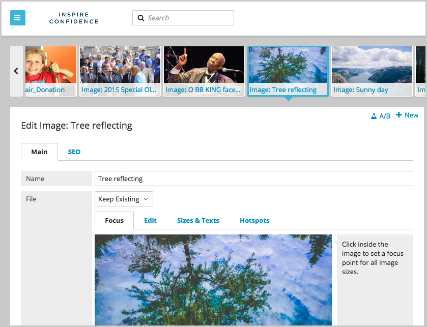

*****************
Release Notes 3.0
*****************

Brightspot 3.0 has a new look and feel, substantial improvements to the user interface and search functionality, and numerous other improvements.

**Released:** 07-15-2015

New Look and Feel
=================

Brightspot now has a flatter, more material design. The UI presents more options without disruption or requiring the user to switch to new screens. It also uses tabs more extensively to ease spacing.

New Features
============

User Dashboard Controls
-----------------------

A new user dashboard system allows each user to customize his or her own dashboard layout, including the Common Content widget's settings. Defaults can now be set by site and role.

Dashboard widget positions can be stored for multiple dashboards.

Selections
----------

Brightspot now allows multiple pieces of content of the same type to be selected in search results and quickly manipulated: bulk-edited, bulk-deleted, etc.

Developers can now customize Brightspot so that multiple selected pieces of content even be selected and formed into content types designed to hold them. For example, images can be collected into galleries, songs into play lists, and so on, provided the collected content pieces fit into the fields of the collection.

Search Results Carousel
-----------------------

A new carousel has been implemented to show the results of a search. Each result is represented by a slide in the carousel. By shifting slides, you can open a result in the content editor without losing the list of search results.

Developers can allow the preview image used in the carousel to be customizable.

Developers can customize search results suggestions.

Improved Features
=================

Search Panel
------------

The search panel has a new look and feel. Its design is more material, and it runs more quickly.

The search panel can be used to bulk restore items.

The search results action section now shows previews of selected search results, indicating the items that will be acted on when a search results action is selected.

Searches can now be saved for easy repeating and limited to a set number of results.

Search results have been improved. They can now:

* be saved for easy repeating.
* be multi-selected and created into a work stream.
* be exported in CSV format.
* be used to create drafts of new content, so that the existing content is used as a starting point. For example, three images could be selected to create an image gallery, which would then include those three images.
* be viewed in an infinite scroll pagination, if they are previewable and viewed in grid mode.

The Show Missing option has been removed because it confused some users and was redundant. Content with a particular field left empty can be found using the advanced query feature.

Java interfaces and abstract classes can be searched as content types, so that any content types that implement/extend the particular interface or abstract class will be found by search for the interface or abstract class. For example, if movie review articles and book review articles both implement the review interface, a search for reviews will find both movie reviews and book reviews.

Content and Enhancements
------------------------

The UI has a flatter, more material design.

Maps now support creating and saving circular regions.

Focus points can be added to images and saved as metadata with the image.

Brightspot now supports social networks that do not support oEmbed including: Facebook, Pinterest, Vine, Instagram, as well as Google Maps when used with the Brightspot-Google plug-in.

Sub-content can now be visually rearranged in a piece of content when a new annotation is used and the underlying classes are properly configured.

Permalinks can now be external URLs. Assigning an external URL to a piece of content makes it function as a URL redirect to the URL.

Guides Usability Improvements
-----------------------------

A new widget is available for overall/top-level production guides so these can be accessed from the dashboard more easily.

Page guides are now associated with content types rather than with templates.

Work Streams
------------

Work streams can now:

* process objects that exist only in draft form.
* be created in the search panel from search results.
* include content from multiple sites.

The work stream widget now displays more information about each work stream.

Workflow
--------

Pieces of content can now be advanced along their workflow in bulk by contributors with proper permissions.

Version Control
---------------

Content locking can be changed to an opt-in feature by administrators. When this setting is enabled, the default for a piece of content is to be unlocked, so each piece of content must be manually locked.

Unlocking another user's content now requires an administrative permission.

Login Screen Customization
--------------------------

Administrators can now add placeholders and a background image to the login page.

Amazon S3 Uploader
------------------

Brightspot now provides an uploader that works directly with Amazon S3 storage. It can be enabled in Admin settings.

Security Improvements
=====================

Permissions
-----------

Bulk editing and unlocking content now have require appropriate permissions.

Forgotten Passwords
-------------------

Forgotten password functionality has been improved to help prevent attempts to spam email inboxes.

Two Factor Authentication
-------------------------

Two-factor authentication has been improved to make it easier to use.
