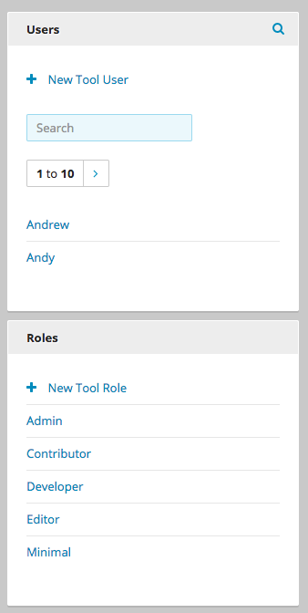

.. _creating_new_roles:

Creating New Roles
------------------

Each role has an associated list of permissions to access certain features within Brightspot. For example, administrators typically have access to all sites, tabs, areas, and widgets. Contributors and editors typically have access only to those sites, areas, and controls associated with the content they provide. (For more information about permissions, see :ref:`understanding_permissions_and_controls`.)

**To create a role:**

1. From the system menu, select **Admin > Users & Roles**. The Users and Roles widgets appear on the left side of the page.

.. _users_roles_widgets:

Users and Roles Widgets

2. In the Roles widget, click **New Tool Role**. The New Tool Role widget appears.

3. In the **Main** tab, and using the following table as a reference, make selections for those features to which the role has access. Yellow shading appears for those fields whose selections you change.

4. In the **Dashboard** tab, make selections to configure the role's dashboard.

5. In the **Advanced** tab, make selections for security settings.

6. Click **Save**.

+----------------------------------+----------------------------------------------------------------------------------------------------------------------------------------------------------------------------------------------------------+
|Field                             |Description                                                                                                                                                                                               |
+==================================+==========================================================================================================================================================================================================+
|**Main tab**                                                                                                                                                                                                                                 |
+----------------------------------+----------------------------------------------------------------------------------------------------------------------------------------------------------------------------------------------------------+
|Name                              |Name of role.                                                                                                                                                                                             |
+----------------------------------+----------------------------------------------------------------------------------------------------------------------------------------------------------------------------------------------------------+
|Permissions                       |Role's permissions associated with a variety of controls. Select all, none, or some for each feature. For an explanation of these controls, see :ref:`understanding_permissions_and_controls`.            |
+----------------------------------+----------------------------------------------------------------------------------------------------------------------------------------------------------------------------------------------------------+
|**Dashboard tab**                                                                                                                                                                                                                            |
+----------------------------------+----------------------------------------------------------------------------------------------------------------------------------------------------------------------------------------------------------+
|Dashboard                         |Settings for role's dashboard.                                                                                                                                                                            |
|                                  |                                                                                                                                                                                                          |
|                                  |None\ |emdash|\ Role sees the system-wide default dashboard.                                                                                                                                              |
|                                  |                                                                                                                                                                                                          |
|                                  |One Off\ |emdash|\ Role can create a customized dashboard. For details, see :doc:`Working with One-off Dashboards </cms/editorial-guide/dashboard/dash-oneoff>`.                                          |
|                                  |                                                                                                                                                                                                          |
|                                  |Shared\ |emdash|\ Role has access to shared dashboards. For details, see :doc:`Working with Shared Dashboards </cms/editorial-guide/dashboard/dash-shared>`.                                              |
|                                  |                                                                                                                                                                                                          |
|                                  |For more information about dashboards, see :doc:`Dashboard </cms/editorial-guide/dashboard/all>`.                                                                                                         |
+----------------------------------+----------------------------------------------------------------------------------------------------------------------------------------------------------------------------------------------------------+
|Common Content Settings           |Appearance of common content widget for all users with this role.                                                                                                                                         |
|                                  |                                                                                                                                                                                                          |
|                                  |None\ |emdash|\ Role sees the system-wide common-content widget.                                                                                                                                          |
|                                  |                                                                                                                                                                                                          |
|                                  |Set\ |emdash|\ Designs the appearance of the role's common content widget. For details, see :doc:`Common Content <../dashboard/common-content>`.                                                          |
+----------------------------------+----------------------------------------------------------------------------------------------------------------------------------------------------------------------------------------------------------+
|**Advanced tab**                                                                                                                                                                                                                             |
+----------------------------------+----------------------------------------------------------------------------------------------------------------------------------------------------------------------------------------------------------+
|Two-factor authentication required|Setting for two-factor authentication to log in to Brightspot.                                                                                                                                            |
|                                  |                                                                                                                                                                                                          |
|                                  |Default\ |emdash|\ Setting is the default as set by the administrator.                                                                                                                                    |
|                                  |                                                                                                                                                                                                          |
|                                  |Required\ |emdash|\ Two-factor authentication is required for all users with this role.                                                                                                                   |
|                                  |                                                                                                                                                                                                          |
|                                  |Not Required\ |emdash|\ Two-factor authentication is not required for all users with this role.                                                                                                           |
|                                  |                                                                                                                                                                                                          |
|                                  |For more information, see :doc:`Two Factor Authentication <../two-factor-auth/all>`.                                                                                                                      |
+----------------------------------+----------------------------------------------------------------------------------------------------------------------------------------------------------------------------------------------------------+
