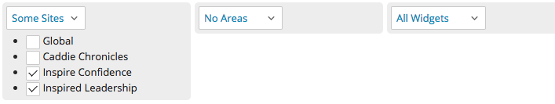
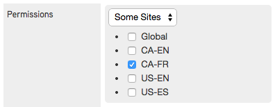
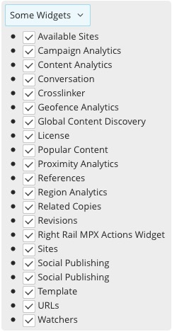
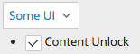
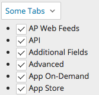
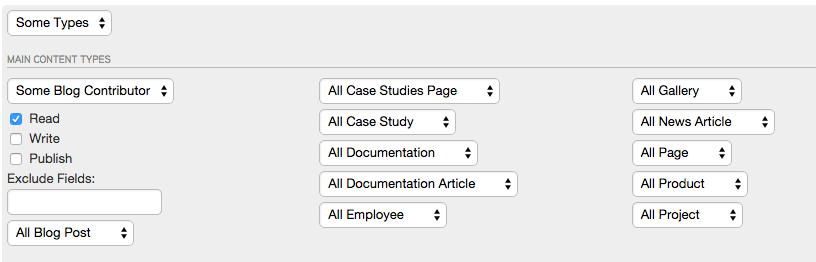
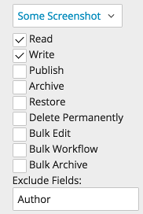

.. _understanding_permissions_and_controls:

Understanding Permissions and Controls
--------------------------------------

A control is an item on a Brightspot page that you click or select, such as a tab, checkbox, or drop-down list. Typically, not all users have acces to all controls. For example, contributors and editors usually do not have access to the administrative-level controls for adding new users. Brightspot uses permissions to restrict the access a role or user has to various controls. The following sections describe those controls and how to use them.

Assigning Permissions to Controls
~~~~~~~~~~~~~~~~~~~~~~~~~~~~~~~~~

There are three levels of permissions for a control: all, none, or some.

* If you select all, the role has access to all options within that feature. For example, selecting ``All Sites`` grants the role's users access to all sites.
* If you select none, the role has no access to the options within that feature. For example, selecting ``No Sites`` prevents the role's users from accessing any site.
* If you select some, the role has access to those options you select. For example, selecting ``Some Sites`` grants the role's users access to those sites you select.

Referring to the following example, the role has access to some sites (Inspire Confidence and Inspire Leadership), has no access to any area, and has access to all widgets.

The following sections describe the various controls to which you can assign permissions.

Sites Control
~~~~~~~~~~~~~

If your Brightspot implementation has multiple sites, the sites control indicates which of the sites a role can access. For example, a Spanish-speaking role might be limited to the Spanish and English sites, not French and German sites. If access to one or more sites is prohibited for a role, users with that role cannot access the ``Global`` option because it encompasses all sites in that Brightspot implementation.

Areas Control
~~~~~~~~~~~~~

The areas control contains the following sub-controls:

* Content\ |emdash|\ Covers the Dashboard and User-Generated Content (UGC). Assigns access to either view or both views, including all content created internally and externally.
* Crosslinker\ |emdash|\ Limits access to different features of Crosslinker, including Dictionaries, Dictionary Import, Simulations, Term Finder, Term Mappings, and Terms. (This sub-control is available if the Crosslinker is included in your version of Brightspot.) If you select ``No Crosslinker``, the Crosslinker tab does not appear in that role's Brightspot interface.
* Admin\ |emdash|\ Controls access to features in the Admin tab. If you select ``All Admin``, role sees all admin features in the Admin tab. If you select ``No Admin``, the Admin tab is not available.

.. image:: images/areas-control.jpg

Widgets Control
~~~~~~~~~~~~~~~

The widgets control specifies which Dashboard and Content Edit widgets are available to a role.

By limiting widgets, you can prevent certain roles from creating new content, scheduling content, setting URLs, and accessing other basic functions.

UI Control
~~~~~~~~~~

The UI control specifies if the content unlock feature is available to a role.

Tabs Control
~~~~~~~~~~~~

The tabs control specifies which tabs are available in Brightspot widgets. For example, you may want to allow some users access to a tab that offers items for sale on an app store.

Types Control
~~~~~~~~~~~~~

The types control shows sub-controls for the content types associated with your Brightspot implementation. For each content type, you can set permissions for the role. 

For example, you could create a role that can read or write screenshots. You can also exclude specific fields in a content type; typing ``Author`` in the Exclude field prevents the role from assigning authors to the screenshot.

