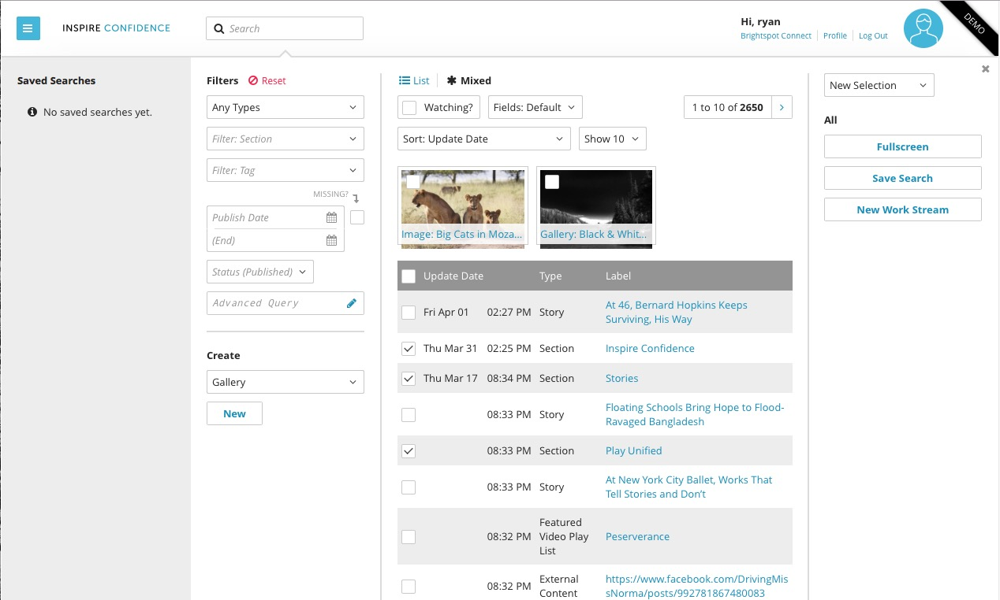
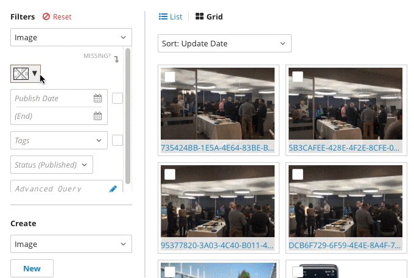
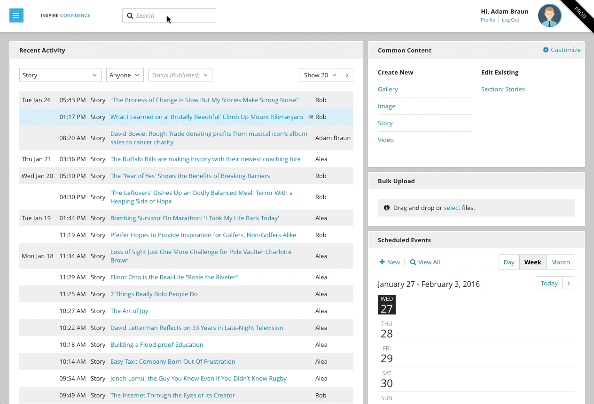
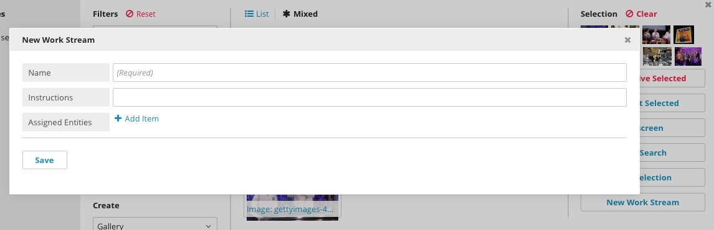
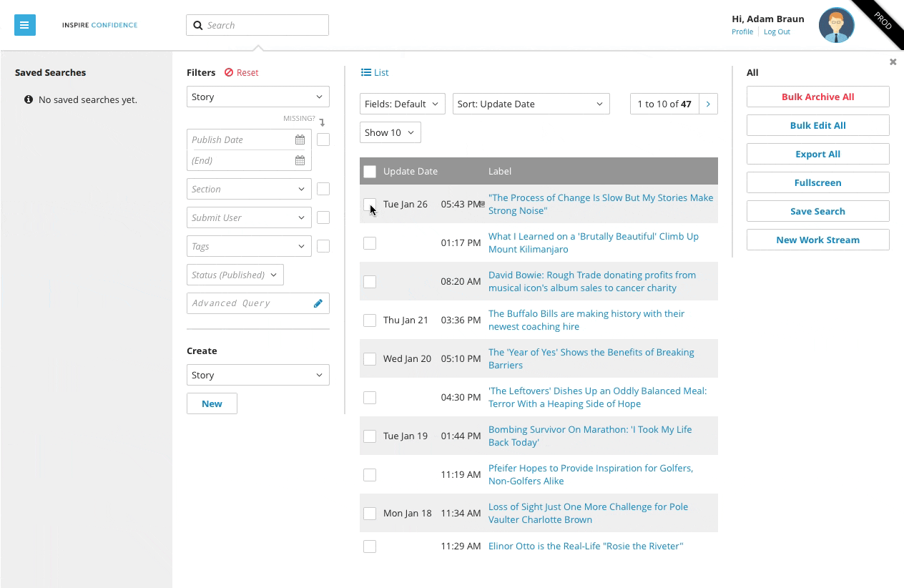
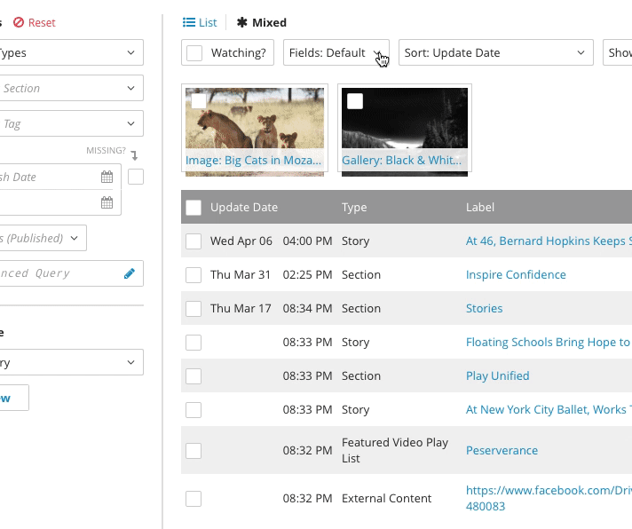
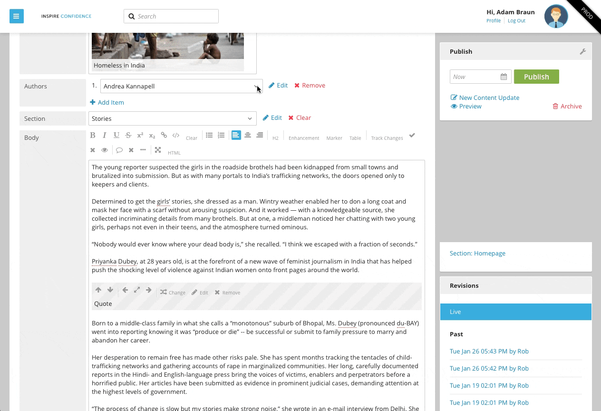
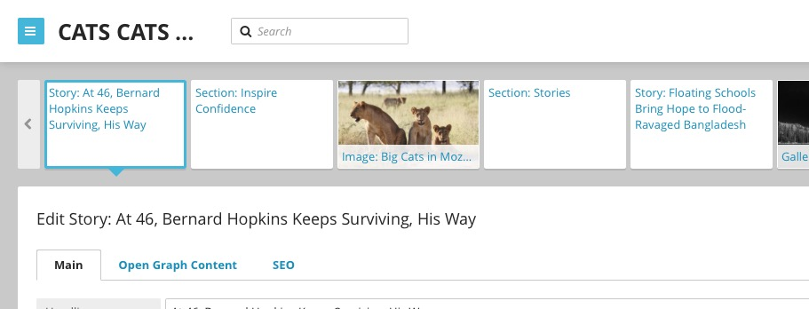
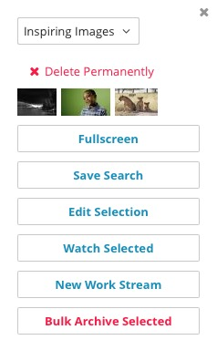

Search
======

Brightspot Search is a powerful tool that keeps your content organized and at your fingertips.

Global Search
-------------

Global Search, always available at the top of the screen, is a fast and full-featured way to find content in Brightspot. Enter your query into the search field and it will return all relevant content. The first ten search results are displayed in the Global Search widget. Your search results can be filtered, saved, and edited from here.

Filtering with Global Search
----------------------------

You can narrow your Global Search results with the following filters:

* Content Type: Includes additional relevant filtering options. For example, an Image filter will include Color, and a blog post will include Author.
* Section: Search only a specified portion of your content.
* Tag
* Publish Date
* Status: Published, Approved, Rejected, etc.0

Check the Missing? box to search for assets with nothing assigned to that field.

Filters are additive, so you can use multiple fields to further narrow the search results.

Click Reset at the top of the Filters field to reset the search terms.

Search By Color
---------------

With Image selected as a Content Type, you can filter assets by color. Choose a color from the palette provided in the drop-down menus on the left side of the search box. Brightspot Search will find images matching the desired hex value you selected from the color palette. Brightspot analyzes images at upload to determine the dominant colors.

Advanced Query Search
---------------------

For the most complex searches, Brightspot's Advanced Query Search can combine multiple search terms with specific operators. You can conduct an Advanced Query Search by clicking on the Advanced Query drop-down in the search box and selecting one of the following operators:

**Match All (AND):** Yields search results in which all given terms are present
**Match Any (OR):** Yields search results in which one or more of the given terms are present
**Match None (NOT):** Yields search results in which the given terms are not present

Full Screen Search
------------------

You can enter full screen mode in Global Search by clicking the Full Screen button on the right side of the Global Search pane.

Saving Searches
---------------

You can save searches for later reference by clicking Save Search on the right side of the search pane and giving the search a name. Your saved searches will appear on the left side of the Search pane.

Creating Work Streams
---------------------

Work Streams, created via Global Search, organize multiple editorial tasks into an orderly queue, allowing you to collaborate seamlessly with the rest of your team. After running your search, turn your search results into a Work Stream by clicking New Work Stream on the right side of the search pane. If you select specific search results with the check box to the left of the result, only the selected results will be included in the Work Stream. If no results are selected, all results will be included in the Work Stream. Once created, your Work Streams are accessed through the Work Streams widget on the Dashboard. Your team can now work sequentially: take the first item in the stream, carry out the assigned tasks, move on to the next item. Each item in the queue is assigned in turn to the next available team member. A progress bar on the Dashboard displays your progress through the Work Stream. See :doc:`../workstreams/all` for more information.

Bulk Edit
---------

To bulk edit multiple assets at the same time, select multiple search results of the same content type. Check the box for each asset to be edited and click Bulk Edit to open the Bulk Edit pane. Any changes made will apply to all selected assets and will overwrite any previous changes.

Custom Field Searches
---------------------

In the Fields: dropdown menu at the top of the search pane, you can choose to run a Custom Field Search by selecting one or more field(s) from the provided list. Your search results will now display the selected fields. Custom Field Searches can be used to locate unused content by checking for the number of references, for example, or to identify the most popular tags by selecting "Tags" and "Page Views." You can export the results of your Custom Field Search in a CSV file to create a customized report.

Contextual Search
-----------------

Contextual Search is used to find, choose, or create assets for fields restricted to only one content type. Click the dropdown menu to access the Contextual Search. Brightspot will display all available content appropriate to the field. Make a selection, and it will be placed in the field.

Search Results Carousel
-----------------------

After choosing a result from the Global Search, the rest of your search results will appear in a carousel above the content edit pane. Click a result to open it in the Content Editor without losing your search results.

Selections
----------

You can save your multi-selected content as a Selection, which you can return to later, use for bulk actions, or convert into a Work Stream. Create a selection by multi-selecting the content you'd like to collect, then click Save Selection on right side of the Search pane. You'll be prompted to name the Selection, then click Save. Your saved Selections will appear in the drop-down box at the top right of the Search pane.

