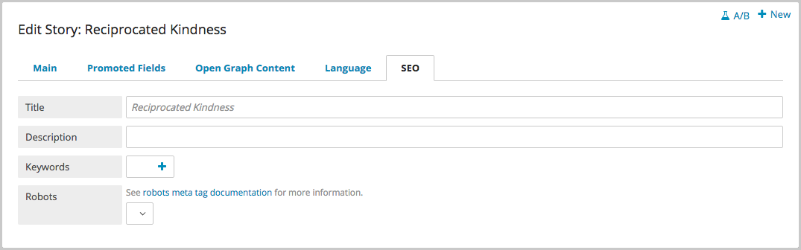

Search Engine Optimization
==========================

SEO Widget
----------

Add custom Search Engine Optimization to any page through the SEO widget at the bottom of the Content Edit screen. You can add a Title, Description and Keywords to be referenced by search engines. Configure other options here as well, such as setting no-index or no-follow.

Brightspot adheres to and encourages SEO best practices. If metatags have not been specified, Brightspot fills in the information with text from the object itself by default.

