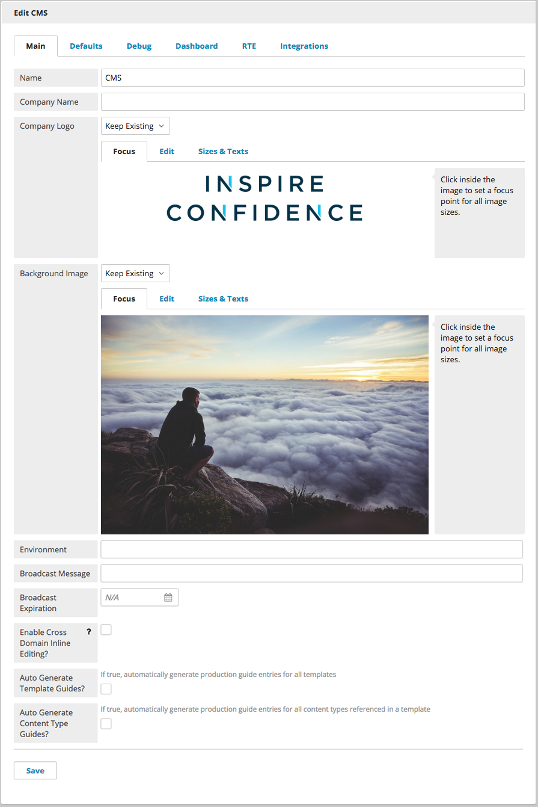
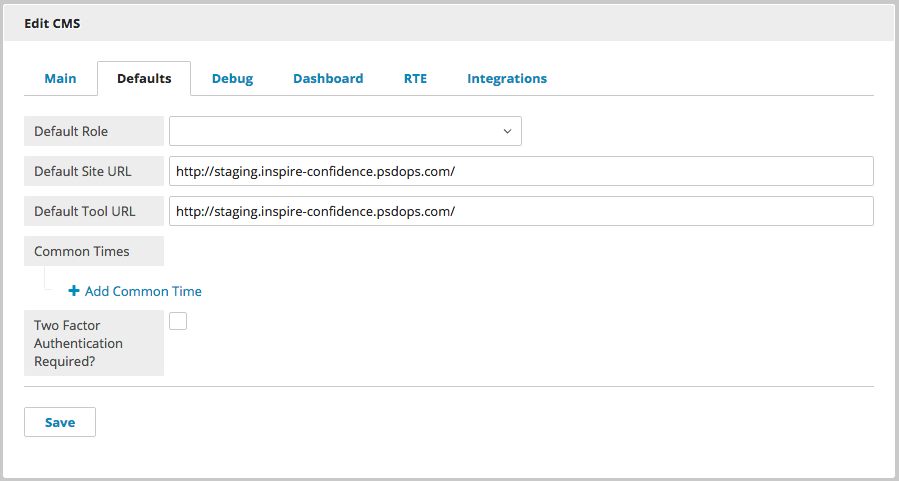
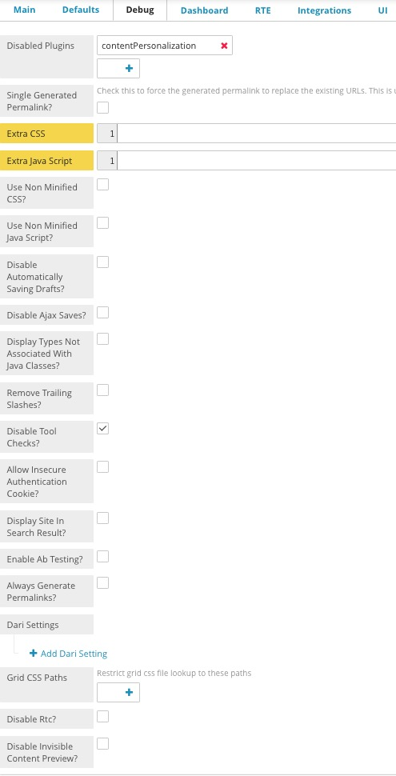
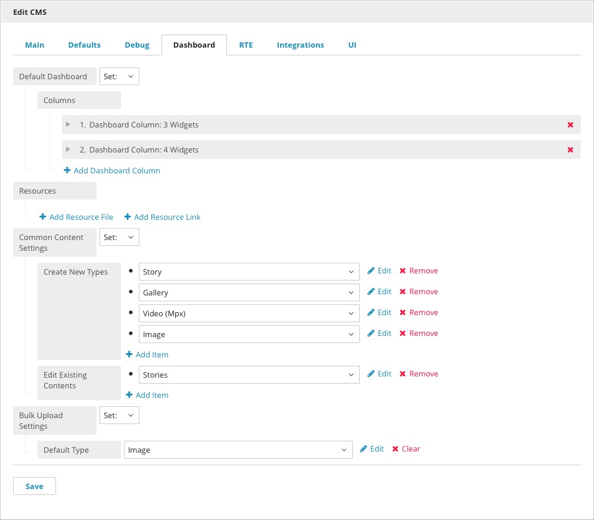
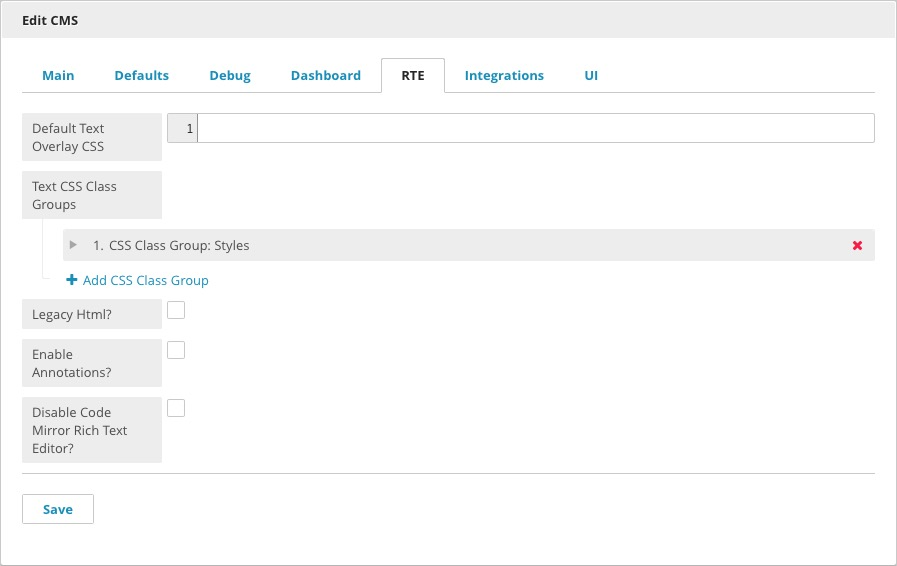
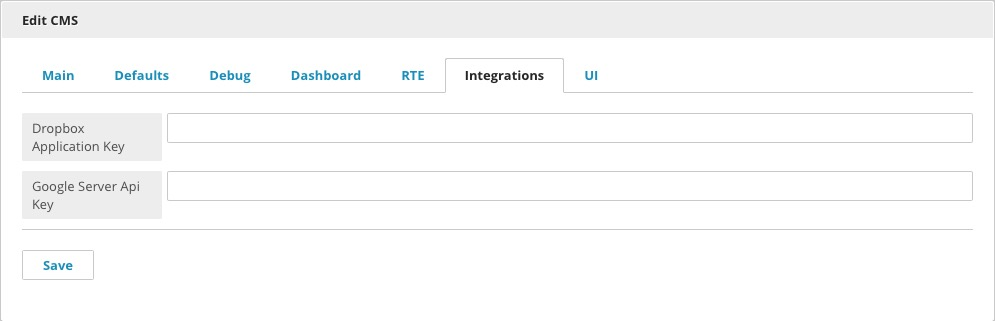
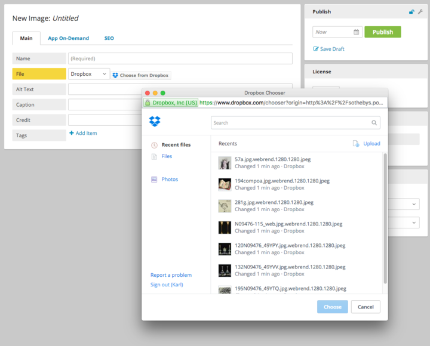
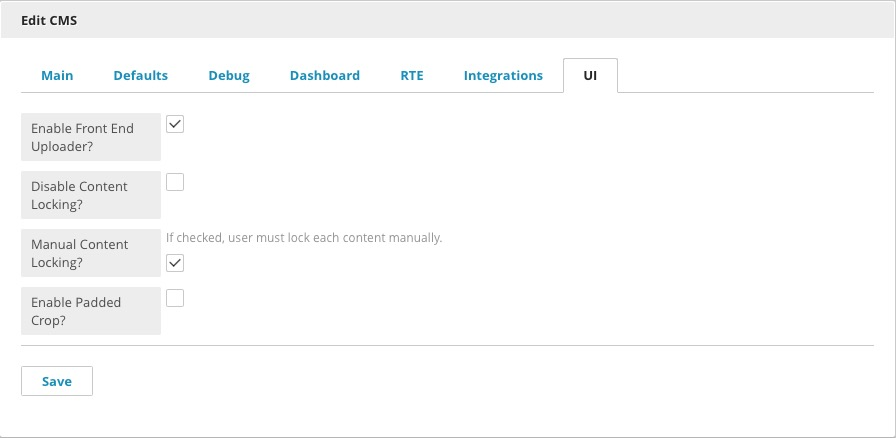

Site Settings
=============

The Admin & Settings page contains options that customize Brightspot to better fit your needs and preferences.

Main
----

Name: Application Name.

Company Name: Used if no logo is uploaded. The name appears in the top left corner of the CMS.

Company Logo: Site logo, which appears on the login screen and at the top left corner of the CMS.

Environment: The name of the current CMS environment, for example, QA or Production. Displayed in Brightspot as a ribbon in the top right.

Broadcast Message: Create a banner message that will appear at the top of the screen.

Broadcast Expiration: Set the date and time when the Broadcast Message will no longer appear.

Enable Cross Domain Inline Editing?: Make the inline editor appear on all sites in a Multi-Site implementation with a variety of different domains,

Auto-Generate Template Guides?: Turn automatic Production Guide generation for templates on or off.

Auto-Generate Content Type Guides?: Turn automatic Production Guide generation for Content Types on or off.

Defaults
--------

Default Role: Set the Default User role inherited by newly created users.

Default Site URL: Set the URL for the website.

Default Tool URL: Set the URL for the CMS application.

Common Times: Set a scheduled time for content to be published. Times set here become preset times you can select to schedule content publishing.

Two Factor Authentication Required?: Force all users to use two factor authentication.

Debug
-----

Disabled plugins: List a widget here to disable it, e.g., dashboard.siteMap.

Single Generated Permalink?: Check to override existing permalinks when content is updated.

Extra CSS: Add extra CSS for the CMS or application.

Extra JavaScript: Add extra JavaScript for the CMS or application here.

Use Non Minified CSS?: Switch between minified and non-minified styles in development mode.

Use Non Minified Java Script?: Switch between minified and non-minified styles in development mode.

Disable Automatically Saving Drafts?: Content in Draft mode will not be automatically saved.

Disable Ajax Saves?:

Display Types not Associated with Java Classes?:

Remove Trailing Slashes?: URLs on the site will not have trailing slashes.

Disable Tool Checks?: By default, Brightspot checks for user activity to timeout inactive users. Disabling tool checks will disable the timeout feature.

Allow Insecure Authentication Cookie?: Allow insecure authentication cookies on the CMS.

Display Site in Search Results?: Make the site searchable in the Search tool.

Enable Ab Testing?: Enable A/B Testing functionality for the site.

Always Generate Permalinks?: The CMS will generate Permalinks for content by default.

Dari Settings: Add attributes to the context.xml.

Grid CSS Paths:

Disable Rtc?: Real Time Connection (RTC) allows Brightspot to update content as it is edited in real time for all users.

Disable Invisible Content Preview?:

Dashboard
---------

From the Dashboard tab, you can customize the placement of widgets to suit your workflow. Create a new Dashboard by clicking the drop-down and selecting Set. From here, you can create multiple columns to organize the widgets on your Dashboard. Click the Add buttons for the widgets you'd like to place in each column. Set the width of each column by entering a number in the Width field. Column width are relative to one another, so a column with a width of 3 is three times the width of a 1 column. To make all columns equally wide, assign them each a width of 0.

When your Dashboard configuration is complete, click Save. To restore your Dashboard to the default configuration and discard your customizations, go back to the Dashboard tab and select None instead of Set.

For more information, see the `Dashboard chapter <http://www.brightspot.com/docs/3.2/editorial-support/dashboard#building-a-custom-dashboard>`_.

RTE
---

The Rich Text Editor is a robust word processing field used to format and style text and embed images, videos, and other supported content. It is typically used for the body text of blogs, articles, or anywhere you require complete control over the formatting and style of the published text. If you have already created content in Microsoft Word or Google Docs, you can paste it directly into the Rich Text Editor and retain the original text formatting. The following settings are available for the Rich Text Editor:

Default Text Overlay CSS: Edit the default CSS styles applied when a text overlay is chosen for an image. You can alter the font properties as needed, including font size, color, etc.

Text CSS Class Groups: Add custom CSS styles for selection in the Rich Text Editor.

Legacy HTML?: Use existing HTML in the HTML editor view.

Enable Annotations?: Use annotations in the HTML editor view.

Disable Code Mirror Rich Text Editor?: Use the legacy Rich Text Editor instead of the current Code Mirror-based version.

Integrations
------------

Dropbox Application Key: Add your Dropbox key here to enable file uploading from Dropbox.

Google Server Api Key: Add your Google Server API key to translate the Brightspot user interface into non-English languages with Google Translate. Change the language of the UI in the :doc:`../user-settings/all`. 

.. image:: images/google.png

UI
--

Enable Front End Uploader?: Turns on the Bulk Upload progress preview feature.

Disable Content Locking?: Turns off the Content Locking feature. See :doc:`../locking/all` for more information.

Manual Content Locking?: Replaces the default Content Locking feature with a version you can activate manually. See :doc:`../locking/all` for more information.

Enable Padded Crop?: Adds padding to your defined image sizes.

