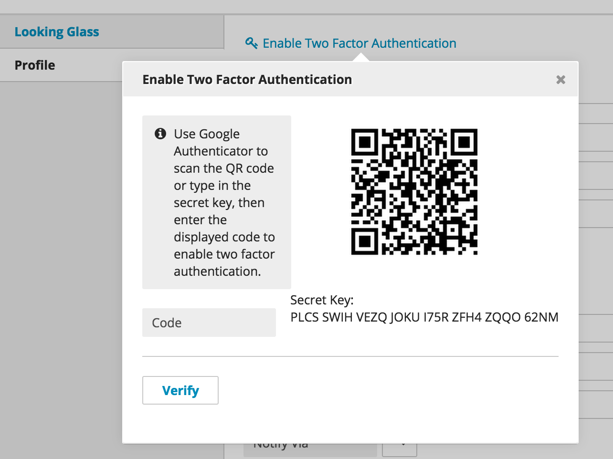

Two Factor Authentication
=========================

Malicious access to the CMS is the most common way for content to be compromised. Spear phishing puts even strong passwords at risk. To protect your CMS from these threats, Brightspot has built-in two factor authentication. Enable two factor authentication by opening the Profile pop-up found at the top of the CMS. Using a smart phone with a service such as Google Authenticator, scan the QR code, receive a confirmation code, and enter that code into the Profile pop-up.

Next, log in with email and password credentials and the code that was received. The Google Authenticator app has settings to control how often the code needs to be entered or changed.

