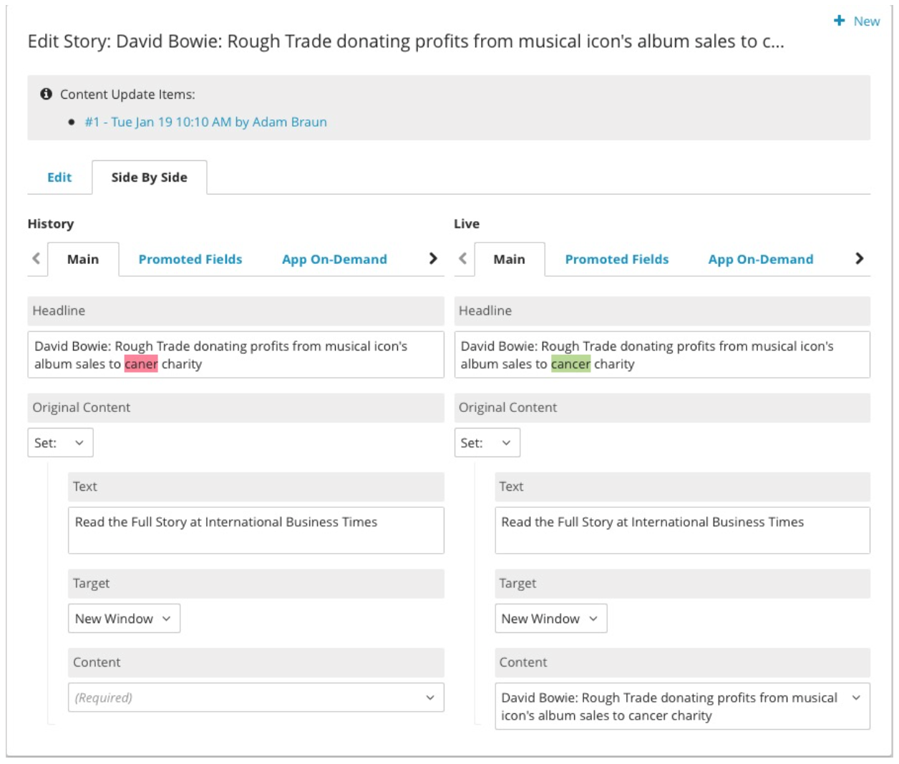

.. raw:: html

    

================================
Versioning
================================

The CMS stores all versions of a content item in the Brightspot database: the current published or archived version, past versions that were published and subsequently replaced, and versions that were never published (drafts). Each version is an independent object in the database, and each is identified by its current state, for example, draft, published, or archived. Collectively, all of the version objects provide an historical record of the content item.

In the Dashboard, the Content Edit page provides the tools to manage the versions of a content item, referred to as “revisions” in the Dashboard UI. The Revisions widget, on the right side of the Content Edit page by default, contains a list of all versions of a content item, organized by publish date and user. In conjunction with the Publish widget and the **Side By Side** tab, the Revision widget allows you to revisit a previous version, view and edit it alongside the current version, and republish it.

The Revisions widget groups and labels the different types of versions for a content item. The following example shows revisions that are either in the published state or the draft state.

.. image:: ./images/ver_revisions.png
      :width: 468px
      :height: 700px

The revisions in the published state are either live (current published version) or previously published. Published revisions can be saved as new drafts, and past published revisions can be renamed. Published revisions cannot be modified or deleted.

There are various draft types:

- Initial draft – the first draft saved from new content. When published, the initial draft version is kept, and a new published version is created as a separate object.

- Workflow drafts – the content item is routed through a workflow, and a separate draft is created for each workflow state (for example, submitted, rejected, resubmitted). When the final workflow version is published, all of the workflow draft versions are kept, and a new published version is created as a separate object.

- Scheduled draft – the version is scheduled for publishing at a future time. When published, the version state is changed from draft to published, and the draft version no longer appears in the Revisions widget.

- Draft created from the Revisions widget – an alternative to creating a draft from the Publish widget. Unlike a draft created from the Publish widget, a draft created from the Revisions widget is named by the user. When the draft is published, the version state is changed from draft to published, and the draft version no longer appears in the Revisions widget.

  Prior to publishing an instance of a content type, you can merge any drafts that you create from the Revisions widget with the initial draft. The Publish widget detects new drafts and provides the merge option.

Note that a draft version can be modified or deleted, but it cannot be renamed.

-------------------
Comparing Versions
-------------------

Using the **Side By Side** tab on the Content Edit page, you can view a side-by-side comparison of the most current version of the content with another version. From the Revisions widget, click on a previous version, and the **Side By Side** tab is displayed. The selected version is shown on the left and the most current version on the right. 

In the example below, a past published version is compared to the current live version, which appears on the right side of the pane. If you were to select a draft version created after the live version, then the draft version would appear on the right side of the pane because it is more current than the live version.

Differences between the two versions are highlighted. To make changes to the selected version, go to the **Edit** tab. Save your changes to see them in the **Side By Side** tab.

| **See also:**
| :doc:`../publishing-process/all`
| :doc:`../publishing-process/pub-widget-ref`

