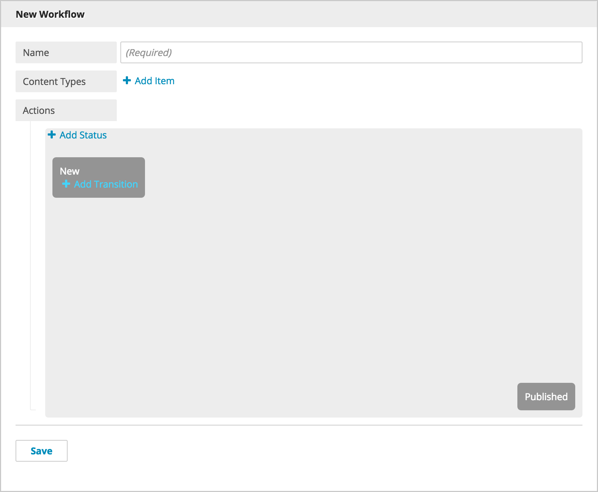

Creating Workflows
------------------

To create a new Workflow, go to the Admin tab and select Workflows. You can create a new Workflow, name it, and select the content types that should appear in the Workflow. When progress is made on the project, update the Workflow by adding statuses and transitions to track the project's development.

Adding Statuses
~~~~~~~~~~~~~~~~~

Add a status by clicking Add Status. The first status starts the Workflow. This will be the status the item is placed in as it moves through the Workflow. For example, an editor might add a status Submitted after submitting a piece of content. The next status might be Approved. Link statuses and transitions to each other by dragging the status boxes from one to the next in the Workflow space.

Adding Transitions
~~~~~~~~~~~~~~~~~~~

After creating the statuses necessary for the project, add transitions between status boxes. For example, a transition between Submitted and Approved might be Pending Approval. Just like statuses, add transitions by clicking Add Transition. Drag the transition to the appropriate status and a transition label box will appear. Linking statuses with transitions helps editors understand the steps of the project.
